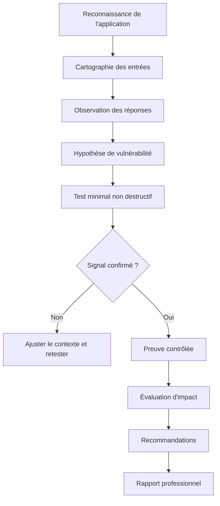
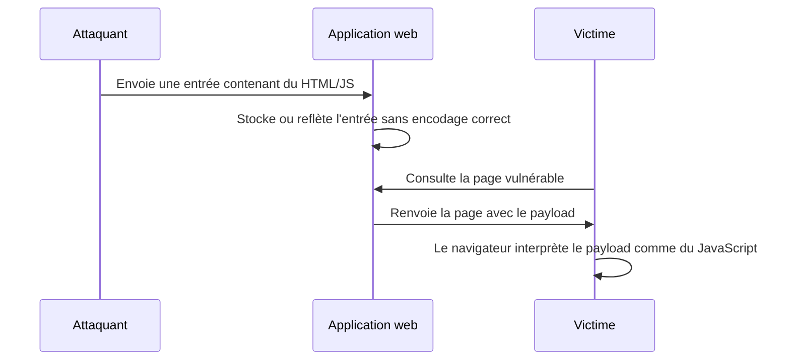
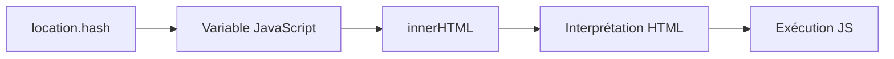
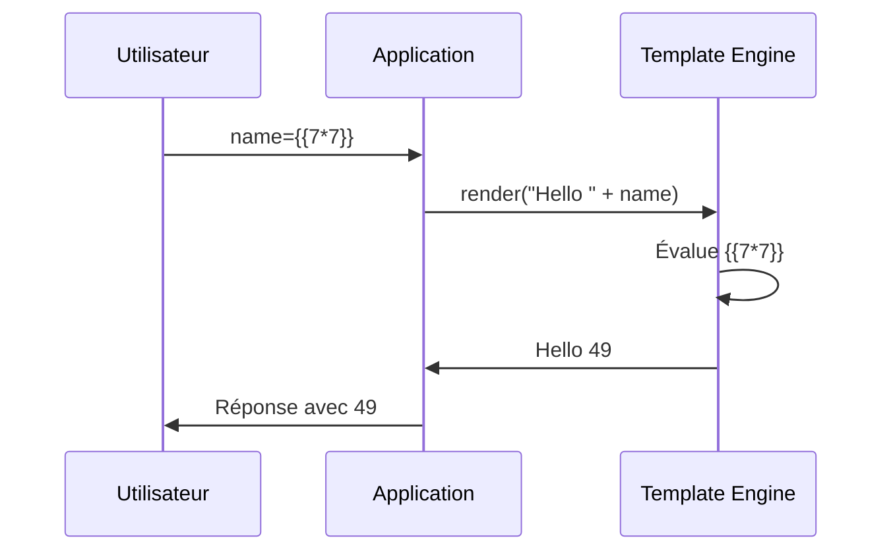

# Advanced Web Attack Techniques

> **"Security is not a product, but a process." — Bruce Schneier**

## Table des matières

1. [Objectif du module](#1-objectif-du-module)
2. [Cadre éthique, légal et professionnel](#2-cadre-éthique-légal-et-professionnel)
3. [Vue d'ensemble des attaques web avancées](#3-vue-densemble-des-attaques-web-avancées)
4. [Méthodologie professionnelle de test](#4-méthodologie-professionnelle-de-test)
5. [XSS — Cross-Site Scripting](#5-xss--cross-site-scripting)
6. [XSS réfléchi, stocké et DOM-based](#6-xss-réfléchi-stocké-et-dom-based)
7. [Détection et exploitation contrôlée d'une XSS](#7-détection-et-exploitation-contrôlée-dune-xss)
8. [Prévention XSS côté développement](#8-prévention-xss-côté-développement)
9. [CSP, cookies et défense en profondeur](#9-csp-cookies-et-défense-en-profondeur)
10. [Insecure Deserialization](#10-insecure-deserialization)
11. [PHP Deserialization](#11-php-deserialization)
12. [Détection et prévention de la désérialisation dangereuse](#12-détection-et-prévention-de-la-désérialisation-dangereuse)
13. [SSTI — Server-Side Template Injection](#13-ssti--server-side-template-injection)
14. [Détection, confirmation et analyse SSTI](#14-détection-confirmation-et-analyse-ssti)
15. [Prévention SSTI](#15-prévention-ssti)
16. [Signaux comportementaux et lecture des logs](#16-signaux-comportementaux-et-lecture-des-logs)
17. [Plan de travail pour les endpoints du projet](#17-plan-de-travail-pour-les-endpoints-du-projet)
18. [Rapport professionnel de pentest](#18-rapport-professionnel-de-pentest)
19. [Checklists rapides](#19-checklists-rapides)
20. [Corrigé des questions](#20-corrigé-des-questions)
21. [Glossaire](#21-glossaire)
22. [Références](#22-références)

---

# 1. Objectif du module

Ce module porte sur les **Advanced Web Attack Techniques**, c'est-à-dire des attaques web qui ne se détectent pas toujours avec un simple scan automatique.

Le but n'est pas seulement de connaître des payloads. Le vrai objectif est d'apprendre à :

- observer le comportement réel d'une application ;
- comprendre comment les données utilisateur circulent entre le client, le serveur, la base de données et les moteurs de rendu ;
- identifier les endroits où une donnée non fiable devient du code ;
- confirmer une vulnérabilité proprement, sans causer de dégâts ;
- documenter une preuve exploitable avec une méthodologie professionnelle ;
- proposer des corrections réalistes pour les développeurs.

Dans ce projet, les attaques principales sont :

| Famille | Où se passe le problème ? | Risque principal |
|---|---|---|
| XSS | Navigateur de la victime | Exécution de JavaScript côté client |
| Insecure deserialization | Serveur ou logique applicative | Modification d'objet, contournement logique, DoS, parfois RCE |
| PHP deserialization | Serveur PHP | Appel automatique de méthodes magiques, chaînes POP, RCE possible |
| SSTI | Moteur de templates côté serveur | Lecture de données serveur, exécution de logique template, parfois RCE |

Le point commun entre ces attaques : **une donnée contrôlée par l'utilisateur est interprétée dans un contexte dangereux**.

---

# 2. Cadre éthique, légal et professionnel

Ce cours est destiné à un usage strictement pédagogique dans un environnement autorisé : labs Holberton, machines CTF, plateformes d'entraînement, applications personnelles ou programmes bug bounty explicitement autorisés.

Une règle simple :

> **Pas d'autorisation explicite = pas de test actif.**

Même une simple XSS peut être illégale sur un site public si elle est testée hors cadre. Dans un contexte professionnel, on limite toujours l'impact :

- pas de vol de cookies réels ;
- pas d'exfiltration de données personnelles ;
- pas de suppression de fichiers ;
- pas de charge destructrice ;
- pas de scan agressif sans accord ;
- preuve minimale, reproductible et non destructive.

Pour tes exercices, les endpoints fournis sont :

```text
Task 0 Endpoint : http://web0x0a.task0.hbtn/
Task 1 Endpoint : http://web0x0a.task1.hbtn/
Task 2 Endpoint : http://web0x0a.task2.hbtn/
Task 3 Endpoint : http://web0x0a.task3.hbtn/
Task 4 Endpoint : http://web0x0a.task4.hbtn/
```

Le projet précise aussi : **utiliser l'adresse IP dans les tasks, pas le hostname**. Cela signifie que pendant les exercices, tu devras probablement résoudre le hostname ou utiliser l'IP fournie par l'environnement, puis envoyer les requêtes vers cette IP.

---

# 3. Vue d'ensemble des attaques web avancées

## 3.1 Pourquoi ces attaques sont considérées comme avancées ?

Elles sont avancées parce qu'elles ne se résument pas à :

```text
Je mets un payload → ça marche / ça ne marche pas.
```

Elles nécessitent de comprendre :

- le **contexte d'injection** ;
- l'endroit où la donnée est rendue ;
- le langage ou moteur qui interprète la donnée ;
- la différence entre stockage, réflexion immédiate et manipulation côté client ;
- les protections partielles qui peuvent modifier le comportement ;
- les signaux faibles dans les réponses HTTP et les logs.

Exemple simple :

```text
Payload envoyé : <script>alert(1)</script>
Réponse affichée : &lt;script&gt;alert(1)&lt;/script&gt;
```

Ici, le payload est bien reflété, mais il est encodé dans le contexte HTML. Il ne s'exécute pas. Il faut donc comprendre si l'encodage est complet, contextuel, ou s'il existe un autre contexte plus dangereux : attribut HTML, URL, JavaScript inline, template, JSON, DOM, etc.

## 3.2 Le principe fondamental : données vs code

Une application sécurisée doit traiter les entrées utilisateur comme des **données**.

Une application vulnérable finit par traiter ces entrées comme du **code**.

| Exemple | Interprétation dangereuse |
|---|---|
| `<script>alert(1)</script>` affiché dans une page | JavaScript exécuté par le navigateur |
| `{{ 7*7 }}` inséré dans un template serveur | Expression évaluée par le moteur de template |
| Objet sérialisé modifié par l'utilisateur | Objet reconstruit côté serveur avec état contrôlé |
| Valeur JSON insérée dans `innerHTML` | HTML/JS interprété côté client |

## 3.3 Les trois questions à se poser

À chaque test, pose-toi ces trois questions :

1. **Où va ma donnée ?**
   - URL ?
   - paramètre GET/POST ?
   - cookie ?
   - header ?
   - base de données ?
   - template ?
   - DOM ?

2. **Dans quel contexte est-elle réutilisée ?**
   - texte HTML ;
   - attribut HTML ;
   - URL ;
   - bloc JavaScript ;
   - JSON ;
   - CSS ;
   - moteur de template ;
   - objet sérialisé.

3. **Quelle protection est appliquée ?**
   - validation d'entrée ;
   - encodage de sortie ;
   - sanitization ;
   - CSP ;
   - signature HMAC ;
   - allowlist ;
   - sandbox ;
   - framework auto-escaping.

---

# 4. Méthodologie professionnelle de test

## 4.1 Le cycle discovery → analysis → exploitation → reporting

Une bonne démarche ressemble à ceci :



## 4.2 Étape 1 — Cartographier les entrées

Les entrées ne sont pas seulement les champs visibles dans un formulaire.

Cherche aussi :

- paramètres GET ;
- corps POST ;
- JSON body ;
- cookies ;
- headers HTTP ;
- fragments d'URL pour le DOM (`#value`) ;
- champs cachés ;
- uploads ;
- noms de fichiers ;
- paramètres de redirection ;
- préférences utilisateur ;
- champs de profil ;
- commentaires ;
- moteur de recherche interne ;
- paramètres d'API.

Exemples :

```http
GET /search?q=test HTTP/1.1
Host: example.local
```

```http
POST /profile HTTP/1.1
Content-Type: application/x-www-form-urlencoded

bio=hello&display_name=student
```

```http
GET /page?template=hello&name=test HTTP/1.1
Cookie: session=...
User-Agent: test
```

## 4.3 Étape 2 — Observer sans attaquer

Avant de tester des payloads, regarde :

- le code source HTML ;
- les scripts JavaScript chargés ;
- les requêtes dans l'onglet Network ;
- les paramètres qui reviennent dans la réponse ;
- les messages d'erreur ;
- les différences entre caractères simples : `'`, `"`, `<`, `>`, `{`, `}`, `$`, `%` ;
- les en-têtes de sécurité : CSP, X-Frame-Options, Set-Cookie, etc.

## 4.4 Étape 3 — Tester avec des marqueurs neutres

Avant un payload, utilise un marqueur unique :

```text
hbtn-test-12345
```

Puis vérifie :

- est-il reflété immédiatement ?
- est-il stocké ?
- est-il visible par un autre utilisateur ?
- est-il modifié ?
- est-il encodé ?
- est-il inclus dans du JavaScript ?
- est-il placé dans un attribut HTML ?

Exemples de marqueurs par contexte :

```text
hbtn_text_123
hbtn'quote
hbtn"double
hbtn<angle>
hbtn{{7*7}}
hbtn${7*7}
```

## 4.5 Étape 4 — Confirmer avec une preuve minimale

Une preuve correcte n'est pas forcément spectaculaire. Elle doit être :

- claire ;
- reproductible ;
- non destructive ;
- limitée à ton compte ou au lab ;
- suffisante pour démontrer l'impact.

Pour XSS, une preuve minimale peut être :

```html
<script>alert(document.domain)</script>
```

ou mieux dans un contexte de bug bounty moderne :

```html

```

Pour SSTI, une preuve minimale peut être :

```text
{{7*7}}
```

Si la réponse affiche `49`, cela prouve une évaluation côté template.

Pour désérialisation, une preuve minimale peut être :

- modification d'un rôle dans un objet signé insuffisamment protégé ;
- erreur serveur révélant une tentative de reconstruction d'objet ;
- changement d'état logique non autorisé ;
- détection d'un format sérialisé user-controllable.

---

# 5. XSS — Cross-Site Scripting

## 5.1 Définition

Le **Cross-Site Scripting**, ou **XSS**, est une vulnérabilité d'injection qui permet à un attaquant d'injecter du code JavaScript dans une page web consultée par un autre utilisateur.

L'idée centrale :

> L'application reçoit une donnée utilisateur, puis la renvoie dans une page sans l'encoder correctement. Le navigateur interprète alors cette donnée comme du code.

## 5.2 Pourquoi le nom "Cross-Site" ?

Historiquement, l'attaque consiste à faire exécuter par le navigateur de la victime un script injecté par l'attaquant dans le contexte d'un autre site.

Le script malveillant s'exécute avec les privilèges du domaine vulnérable.

Si une victime est connectée à :

```text
https://bank.example
```

et qu'une XSS s'exécute sur ce domaine, alors le JavaScript peut potentiellement interagir avec la page comme si le code venait de ce site.

## 5.3 Ce que peut faire une XSS

Selon le contexte et les protections, une XSS peut permettre :

- vol de données affichées dans la page ;
- actions au nom de la victime ;
- modification du contenu visible ;
- phishing interne ;
- lecture de tokens stockés dans `localStorage` ou `sessionStorage` ;
- contournement partiel de protections CSRF ;
- pivot vers des endpoints internes accessibles par le navigateur ;
- keylogging dans la page ;
- prise de contrôle de compte si des tokens sensibles sont accessibles ;
- propagation type ver si le champ vulnérable est stocké.

Important : une XSS n'est pas seulement une `alert(1)`. L'alerte est une preuve visuelle, mais l'impact réel dépend du contexte métier.

## 5.4 Les trois grandes familles

| Type | Où le payload est stocké ? | Qui déclenche ? | Exemple |
|---|---|---|---|
| Reflected XSS | Pas stocké | Victime qui ouvre un lien ou soumet une requête | recherche, message d'erreur |
| Stored XSS | Base de données / stockage serveur | Toute personne qui consulte la page | commentaire, profil, ticket support |
| DOM-based XSS | Côté navigateur | JavaScript client manipule le DOM dangereusement | `location.hash` vers `innerHTML` |

## 5.5 Le modèle mental d'une XSS



## 5.6 Pourquoi l'encodage est central

Le navigateur ne sait pas si une chaîne vient d'un utilisateur ou d'un développeur. Il voit seulement du HTML, du JavaScript, des attributs, des URL, etc.

Exemple dangereux :

```html
<p>Bonjour <script>alert(1)</script></p>
```

Exemple sûr :

```html
<p>Bonjour &lt;script&gt;alert(1)&lt;/script&gt;</p>
```

Dans le second cas, le navigateur affiche le texte au lieu de l'exécuter.

---

# 6. XSS réfléchi, stocké et DOM-based

## 6.1 Reflected XSS

### Définition

Une **Reflected XSS** se produit quand le payload est envoyé dans une requête et immédiatement renvoyé dans la réponse HTTP.

Exemple :

```http
GET /search?q=<script>alert(1)</script> HTTP/1.1
Host: vulnerable.local
```

Réponse vulnérable :

```html
<p>Résultats pour : <script>alert(1)</script></p>
```

Le payload n'est pas stocké. Il faut que la victime clique sur un lien piégé ou soumette une requête.

### Signaux typiques

- paramètre reflété dans la page ;
- message d'erreur contenant l'entrée ;
- recherche interne ;
- redirection ou page de confirmation ;
- réponse différente selon les caractères spéciaux.

### Impact

L'impact dépend de la capacité à faire exécuter le lien par une victime :

- phishing ;
- vol de données accessibles dans la page ;
- actions au nom de la victime ;
- exploitation d'un utilisateur authentifié.

## 6.2 Stored XSS

### Définition

Une **Stored XSS** se produit quand l'application stocke le payload puis le réaffiche plus tard.

Exemples d'emplacements :

- commentaire ;
- pseudo ;
- avatar ou nom de fichier ;
- champ bio ;
- ticket support ;
- message privé ;
- titre d'article ;
- champ administrateur ;
- log viewer web.

### Exemple

L'attaquant poste un commentaire :

```html
Très bon article ! 
```

Plus tard, un admin ouvre la page des commentaires. Le script s'exécute dans sa session.

### Pourquoi c'est souvent plus grave

Stored XSS est souvent plus dangereux que reflected XSS parce que :

- la victime n'a pas besoin de cliquer sur un lien externe ;
- le payload se déclenche automatiquement ;
- il peut toucher plusieurs utilisateurs ;
- il peut atteindre un administrateur ;
- il peut rester actif jusqu'à suppression.

## 6.3 DOM-based XSS

### Définition

Une **DOM-based XSS** vient du code JavaScript côté client. Le serveur peut renvoyer une page parfaitement normale, mais le JavaScript du navigateur lit une donnée contrôlée par l'utilisateur et l'insère dans le DOM de manière dangereuse.

Exemple vulnérable :

```javascript
const name = location.hash.substring(1);
document.getElementById("welcome").innerHTML = name;
```

URL attaquante :

```text
https://example.local/#
```

Ici, le serveur ne voit pas forcément le fragment après `#`. L'attaque se produit entièrement côté navigateur.

### Sources et sinks

Pour comprendre DOM XSS, il faut connaître deux mots :

| Terme | Définition | Exemples |
|---|---|---|
| Source | Origine d'une donnée contrôlable | `location`, `location.hash`, `document.URL`, `document.referrer`, `postMessage`, `localStorage` |
| Sink | Fonction dangereuse qui interprète la donnée | `innerHTML`, `outerHTML`, `document.write`, `eval`, `setTimeout(string)`, `insertAdjacentHTML` |

### Exemple de flux dangereux



### Ce qu'il faut chercher dans le JavaScript

Mots-clés utiles :

```text
innerHTML
outerHTML
document.write
insertAdjacentHTML
eval
Function(
setTimeout(
setInterval(
location
location.hash
location.search
document.URL
document.referrer
postMessage
localStorage
sessionStorage
```

---

# 7. Détection et exploitation contrôlée d'une XSS

## 7.1 Objectif du test

L'objectif n'est pas d'envoyer directement un payload agressif. L'objectif est de comprendre :

- si la donnée est reflétée ;
- où elle est reflétée ;
- dans quel contexte elle apparaît ;
- quels caractères sont filtrés ou encodés ;
- quelle preuve minimale peut confirmer l'exécution.

## 7.2 Étape A — Détecter la réflexion

Commence par :

```text
hbtnxss123
```

Puis observe le code source :

```html
<p>Résultats pour hbtnxss123</p>
```

La donnée est reflétée dans du texte HTML.

## 7.3 Étape B — Identifier le contexte

Même payload, contextes différents :

### Contexte texte HTML

```html
<p>hbtnxss123</p>
```

Risque : injection de balise HTML si `<` et `>` ne sont pas encodés.

### Contexte attribut HTML

```html
<input value="hbtnxss123">
```

Risque : sortir de l'attribut avec un guillemet puis ajouter un gestionnaire d'événement.

### Contexte JavaScript

```html
<script>
  const q = "hbtnxss123";
</script>
```

Risque : casser la chaîne puis injecter du JavaScript.

### Contexte URL

```html
<a href="/search?q=hbtnxss123">link</a>
```

Risque : protocole dangereux, redirection ou injection d'attribut selon l'encodage.

### Contexte JSON

```json
{"name":"hbtnxss123"}
```

Risque indirect : si le JSON est ensuite injecté dans le DOM avec `innerHTML`.

## 7.4 Étape C — Tester les caractères spéciaux

Payloads de diagnostic :

```text
<test>
"test"
'test'
`test`
${7*7}
{{7*7}}
</script>
```

Observe si les caractères deviennent :

```text
&lt;test&gt;
&quot;test&quot;
&#x27;test&#x27;
```

Si les caractères sont encodés correctement, le risque baisse dans ce contexte précis.

## 7.5 Étape D — Confirmer avec une preuve minimale

Payloads de preuve non destructive :

```html
<script>alert(document.domain)</script>
```

```html

```

```html
<svg onload=alert(document.domain)>
```

Attention : certains payloads peuvent être bloqués par le navigateur, par un filtre, par une CSP, ou par l'encodage du framework.

## 7.6 Étape E — Comprendre l'impact sans voler de données

Pour un rapport, évite de voler réellement des cookies ou tokens.

Tu peux démontrer l'impact avec :

```javascript
alert(document.domain)
```

ou :

```javascript
alert(document.body.innerText.slice(0,50))
```

Dans un vrai rapport, il vaut mieux rester sobre :

- capture de l'exécution ;
- URL ou requête exacte ;
- contexte vulnérable ;
- compte utilisé ;
- rôle touché ;
- impact plausible ;
- remédiation.

## 7.7 Exemple de mini-rapport XSS

```markdown
## Stored XSS in profile display name

### Summary
A stored XSS vulnerability exists in the profile display name field. User-controlled input is stored and later rendered without context-aware output encoding.

### Steps to reproduce
1. Log in as a standard user.
2. Go to `/profile/edit`.
3. Set display name to ``.
4. Save the profile.
5. Open `/profile/view`.

### Observed result
The JavaScript payload executes in the browser context of the application.

### Expected result
The display name should be rendered as text, not interpreted as HTML.

### Impact
An attacker could execute JavaScript in the victim's session, potentially reading page content, performing actions as the victim, or targeting privileged users.

### Recommendation
Apply context-aware output encoding when rendering user-controlled data. Avoid direct HTML insertion. Add a strict CSP as defense in depth.
```

---

# 8. Prévention XSS côté développement

## 8.1 Règle numéro 1 : encoder à la sortie

La protection principale contre XSS est l'**output encoding contextuel**.

Cela signifie :

> On encode la donnée au moment où elle est insérée dans un contexte précis.

Il ne suffit pas de filtrer `<script>`.

Pourquoi ? Parce qu'il existe beaucoup de manières d'exécuter du JavaScript :

```html

<svg onload=alert(1)>
<a href="javascript:alert(1)">click</a>
<iframe srcdoc="<script>alert(1)</script>">
```

## 8.2 Encodage selon le contexte

| Contexte | Protection attendue |
|---|---|
| Texte HTML | HTML entity encoding |
| Attribut HTML | Attribute encoding + guillemets autour de l'attribut |
| URL | URL encoding + validation du schéma |
| JavaScript string | JavaScript string encoding |
| CSS | CSS encoding ou éviter les données utilisateur |
| HTML riche autorisé | Sanitization robuste avec allowlist |

## 8.3 Exemple sécurisé côté template

Dangereux :

```html
<p>{{ user_input | safe }}</p>
```

Plus sûr :

```html
<p>{{ user_input }}</p>
```

Dans beaucoup de moteurs de template modernes, l'auto-escaping encode automatiquement les variables. Mais si le développeur utilise `safe`, `raw`, `dangerouslySetInnerHTML`, `innerHTML`, ou une concaténation manuelle, la protection peut disparaître.

## 8.4 Validation d'entrée

La validation d'entrée ne remplace pas l'encodage de sortie, mais elle réduit la surface d'attaque.

Bonne validation :

- allowlist ;
- type attendu ;
- longueur maximale ;
- format attendu ;
- rejet des valeurs impossibles.

Exemple :

```text
age: entier entre 0 et 120
email: format email raisonnable
role: valeur parmi [user, admin, moderator]
color: valeur parmi [red, blue, green]
```

Mauvaise validation :

```text
Bloquer seulement le mot <script>
```

## 8.5 Sanitization

La sanitization consiste à nettoyer du contenu HTML quand l'application veut volontairement accepter du HTML riche.

Exemple : un éditeur de blog autorise :

```html
<strong>
<em>
<p>
<ul>
<li>
<a href="...">
```

Mais il doit bloquer :

```html
<script>
onerror=
onload=
javascript:
iframe
object
embed
```

Il faut utiliser une bibliothèque spécialisée, pas une regex maison.

## 8.6 Éviter les sinks dangereux en JavaScript

Dangereux :

```javascript
output.innerHTML = userInput;
```

Plus sûr :

```javascript
output.textContent = userInput;
```

Dangereux :

```javascript
eval(userInput);
```

Plus sûr :

```javascript
// Ne pas exécuter une chaîne utilisateur comme du code.
```

Dangereux :

```javascript
document.write(location.search);
```

Plus sûr :

```javascript
const params = new URLSearchParams(location.search);
output.textContent = params.get("q") || "";
```

## 8.7 Fonctions JavaScript utiles et limites

`encodeURIComponent()` est utile pour encoder une valeur destinée à être placée dans un composant d'URL.

Exemple :

```javascript
const q = encodeURIComponent(userInput);
const url = `/search?q=${q}`;
```

Mais attention :

- ce n'est pas une protection universelle contre XSS ;
- ce n'est pas un encodeur HTML ;
- ce n'est pas un encodeur JavaScript ;
- il faut toujours encoder selon le contexte final.

## 8.8 Frameworks modernes

Les frameworks comme React, Vue, Angular ou les moteurs de templates backend protègent souvent par défaut contre certaines XSS.

Mais ils ne protègent pas si le développeur contourne volontairement les protections :

| Technologie | API dangereuse si mal utilisée |
|---|---|
| React | `dangerouslySetInnerHTML` |
| Vue | `v-html` |
| Angular | `bypassSecurityTrustHtml` |
| Jinja2 | `|safe` |
| Twig | `|raw` |
| JavaScript natif | `innerHTML`, `eval`, `document.write` |

---

# 9. CSP, cookies et défense en profondeur

## 9.1 Content Security Policy

La **Content Security Policy** ou **CSP** est un en-tête HTTP qui indique au navigateur quelles sources de contenu sont autorisées.

Exemple simple :

```http
Content-Security-Policy: default-src 'self'; script-src 'self'
```

Cela signifie :

- par défaut, charger seulement depuis le même domaine ;
- les scripts doivent venir du même domaine.

## 9.2 CSP ne remplace pas l'encodage

CSP est une défense en profondeur. Elle peut réduire l'impact d'une XSS, mais elle ne corrige pas la vulnérabilité d'injection.

Mauvaise logique :

```text
On a une CSP, donc pas besoin d'encoder.
```

Bonne logique :

```text
On encode correctement, et la CSP limite l'impact si une erreur échappe aux contrôles.
```

## 9.3 CSP stricte moderne

Une CSP moderne peut utiliser des nonces ou des hashes.

Exemple conceptuel :

```http
Content-Security-Policy: default-src 'self'; script-src 'nonce-randomValue' 'strict-dynamic'; object-src 'none'; base-uri 'none'
```

Le serveur génère un nonce aléatoire par réponse, puis l'ajoute aux scripts autorisés :

```html
<script nonce="randomValue">
  console.log("script autorisé");
</script>
```

Points importants :

- le nonce doit être imprévisible ;
- il doit changer à chaque réponse ;
- il ne doit pas être réutilisé ;
- il ne faut pas garder `unsafe-inline` sauf cas très particulier ;
- il faut tester en mode `Report-Only` avant de bloquer en production.

## 9.4 Cookies sécurisés

Une XSS peut souvent essayer de lire ou utiliser des données de session.

Flags importants :

```http
Set-Cookie: session=abc; HttpOnly; Secure; SameSite=Lax
```

| Flag | Rôle |
|---|---|
| HttpOnly | Empêche JavaScript de lire le cookie avec `document.cookie` |
| Secure | Cookie envoyé seulement en HTTPS |
| SameSite | Réduit certains risques CSRF |

Attention : `HttpOnly` protège contre le vol direct du cookie par JavaScript, mais une XSS peut encore effectuer des actions dans la session de la victime si le navigateur joint automatiquement les cookies aux requêtes.

## 9.5 Stockage côté client

Évite de stocker des secrets sensibles dans :

```text
localStorage
sessionStorage
IndexedDB
variables JavaScript globales
```

Pourquoi ? Parce qu'une XSS peut souvent lire ces espaces de stockage.

---

# 10. Insecure Deserialization

## 10.1 Définition de la sérialisation

La **sérialisation** consiste à transformer un objet en un format stockable ou transmissible.

Exemple conceptuel :

```text
Objet en mémoire → représentation texte/binaire → stockage/transmission
```

La **désérialisation** fait l'inverse :

```text
représentation texte/binaire → reconstruction d'un objet en mémoire
```

## 10.2 Exemples de formats

| Langage / écosystème | Terme ou format fréquent |
|---|---|
| PHP | `serialize()` / `unserialize()` |
| Java | Java serialization |
| Python | pickle, marshal |
| Ruby | Marshal |
| .NET | BinaryFormatter, DataContractSerializer |
| JavaScript | JSON.parse, mais JSON n'est pas une sérialisation d'objets exécutables au même niveau |

## 10.3 Définition d'une désérialisation dangereuse

Une **insecure deserialization** apparaît quand une application désérialise une donnée contrôlable par l'utilisateur sans vérification suffisante.

Le danger vient du fait que l'application ne reçoit pas juste une chaîne de caractères. Elle reconstruit parfois un objet avec :

- des propriétés ;
- un type ;
- des méthodes associées ;
- des comportements automatiques ;
- un état interne.

## 10.4 Exemple logique simple

Imagine un cookie contenant un objet sérialisé :

```json
{
  "username": "alice",
  "role": "user"
}
```

Si l'application fait confiance à ce cookie et qu'un attaquant le modifie en :

```json
{
  "username": "alice",
  "role": "admin"
}
```

alors il peut obtenir un accès admin si aucune signature ni vérification serveur n'est appliquée.

Même si cet exemple utilise JSON, il illustre le problème de confiance : **ne jamais faire confiance à un état sensible fourni par le client**.

## 10.5 Impacts possibles

| Impact | Explication |
|---|---|
| Contournement d'authentification | Modifier un rôle ou un identifiant |
| Élévation de privilèges | Passer de user à admin |
| Exécution de code | Déclencher des méthodes dangereuses pendant la reconstruction |
| DoS | Créer des objets énormes ou récursifs |
| Injection | Injecter des données dans une logique serveur |
| Manipulation métier | Modifier prix, panier, permissions, workflow |

## 10.6 Pourquoi c'est dangereux

La désérialisation est dangereuse parce qu'elle peut déclencher du comportement automatiquement.

Dans certains langages, la reconstruction d'un objet peut appeler :

- constructeur ;
- destructeur ;
- méthode magique ;
- méthode de chargement ;
- méthode de conversion ;
- accesseur ;
- logique métier liée à l'objet.

Si une chaîne d'objets existants permet d'atteindre une fonction dangereuse, on parle souvent de **gadget chain** ou de **POP chain** en PHP.

## 10.7 Signaux de désérialisation

Indices dans les requêtes :

```text
Cookie long et encodé
Paramètre base64
Valeur qui commence par a:, O:, s: en PHP serialize
Objet Java sérialisé commençant par rO0AB en base64
Token qui ressemble à du JSON modifiable
Paramètre contenant beaucoup de caractères spéciaux structurés
```

Exemples :

```text
O:4:"User":2:{s:4:"name";s:5:"admin";s:4:"role";s:4:"user";}
```

```text
rO0ABXNyABFqYXZhLnV0aWwuSGFzaE1hcA...
```

```text
eyJ1c2VyIjoiYWxpY2UiLCJyb2xlIjoidXNlciJ9
```

## 10.8 Mauvais pattern de développement

```php
$user = unserialize($_COOKIE['user']);
```

Problème : l'utilisateur contrôle le cookie. Le serveur reconstruit un objet à partir d'une donnée non fiable.

Autre mauvais pattern :

```python
obj = pickle.loads(request.body)
```

Problème : `pickle` peut reconstruire des objets Python complexes et ne doit pas être utilisé sur des données non fiables.

---

# 11. PHP Deserialization

## 11.1 Pourquoi PHP est souvent cité

PHP fournit des fonctions natives :

```php
serialize($object)
unserialize($data)
```

Ces fonctions sont puissantes mais dangereuses si `unserialize()` reçoit des données contrôlables par un utilisateur.

## 11.2 Format PHP serialize

Exemples :

```php
s:5:"hello";
```

Signifie : string de longueur 5, valeur `hello`.

```php
a:2:{i:0;s:3:"one";i:1;s:3:"two";}
```

Signifie : array de 2 éléments.

```php
O:4:"User":2:{s:4:"name";s:5:"alice";s:4:"role";s:4:"user";}
```

Signifie : objet de classe `User` avec 2 propriétés.

## 11.3 Méthodes magiques dangereuses

PHP possède des méthodes spéciales appelées automatiquement dans certains contextes :

| Méthode | Quand elle peut être appelée |
|---|---|
| `__wakeup()` | Lors d'un `unserialize()` |
| `__destruct()` | Quand l'objet est détruit |
| `__toString()` | Quand l'objet est converti en chaîne |
| `__call()` | Appel d'une méthode inaccessible |
| `__get()` | Accès à une propriété inaccessible |
| `__set()` | Modification d'une propriété inaccessible |

Si une de ces méthodes effectue une action sensible avec des propriétés contrôlées, une désérialisation peut devenir exploitable.

## 11.4 POP chain

Une **POP chain** signifie **Property-Oriented Programming chain**.

L'idée :

1. L'attaquant ne peut pas forcément injecter du code directement.
2. Mais il peut contrôler des propriétés d'objets.
3. Le code existant de l'application contient des méthodes magiques.
4. En combinant plusieurs objets et propriétés, l'attaquant déclenche un comportement non prévu.

Exemple conceptuel non destructif :

```text
Objet A.__destruct()
  appelle Objet B.log(message)
    utilise une propriété contrôlée
      écrit ou lit un fichier inattendu
```

## 11.5 Pourquoi il ne faut pas se focaliser seulement sur RCE

La RCE est l'impact le plus critique, mais une désérialisation peut être grave même sans RCE :

- accès admin ;
- contournement de paiement ;
- modification d'un panier ;
- suppression logique ;
- lecture de fichiers ;
- SSRF indirecte ;
- DoS.

## 11.6 Alternatives sûres en PHP

Préférer :

```php
json_encode()
json_decode($data, true)
```

Mais même JSON doit être validé :

- types attendus ;
- valeurs autorisées ;
- champs requis ;
- champs interdits ;
- longueur maximale ;
- signature si donnée côté client sensible.

Si `unserialize()` est absolument nécessaire :

```php
unserialize($data, ['allowed_classes' => false]);
```

ou allowlist stricte :

```php
unserialize($data, ['allowed_classes' => ['SafeClass']]);
```

Mais la meilleure correction reste souvent : **ne pas désérialiser de données utilisateur**.

---

# 12. Détection et prévention de la désérialisation dangereuse

## 12.1 Détection côté pentest

Pendant un test, cherche :

- cookies longs ;
- paramètres encodés en base64 ;
- objets PHP `O:` ;
- Java serialized object `rO0AB` ;
- erreurs mentionnant `unserialize`, `pickle`, `Marshal`, `ObjectInputStream` ;
- paramètres qui changent le comportement après modification ;
- token non signé ;
- rôle ou prix stocké côté client.

## 12.2 Tests contrôlés

Méthode non destructive :

1. Identifier une donnée sérialisée.
2. La décoder si possible.
3. Modifier une valeur bénigne.
4. Réencoder proprement.
5. Observer si l'application accepte la modification.
6. Documenter la différence de comportement.

Exemple :

```text
Avant : role=user
Après : role=admin
Résultat : accès refusé → protection présente ou autre contrôle
Résultat : accès accepté → vulnérabilité critique
```

## 12.3 Mesures de prévention

| Mesure | Pourquoi |
|---|---|
| Ne pas désérialiser de données non fiables | Réduit le risque à la source |
| Utiliser JSON avec schéma strict | Format plus simple, moins magique |
| Signer les données côté client | Empêche la modification silencieuse |
| Vérifier HMAC/signature avant parsing | La donnée ne doit pas être traitée si modifiée |
| Allowlist de classes | Empêche l'instanciation de classes dangereuses |
| Désactiver les méthodes dangereuses | Réduit les gadgets |
| Limiter taille/profondeur | Réduit DoS |
| Logs et alertes | Détection d'anomalies |
| Mettre à jour les dépendances | Réduit les gadget chains connues |

## 12.4 Signature HMAC conceptuelle

Si l'application doit stocker un état côté client, elle peut signer la donnée.

```text
payload = base64(json)
signature = HMAC(secret, payload)
token = payload.signature
```

À la réception :

```text
1. recalculer la signature ;
2. comparer en temps constant ;
3. rejeter si invalide ;
4. seulement ensuite parser la donnée.
```

Erreur fréquente : parser d'abord, vérifier ensuite. C'est dangereux.

## 12.5 Ce qu'il faut écrire dans un rapport

Pour une désérialisation, le rapport doit préciser :

- où se trouve la donnée sérialisée ;
- si elle est contrôlable par l'utilisateur ;
- si elle est signée ou non ;
- quelle modification a été testée ;
- quel comportement a changé ;
- impact métier concret ;
- correction recommandée.

---

# 13. SSTI — Server-Side Template Injection

## 13.1 Définition

Une **Server-Side Template Injection** apparaît quand une donnée contrôlée par l'utilisateur est insérée dans un template côté serveur puis interprétée par le moteur de template.

Exemple conceptuel vulnérable :

```python
template = "Hello " + user_input
return render_template_string(template)
```

Si `user_input` vaut :

```text
{{7*7}}
```

et que la page affiche :

```text
Hello 49
```

alors l'entrée utilisateur a été interprétée par le moteur de template.

## 13.2 Pourquoi c'est grave

Une SSTI peut mener à :

- fuite de variables serveur ;
- lecture de configuration ;
- accès à des objets internes ;
- contournement de logique ;
- exécution de fonctions du langage ;
- lecture de fichiers ;
- SSRF ;
- RCE selon moteur, sandbox et contexte.

## 13.3 Différence entre XSS et SSTI

| XSS | SSTI |
|---|---|
| Exécutée dans le navigateur | Évaluée côté serveur |
| Langage principal : JavaScript | Langage du moteur template / backend |
| Impact côté utilisateur | Impact côté serveur |
| Payload visible dans HTML final | Payload transformé avant réponse |
| Exemple : `<script>alert(1)</script>` | Exemple : `{{7*7}}` → `49` |

Une SSTI peut parfois produire une XSS si l'expression template génère du HTML dangereux, mais ce n'est pas la même vulnérabilité.

## 13.4 Moteurs de templates courants

| Langage | Moteurs fréquents | Syntaxes typiques |
|---|---|---|
| Python | Jinja2, Mako, Tornado | `{{ }}`, `` |
| PHP | Twig, Smarty, Blade | `{{ }}`, `` |
| Java | FreeMarker, Velocity, Thymeleaf | `${ }`, `#set`, `*{ }` |
| Ruby | ERB | `<%= %>` |
| JavaScript/Node | Pug, EJS, Handlebars, Mustache | `<%= %>`, `#{}`, `{{ }}` |

## 13.5 Comment les SSTI apparaissent

Pattern dangereux :

```text
Le développeur construit le template lui-même avec une chaîne utilisateur.
```

Exemple conceptuel :

```python
template = f"Welcome {name}"
render_template_string(template)
```

Pattern plus sûr :

```python
render_template("welcome.html", name=name)
```

Dans le second cas, `name` est une variable transmise au template, pas du code template concaténé.

## 13.6 Exemple mental



---

# 14. Détection, confirmation et analyse SSTI

## 14.1 Étape A — Chercher une réflexion

Comme pour XSS, commence par un marqueur :

```text
hbtnssti123
```

Si la réponse contient ce marqueur, continue.

## 14.2 Étape B — Tester les syntaxes simples

Payloads de diagnostic non destructifs :

```text
{{7*7}}
${7*7}
<%= 7*7 %>
#{7*7}
*{7*7}
```

Résultats possibles :

| Résultat | Interprétation |
|---|---|
| `49` | Expression évaluée |
| payload inchangé | Pas évalué ou mauvais moteur |
| erreur template | Signal intéressant |
| 500 Internal Server Error | Possible évaluation ou filtre cassé |
| caractères encodés | Contexte HTML, pas forcément template |

## 14.3 Étape C — Identifier le moteur

Le but est de trouver quel moteur interprète l'expression.

Indices :

- messages d'erreur ;
- extensions de fichiers ;
- stack trace ;
- comportement des syntaxes ;
- headers ;
- framework utilisé ;
- cookies ou noms de routes ;
- réponses par défaut.

Exemple :

```text
{{7*7}} → 49
${7*7} → ${7*7}
```

Cela peut faire penser à un moteur utilisant `{{ }}`, comme Jinja2/Twig/Handlebars, mais ce n'est pas suffisant. Il faut confirmer avec d'autres tests sûrs.

## 14.4 Étape D — Évaluer l'impact sans destruction

Tu peux chercher :

- accès à variables non sensibles ;
- nom du moteur ;
- erreur contrôlée ;
- preuve mathématique ;
- preuve que le rendu est serveur et non client.

Évite :

- commandes système ;
- lecture de fichiers sensibles ;
- suppression de fichiers ;
- extraction de secrets ;
- payloads destructifs.

Dans un lab CTF, les consignes peuvent demander une exploitation plus poussée. Même dans ce cas, reste dans le périmètre de la task.

## 14.5 Arbre mental de test SSTI

```mermaid
flowchart TD
    A[Entrée utilisateur reflétée] --> B[Test {{7*7}}]
    B --> C{Affiche 49 ?}
    C -- Oui --> D[SSTI probable]
    C -- Non --> E[Test autres syntaxes]
    E --> F{Erreur template ?}
    F -- Oui --> G[Identifier moteur]
    F -- Non --> H[Réévaluer contexte]
    D --> I[Confirmer moteur]
    I --> J[Preuve non destructive]
    J --> K[Rapport + correction]
```

## 14.6 Erreurs à ne pas faire

- Confondre XSS et SSTI.
- Tester directement des payloads RCE.
- Ignorer les erreurs 500.
- Ne pas regarder le code source de la réponse.
- Ne pas vérifier si le rendu est serveur ou client.
- Utiliser un payload d'un moteur sans identifier le moteur.
- Oublier l'impact métier dans le rapport.

---

# 15. Prévention SSTI

## 15.1 Règle principale

> Ne jamais concaténer une entrée utilisateur dans une chaîne de template.

Dangereux :

```python
render_template_string("Hello " + user_input)
```

Plus sûr :

```python
render_template("hello.html", name=user_input)
```

Dans le template :

```html
Hello {{ name }}
```

Ici, `name` est une donnée, pas du code template.

## 15.2 Séparer logique et rendu

Une bonne architecture sépare :

- logique métier ;
- validation ;
- accès aux données ;
- rendu template.

Mauvais :

```text
L'utilisateur fournit un morceau de template.
```

Bon :

```text
L'utilisateur fournit des données validées qui sont rendues par un template fixe.
```

## 15.3 Utiliser des moteurs logic-less

Des moteurs comme Mustache limitent volontairement la logique disponible dans les templates. Cela peut réduire le risque, mais ne dispense pas de validation ni d'encodage.

## 15.4 Sandboxing

Certains moteurs proposent un mode sandbox.

Attention :

- une sandbox mal configurée peut être contournée ;
- une sandbox n'est pas une excuse pour interpréter des templates utilisateur ;
- il faut limiter les objets et fonctions accessibles ;
- il faut surveiller les dépendances et CVE.

## 15.5 Checklist prévention SSTI

- Templates fixes côté serveur.
- Données utilisateur passées comme variables.
- Pas de `render_template_string()` avec entrée utilisateur.
- Pas de concaténation de template.
- Auto-escaping activé.
- Sandbox si templates utilisateur nécessaires.
- Allowlist stricte des variables exposées.
- Pas d'objets système exposés au template.
- Logs d'erreur sans stack trace en production.
- Tests unitaires avec payloads `{{7*7}}`, `${7*7}`, `<%=7*7%>`.

---

# 16. Signaux comportementaux et lecture des logs

## 16.1 Pourquoi les signaux faibles comptent

Une attaque avancée commence souvent par quelque chose de discret :

```text
Une accolade dans un paramètre.
Un guillemet dans un champ de recherche.
Un cookie très long.
Un 500 après {{7*7}}.
Un nom de fichier étrange.
Une requête avec un fragment encodé.
```

Un bon pentester repère ces détails.

## 16.2 Signaux XSS

Dans les requêtes :

```text
<script>

%3C
%3E
```

Dans les réponses :

```text
payload reflété
encodage incomplet
différence entre source HTML et DOM final
CSP violation dans console
```

Dans les logs :

```text
GET /search?q=%3Cscript%3Ealert(1)%3C/script%3E
POST /comment body contains onerror=
```

## 16.3 Signaux désérialisation

```text
Cookie avec O:4:"User"
Base64 rO0AB
Erreurs unserialize
Erreurs pickle
Objet trop profond
Modification de role acceptée
```

## 16.4 Signaux SSTI

```text
{{7*7}}
${7*7}
<%= 7*7 %>
TemplateSyntaxError
Jinja2
Twig_Error
FreeMarker template error
VelocityException
```

## 16.5 Comment documenter un signal

Pour chaque signal, note :

```markdown
- Date/heure :
- Endpoint :
- Paramètre :
- Valeur envoyée :
- Réponse observée :
- Hypothèse :
- Test suivant :
```

Exemple :

```markdown
- Endpoint : /search?q=
- Valeur envoyée : {{7*7}}
- Réponse : Search result for 49
- Hypothèse : SSTI côté serveur
- Test suivant : identifier le moteur avec payloads non destructifs
```

---

# 17. Plan de travail pour les endpoints du projet

Tu as 5 endpoints de lab. Sans supposer leur solution exacte, voici une méthode propre pour chacun.

## 17.1 Préparation environnement

Outils utiles sur Kali :

```bash
curl
Burp Suite
Firefox Developer Tools
httpie si installé
python3
jq
```

Rappel projet : les scripts seront testés sur Kali Linux, éditeurs autorisés `vi`, `vim`, `emacs`, fichier `README.md` obligatoire à la racine, chaque fichier doit finir par une nouvelle ligne.

## 17.2 Résoudre ou utiliser l'IP

Le projet demande d'utiliser l'IP dans les tasks, pas le hostname.

Tu peux identifier l'IP selon ton environnement avec :

```bash
getent hosts web0x0a.task0.hbtn
```

ou :

```bash
ping -c 1 web0x0a.task0.hbtn
```

Puis utiliser l'IP dans tes requêtes, éventuellement avec un header `Host` si le virtual host l'exige dans le lab :

```bash
curl -i http://IP_ADDRESS/ -H 'Host: web0x0a.task0.hbtn'
```

Si la consigne dit strictement de ne pas utiliser le hostname, suis la consigne exacte de ta plateforme.

## 17.3 Phase commune à toutes les tasks

Pour chaque endpoint :

```markdown
## Task X - Reconnaissance

- URL/IP :
- Fonction apparente :
- Méthodes HTTP observées :
- Paramètres GET :
- Paramètres POST :
- Cookies :
- Headers intéressants :
- Réflexions dans la réponse :
- Erreurs :
- Hypothèse vulnérabilité :
```

## 17.4 Tests de base

```bash
curl -i http://IP_ADDRESS/
```

```bash
curl -i 'http://IP_ADDRESS/?q=hbtn-test-123'
```

```bash
curl -i 'http://IP_ADDRESS/?q=%3Ctest%3E'
```

```bash
curl -i 'http://IP_ADDRESS/?q=%7B%7B7*7%7D%7D'
```

## 17.5 Si tu suspectes XSS

Checklist :

- le marqueur est-il reflété ?
- dans quel contexte ?
- `<` est-il encodé ?
- les guillemets sont-ils encodés ?
- le payload s'exécute-t-il dans le navigateur ?
- CSP bloque-t-elle l'exécution ?
- stored ou reflected ?
- un autre utilisateur peut-il être impacté ?

## 17.6 Si tu suspectes désérialisation

Checklist :

- y a-t-il un cookie ou paramètre encodé ?
- ressemble-t-il à du PHP serialize, Java serialization, JSON base64 ?
- la donnée est-elle signée ?
- modifier une valeur bénigne change-t-il le comportement ?
- une signature invalide est-elle rejetée ?
- l'application révèle-t-elle des erreurs de parsing ?

## 17.7 Si tu suspectes SSTI

Checklist :

- `{{7*7}}` renvoie-t-il `49` ?
- `${7*7}` renvoie-t-il `49` ?
- `<%=7*7%>` renvoie-t-il `49` ?
- y a-t-il une erreur de moteur template ?
- le rendu est-il serveur ou client ?
- quelle preuve minimale démontre l'évaluation ?

---

# 18. Rapport professionnel de pentest

## 18.1 Structure attendue

Un bon rapport contient :

```markdown
# Title

## Summary
Description courte de la vulnérabilité.

## Affected endpoint
URL, méthode, paramètre.

## Severity
Low / Medium / High / Critical + justification.

## Steps to reproduce
Étapes précises et reproductibles.

## Proof of Concept
Payload ou requête minimale.

## Observed result
Ce qui se passe réellement.

## Expected result
Ce qui devrait se passer.

## Impact
Conséquence technique et métier.

## Recommendation
Correction concrète.

## Evidence
Screenshots, requêtes Burp, réponses HTTP.
```

## 18.2 Comment évaluer la sévérité

| Vulnérabilité | Sévérité typique | Dépendances |
|---|---|---|
| Reflected XSS | Medium | interaction victime, données accessibles |
| Stored XSS simple | High | portée multi-utilisateur/admin |
| DOM XSS | Medium à High | source/sink, exploitation réelle |
| Insecure deserialization rôle modifiable | High | impact authz |
| Insecure deserialization RCE | Critical | exécution serveur |
| SSTI avec évaluation simple | High | accès à variables serveur |
| SSTI menant à RCE | Critical | contrôle serveur |

## 18.3 Exemple de wording propre

```markdown
The vulnerability occurs because user-controlled input is embedded into a server-side template before rendering. As a result, template expressions are evaluated by the server. A non-destructive arithmetic payload confirms server-side evaluation.
```

En français :

```markdown
La vulnérabilité apparaît parce qu'une entrée contrôlée par l'utilisateur est intégrée dans un template côté serveur avant le rendu. Par conséquent, les expressions du moteur de template sont évaluées par le serveur. Un payload arithmétique non destructif confirme cette évaluation côté serveur.
```

## 18.4 Preuves à capturer

Screenshots utiles :

1. page ou endpoint initial ;
2. requête Burp Repeater avec payload ;
3. réponse HTTP montrant le résultat ;
4. navigateur montrant l'exécution ou le rendu ;
5. console navigateur si CSP ou DOM XSS ;
6. comparaison avant/après ;
7. preuve du rôle utilisateur utilisé ;
8. absence de destruction ou limitation du test.

---

# 19. Checklists rapides

## 19.1 Checklist XSS

```text
[ ] Identifier tous les paramètres
[ ] Envoyer un marqueur unique
[ ] Vérifier réflexion dans HTML source
[ ] Vérifier DOM final
[ ] Identifier le contexte exact
[ ] Tester caractères < > ' " `
[ ] Tester payload minimal
[ ] Vérifier CSP
[ ] Vérifier cookies HttpOnly/SameSite
[ ] Déterminer reflected/stored/DOM
[ ] Évaluer impact réel
[ ] Proposer encodage contextuel
```

## 19.2 Checklist DOM XSS

```text
[ ] Lire les fichiers JavaScript
[ ] Identifier sources contrôlables
[ ] Identifier sinks dangereux
[ ] Tracer source → sink
[ ] Tester fragment # et query string
[ ] Observer DOM final
[ ] Confirmer exécution minimale
[ ] Recommander textContent / safe APIs
```

## 19.3 Checklist désérialisation

```text
[ ] Repérer données encodées ou structurées
[ ] Identifier format possible
[ ] Décoder sans modifier
[ ] Modifier une valeur bénigne
[ ] Réencoder proprement
[ ] Observer acceptation/rejet
[ ] Vérifier signature/HMAC
[ ] Évaluer impact métier
[ ] Recommander suppression désérialisation non fiable
```

## 19.4 Checklist SSTI

```text
[ ] Identifier réflexion utilisateur
[ ] Tester {{7*7}}
[ ] Tester ${7*7}
[ ] Tester <%=7*7%>
[ ] Observer 49 ou erreur moteur
[ ] Identifier moteur
[ ] Confirmer côté serveur
[ ] Éviter tests destructifs
[ ] Recommander templates fixes + variables
```

## 19.5 Checklist secure coding générale

```text
[ ] Validation allowlist côté serveur
[ ] Encodage de sortie contextuel
[ ] Pas de concaténation de code/template
[ ] Pas de désérialisation non fiable
[ ] Secrets jamais stockés côté client sans protection
[ ] Cookies HttpOnly Secure SameSite
[ ] CSP stricte en défense en profondeur
[ ] Logs sécurité exploitables
[ ] Tests unitaires de sécurité
[ ] Revues de code sur les sinks dangereux
```

---

# 20. Corrigé des questions

## Question #0

**Réponse :** A type of security vulnerability that allows an attacker to inject malicious code into a webpage viewed by other users.

Explication : XSS permet d'injecter du JavaScript ou du contenu interprété par le navigateur d'autres utilisateurs.

## Question #1

**Réponse :** Remote XSS.

Explication : les types classiques sont reflected, stored et DOM-based XSS.

## Question #2

**Réponse :** By injecting malicious code into a webpage that is immediately returned to the user’s browser.

Explication : reflected XSS n'est pas stockée. Le payload revient directement dans la réponse.

## Question #3

**Réponse :** A vulnerability in client-side JavaScript code.

Explication : DOM XSS vient du JavaScript côté client qui lit une source contrôlable et écrit dans un sink dangereux.

## Question #4

**Réponse :** To specify which sources of content are allowed to be loaded on a webpage to prevent XSS attacks.

Explication : CSP limite les sources autorisées pour scripts, images, styles, connexions, etc. C'est une défense en profondeur contre XSS.

## Question #5

**Réponse :** Input validation and output encoding.

Explication : l'encodage contextuel de sortie est essentiel. La validation d'entrée aide mais ne suffit pas seule.

## Question #6

**Réponse :** encodeInput().

Explication : dans le QCM donné, c'est probablement la réponse attendue par formulation. En JavaScript réel, la fonction native utile pour encoder une composante d'URL est `encodeURIComponent()`, mais il n'existe pas de fonction native universelle nommée `encodeInput()` qui protège contre toutes les XSS. La vraie protection dépend du contexte : HTML, attribut, URL, JS, CSS.

## Question #7

**Réponse :** HTTP-only flag.

Explication : `HttpOnly` empêche l'accès au cookie via `document.cookie`.

## Question #8

**Réponse :** Deserialization of user-controllable data.

Explication : le danger principal est de reconstruire des objets à partir de données contrôlables par l'utilisateur.

## Question #9

**Réponse :** It allows remote code execution.

Explication : la RCE est un impact possible très critique. La désérialisation dangereuse peut aussi mener à DoS, contournement logique ou élévation de privilèges.

## Question #10

**Réponse :** Java and Python.

Explication : Java parle souvent de serialization/marshalling selon contexte, Python utilise notamment pickle. Le terme marshalling existe aussi dans d'autres écosystèmes, mais dans ce QCM, Java/Python est la réponse la plus attendue.

## Question #11

**Réponse :** Checking digital signatures.

Explication : vérifier une signature ou un HMAC avant désérialisation permet de détecter une modification de la donnée.

## Question #12

**Réponse :** Remote Code Execution (RCE).

Explication : SSTI peut mener à RCE selon le moteur de template et le contexte.

## Question #13

**Réponse :** By concatenating user input directly into templates.

Explication : c'est le pattern typique : l'entrée utilisateur devient du code template.

## Question #14

**Réponse :** Use "logic-less" template engines like Mustache.

Explication : les moteurs logic-less réduisent la surface d'exécution, même si la prévention principale reste de ne jamais concaténer d'entrée utilisateur dans un template.

## Question #15

**Réponse :** They can lead to remote code execution.

Explication : une SSTI est sévère car elle se produit côté serveur et peut exposer des objets internes ou mener à une exécution de code.

## Question #16

**Réponse :** To minimize the risk of injecting malicious code into templates.

Explication : séparer logique applicative et rendu évite de transformer une donnée utilisateur en instruction template.

---

# 21. Glossaire

| Terme | Définition |
|---|---|
| XSS | Injection de script exécuté dans le navigateur |
| Reflected XSS | Payload renvoyé immédiatement dans la réponse |
| Stored XSS | Payload stocké puis réaffiché plus tard |
| DOM XSS | XSS causée par JavaScript côté client |
| Source | Origine d'une donnée contrôlable côté client |
| Sink | Fonction qui consomme une donnée dans un contexte dangereux |
| Output encoding | Transformation d'une donnée pour qu'elle soit affichée comme texte |
| Sanitization | Nettoyage d'un contenu pour supprimer les éléments dangereux |
| CSP | Politique navigateur limitant les sources de contenu |
| HttpOnly | Flag cookie empêchant l'accès via JavaScript |
| Serialization | Transformation d'un objet en format transmissible/stockable |
| Deserialization | Reconstruction d'un objet depuis ce format |
| Gadget chain | Suite d'objets/méthodes existants permettant un comportement dangereux |
| POP chain | Property-Oriented Programming, fréquent en PHP deserialization |
| SSTI | Injection dans un moteur de template côté serveur |
| Template engine | Moteur qui rend des pages dynamiques à partir de templates |
| RCE | Remote Code Execution, exécution de code à distance |
| DoS | Denial of Service, indisponibilité d'un service |
| HMAC | Signature basée sur un secret partagé pour vérifier l'intégrité |
| Allowlist | Liste explicite de valeurs autorisées |

---

# 22. Références

Ressources principales utilisées pour compléter le cours :

- OWASP — Cross Site Scripting Prevention Cheat Sheet  
  https://cheatsheetseries.owasp.org/cheatsheets/Cross_Site_Scripting_Prevention_Cheat_Sheet.html

- OWASP — Cross Site Scripting overview  
  https://owasp.org/www-community/attacks/xss/

- OWASP Web Security Testing Guide — Testing for Reflected XSS  
  https://owasp.org/www-project-web-security-testing-guide/latest/4-Web_Application_Security_Testing/07-Input_Validation_Testing/01-Testing_for_Reflected_Cross_Site_Scripting

- OWASP Web Security Testing Guide — Testing for Stored XSS  
  https://owasp.org/www-project-web-security-testing-guide/latest/4-Web_Application_Security_Testing/07-Input_Validation_Testing/02-Testing_for_Stored_Cross_Site_Scripting

- OWASP Web Security Testing Guide — Testing for DOM-based XSS  
  https://owasp.org/www-project-web-security-testing-guide/v42/4-Web_Application_Security_Testing/11-Client-side_Testing/01-Testing_for_DOM-based_Cross_Site_Scripting

- OWASP — Deserialization Cheat Sheet  
  https://cheatsheetseries.owasp.org/cheatsheets/Deserialization_Cheat_Sheet.html

- OWASP — Insecure Deserialization  
  https://owasp.org/www-community/vulnerabilities/Insecure_Deserialization

- OWASP — Content Security Policy Cheat Sheet  
  https://cheatsheetseries.owasp.org/cheatsheets/Content_Security_Policy_Cheat_Sheet.html

- MDN — Content Security Policy  
  https://developer.mozilla.org/en-US/docs/Web/HTTP/Guides/CSP

- MDN — `encodeURIComponent()`  
  https://developer.mozilla.org/fr/docs/Web/JavaScript/Reference/Global_Objects/encodeURIComponent

- PortSwigger Web Security Academy — Server-side template injection  
  https://portswigger.net/web-security/server-side-template-injection

- PortSwigger Research — Server-Side Template Injection  
  https://portswigger.net/research/server-side-template-injection

- OWASP ASVS — Application Security Verification Standard  
  https://owasp.org/www-project-application-security-verification-standard/

---

# Conclusion

Les attaques XSS, désérialisation dangereuse et SSTI ont un point commun : elles exploitent une frontière mal contrôlée entre **donnée** et **code**.

Pour progresser, ne cherche pas seulement à retenir des payloads. Cherche plutôt à comprendre :

1. où l'entrée utilisateur arrive ;
2. comment elle est transformée ;
3. où elle est réutilisée ;
4. quel moteur l'interprète ;
5. quelle preuve minimale démontre le problème ;
6. quelle correction supprime la cause racine.

Un bon pentester n'est pas celui qui envoie le plus de payloads. C'est celui qui observe précisément, formule une hypothèse propre, la valide sans dégâts, puis explique clairement le risque et la correction.
