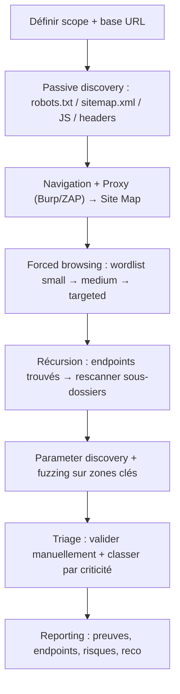

# Content Discovery — Cours complet (WebSec 0x04)

> **Cadre** : toutes les techniques et commandes ci‑dessous doivent être utilisées **uniquement** dans un environnement **autorisé** (lab Holberton / machine cible / scope défini).  
> **Objectif** : cartographier la surface d’attaque Web en découvrant des **endpoints**, **répertoires**, **fichiers**, **API routes**, et fonctionnalités **non liées** (unlinked / hidden content).

---

## Table des matières

1. [Définition : c’est quoi le *content discovery* ?](#définition--cest-quoi-le-content-discovery-)
2. [Pourquoi c’est important ?](#pourquoi-cest-important-)
3. [Ce qu’on cherche : répertoires, fichiers, endpoints, paramètres](#ce-quon-cherche--répertoires-fichiers-endpoints-paramètres)
4. [Méthodes de content discovery](#méthodes-de-content-discovery)
   - 4.1 [Passive discovery](#41-passive-discovery)
   - 4.2 [Active discovery](#42-active-discovery)
   - 4.3 [Forced browsing / directory bruteforce](#43-forced-browsing--directory-bruteforce)
   - 4.4 [Fuzzing : chemins, extensions, paramètres](#44-fuzzing--chemins-extensions-paramètres)
5. [Comprendre le directory bruteforcing](#comprendre-le-directory-bruteforcing)
6. [Wordlists : le carburant de l’énumération](#wordlists--le-carburant-de-lénumération)
7. [Outils principaux](#outils-principaux)
   - 7.1 [Gobuster](#71-gobuster)
   - 7.2 [Feroxbuster](#72-feroxbuster)
   - 7.3 [DirBuster (GUI)](#73-dirbuster-gui)
   - 7.4 [Dirb](#74-dirb)
   - 7.5 [ffuf, wfuzz](#75-ffuf-wfuzz)
   - 7.6 [Nikto](#76-nikto)
8. [Burp Suite pour le content discovery](#burp-suite-pour-le-content-discovery)
9. [OWASP ZAP pour le content discovery](#owasp-zap-pour-le-content-discovery)
10. [Gérer les pièges : wildcard, faux positifs, WAF, rate-limit](#gérer-les-pièges--wildcard-faux-positifs-waf-rate-limit)
11. [Méthodologie “pro” (workflow)](#méthodologie-pro-workflow)
12. [Livrables & preuve (reporting)](#livrables--preuve-reporting)
13. [Exercices guidés (lab)](#exercices-guidés-lab)
14. [Cheat sheet](#cheat-sheet)
15. [Références](#références)

---

## Définition : c’est quoi le *content discovery* ?

Le **content discovery** (ou **content enumeration**) est l’ensemble des techniques visant à **découvrir** :
- des **ressources** accessibles via HTTP(S) (URL),
- **non visibles** dans la navigation “normale” (pas de lien dans l’UI),
- mais **présentes** sur le serveur (répertoires, fichiers, endpoints API, panels admin, backups…).

On parle souvent de :
- **unlinked content** : contenu accessible mais non relié par des liens,
- **forced browsing** : tenter d’accéder directement à des chemins “probables”,
- **predictable resource location** : les développeurs utilisent souvent des noms prévisibles (`/admin`, `/backup`, `/api/v1/…`).

---

## Pourquoi c’est important ?

Sans discovery, tu testes une app “à l’aveugle” :
- Tu ignores une partie de la surface d’attaque → tu rates des vulnérabilités.
- Les zones sensibles sont souvent **cachées** (admin, debug, old versions, staging).
- Les fuites classiques sont des **fichiers oubliés** : `.bak`, `.old`, `.zip`, `.sql`, `.env`, `swagger.json`, `openapi.yaml`, `config.php~`, etc.

**Impact sécurité** (exemples typiques) :
- accès à un **panel admin** non protégé,
- exposition de **backups** ou **logs** contenant des secrets,
- endpoints API non documentés → contournements auth,
- pages “legacy” vulnérables (XSS/SQLi/IDOR).

---

## Ce qu’on cherche : répertoires, fichiers, endpoints, paramètres

### 1) Répertoires
- `/admin/`, `/dashboard/`, `/internal/`, `/uploads/`, `/api/`, `/v1/`, `/static/`

### 2) Fichiers
- `robots.txt`, `sitemap.xml`, `swagger.json`
- `.env`, `.git/`, `.DS_Store`, `config.yml`
- backups : `index.php.bak`, `db.sql`, `site.zip`

### 3) Endpoints dynamiques / routes
- `/login`, `/register`, `/reset`, `/profile/edit`
- `/api/users`, `/api/orders`, `/graphql`

### 4) Paramètres & fonctionnalités “cachées”
- `?debug=true`, `?admin=1`, `?redirect=…`
- paramètres non documentés dans les formulaires
- champs JSON dans POST/PUT

---

## Méthodes de content discovery

### 4.1 Passive discovery

But : collecter un maximum d’indices **sans** bruteforce.

**Sources** :
- **HTML/JS** : regarder les routes appelées par le front (fetch/XHR).
- **Commentaires** : parfois des URLs cachées.
- **Headers** : `Server`, `X-Powered-By`, `Location`, etc.
- `robots.txt` & `sitemap.xml`
- **Historique** : outils, caches, archive (selon scope).

**Exemples d’indices dans JS** :
- `/api/v2/users`
- `/admin/reports`
- `GET /debug/status`

> Astuce : en lab, l’analyse du front (DevTools / Burp Proxy) donne souvent 30–60% de la cartographie “gratuitement”.

---

### 4.2 Active discovery

But : explorer activement via crawler/spider + navigation.

Techniques :
- Naviguer l’app “comme un user”
- Lancer un **crawler** (Burp / ZAP) → construit une **site map**
- Tester manuellement des chemins “logiques” :
  - `/admin`, `/administrator`, `/manage`
  - `/api`, `/graphql`, `/swagger`

---

### 4.3 Forced browsing / directory bruteforce

But : tester des milliers de chemins issus d’une **wordlist**.

Principe :
- Pour chaque mot `w` dans la wordlist, le tool teste :
  - `GET /w` (ou `/w/`)
  - et/ou `GET /w.ext` (selon extensions)
- Il observe la réponse :
  - code HTTP (200/301/302/401/403/500…)
  - taille de réponse
  - temps de réponse
  - pattern (wildcard)

---

### 4.4 Fuzzing : chemins, extensions, paramètres

**Fuzzing** = injecter une liste de payloads dans une partie variable d’une requête.

- **Path fuzzing** : `/FUZZ`
- **Extension fuzzing** : `index.FUZZ` (php, asp, aspx, js…)
- **Param fuzzing** : `?FUZZ=value` ou `?param=FUZZ`
- **Body fuzzing** : JSON/POST

Exemple conceptuel :

```text
GET /api/v1/FUZZ HTTP/1.1
Host: target
```

OU

```text
GET /search?q=FUZZ HTTP/1.1
Host: target
```

---

## Comprendre le directory bruteforcing

### Comment ça marche, concrètement ?

1. Tu choisis une base URL : `http://TARGET/`
2. Tu choisis une wordlist : `common.txt`
3. Le tool “fabrique” des URLs :  
   - `/admin`, `/login`, `/uploads`, …
4. Il envoie des requêtes HTTP en parallèle (threads)
5. Il filtre / affiche les hits significatifs

### Pourquoi on a des faux positifs ?

- Certaines apps renvoient **200** sur tout, avec une page “Not found” custom.
- Certains serveurs redirigent tout (302) vers `/login`.
- Certains WAF/CDN modifient les réponses sous charge.

👉 D’où l’importance des filtres (codes, taille, regex) et de tests manuels.

---

## Wordlists : le carburant de l’énumération

Une **wordlist** est une liste de mots (un par ligne) utilisée pour générer des chemins/paramètres.

### Où les trouver (Kali) ?
- `/usr/share/wordlists/`
- **SecLists** (souvent dans `/usr/share/seclists/` si installé)

### Types utiles
- **small/common** : rapide, bon signal/bruit
- **medium** : meilleur coverage
- **large** : long, plus de bruit
- **extensions** : `.php`, `.html`, `.bak`, `.zip`, `.sql`, etc.
- **params** : `id`, `user`, `token`, `debug`, `redirect`, …

### Construire une wordlist “intelligente”
- Prendre les mots vus dans l’app (menu, JS, API paths)
- Ajouter des variantes :
  - `admin`, `administrator`, `admin-panel`
  - `backup`, `backups`, `backup.zip`
- Ajouter des **technos** détectées :
  - PHP → `.php`, `.phps`
  - ASP.NET → `.aspx`
  - Node → `.js` (moins pour routes, plus pour assets)

---

## Outils principaux

> Tous ces outils font la même chose “au fond” : **forcer des URLs** via une wordlist, avec des filtres.

### 7.1 Gobuster

**Gobuster** est un outil CLI rapide (Go) pour brute‑forcer :
- **répertoires/fichiers** (mode `dir`)
- DNS (subdomains) et vhosts (hors scope ici, mais utile en recon)

#### Template minimal (dir)
```bash
gobuster dir -u http://TARGET -w /path/to/wordlist.txt
```

#### Avec extensions + threads + user-agent
```bash
gobuster dir -u http://TARGET -w /path/to/wordlist.txt -x php,txt,html,bak -t 50 -a "Mozilla/5.0"
```

#### Codes à inclure/exclure
- inclure : `-s 200,204,301,302,307,401,403`
- exclure : `-b 404`

> Lecture rapide : 200 = OK, 301/302 = redirection (souvent intéressant), 401/403 = existe mais protégé (aussi intéressant).

---

### 7.2 Feroxbuster

**Feroxbuster** (Rust) se distingue par le **récursif** :
- découvre un dossier `/admin/`
- puis brute‑force *dans* `/admin/` automatiquement (selon options)

#### Scan simple
```bash
feroxbuster -u http://TARGET -w /path/to/wordlist.txt
```

#### Récursion + profondeur + extensions + filtre
```bash
feroxbuster -u http://TARGET -w /path/to/wordlist.txt -x php,txt,html,bak -d 2 --status-codes 200 301 302 401 403
```

#### Utiliser un proxy (Burp)
```bash
feroxbuster -u http://TARGET -w /path/to/wordlist.txt --proxy http://127.0.0.1:8080
```

---

### 7.3 DirBuster (GUI)

**DirBuster** est un outil **GUI** (Java) historique OWASP.
- pratique pour visualiser, comparer des wordlists, régler finement
- souvent plus lent que les tools modernes CLI, mais utile pédagogiquement

Workflow GUI :
1. target URL
2. wordlist
3. threads
4. extensions
5. run → analyser résultats

---

### 7.4 Dirb

**dirb** est “old school” mais simple :
- rapide à lancer
- wordlists basiques
- moins flexible que ferox/ffuf

Exemple :
```bash
dirb http://TARGET /path/to/wordlist.txt
```

---

### 7.5 ffuf, wfuzz

Ici on passe à la logique “fuzzer” :
- injection dans URL / param / body
- filtres avancés (status, taille, mots, regex)

#### ffuf (path fuzzing)
```bash
ffuf -u http://TARGET/FUZZ -w /path/to/wordlist.txt -mc 200,301,302,401,403
```

#### ffuf (extensions)
```bash
ffuf -u http://TARGET/FUZZ -w /path/to/wordlist.txt -e .php,.txt,.bak -mc 200,301,302,401,403
```

#### wfuzz (filtres 404/403)
```bash
wfuzz -c -z file,/path/to/wordlist.txt --hc 404 http://TARGET/FUZZ
```

> `--hc` = hide code (cache les réponses 404).  
> Les filtres taille (`-fs`), mots (`-fw`) et lignes (`-fl`) sont tes meilleurs amis contre les wildcard.

---

### 7.6 Nikto

**Nikto** est un scanner web orienté :
- fichiers “dangereux” connus
- mauvaises configs
- versions vulnérables (à confirmer ensuite)

Ça complète le content discovery (pas un bruteforcer pur).

Exemple :
```bash
nikto -h http://TARGET
```

---

## Burp Suite pour le content discovery

Burp sert à **cartographier** + **découvrir** :
- tu proxifies ta navigation → Burp construit une **Site map**
- tu lances la fonctionnalité **Discover content** (Engagement tools)
- tu peux ensuite envoyer les URLs dans Repeater/Intruder/Scanner (selon édition)

### À quoi ça sert vraiment ?
- découvrir du contenu non lié que le crawler classique ne voit pas
- s’appuyer sur tes requêtes réelles (auth, cookies, headers) → plus efficace

### Workflow (concept)
1. Proxy ON → browse app (login, sections)
2. Target → Site map → choisir host
3. Engagement tools → Discover content
4. Configurer :
   - wordlist
   - types de requêtes
   - filtres
   - profondeur
5. Lancer, puis trier les hits

---

## OWASP ZAP pour le content discovery

ZAP offre plusieurs angles :

### 1) Spider / Crawl
Le **Spider** visite des URLs seed, extrait les liens, et explore récursivement.

### 2) Forced Browse
“Forced Browse” tente des chemins depuis une wordlist (logique DirBuster), sans dépendre des liens.

### 3) Fuzzer
ZAP peut fuzz des paramètres/requêtes (via l’UI ou API), utile pour :
- parameter discovery
- variations de path
- tests sur JSON

---

## Gérer les pièges : wildcard, faux positifs, WAF, rate-limit

### Wildcard responses (le piège n°1)
Symptôme :
- `/thispagedoesnotexist` → 200 OK avec une page “Not found”
- ton bruteforce affiche des milliers de faux hits

Contre‑mesures :
- comparer la **taille** des réponses : un vrai `/admin` aura souvent une taille différente
- filtrer par **length/words/lines** (ffuf/wfuzz)
- tester un chemin aléatoire pour “apprendre” la signature du faux 200

### Redirections massives
Exemple :
- tout redirige vers `/login` (302)
- tu vois 302 partout

Contre‑mesures :
- suivre la redirection et comparer la destination
- filtrer par `Location` si l’outil le permet
- scanner en étant authentifié (cookies)

### Rate limiting / WAF
Symptômes :
- 429 Too Many Requests
- temps de réponse explose
- blocage IP

Contre‑mesures :
- réduire threads
- ajouter délai
- varier User-Agent (pas magique, mais parfois)
- respecter le scope (en lab, te limite pas à l’absurde : tu veux apprendre, pas DOS)

---

## Méthodologie “pro” (workflow)

### Vue d’ensemble



### Checklist rapide
- [ ] Ai‑je fait un login et proxifié la session ?
- [ ] Ai‑je récupéré robots/sitemap ?
- [ ] Ai‑je analysé le JS pour des routes API ?
- [ ] Ai‑je lancé un bruteforce “small” (rapide) ?
- [ ] Ai‑je adapté la wordlist à la techno ?
- [ ] Ai‑je géré wildcard et redirections ?
- [ ] Ai‑je relancé sur les dossiers trouvés (récursif) ?
- [ ] Ai‑je fait un mini fuzz de paramètres ?

---

## Livrables & preuve (reporting)

Ce que tu dois être capable de produire (même en projet Holberton) :
- **liste des endpoints** découverts (avec méthode)
- **captures** (ou logs) montrant :
  - commande
  - résultat (200/301/403…)
- tri par catégories :
  - admin / auth / upload / api / debug / backups
- hypothèses de risque :
  - “403 sur /admin/ → existe, vérifier contrôle d’accès”
  - “/backup.zip accessible → fuite de code potentielle”
- recommandations :
  - retirer fichiers sensibles
  - fermer endpoints legacy
  - authent + least privilege
  - désactiver directory listing
  - headers de sécurité

---

## Exercices guidés (lab)

> Fais-les dans l’ordre, et écris tes conclusions (1–2 lignes) après chaque étape.

### Exo 1 — Passive discovery “propre”
1. Trouver `robots.txt` et `sitemap.xml` si présents
2. Ouvrir la page d’accueil + inspecter le JS → noter les routes

✅ Résultat attendu : une liste d’URLs candidates (5–20).

### Exo 2 — Bruteforce *small* (signal rapide)
1. Lancer un scan avec une wordlist **petite**
2. Garder seulement `200/301/302/401/403`

✅ Résultat attendu : quelques hits pertinents + une idée du comportement 404.

### Exo 3 — Détection wildcard
1. Tester un chemin random : `/qzjzqzjzqzjz`
2. Comparer :
   - status code
   - taille
   - contenu

✅ Résultat attendu : décider si tu dois filtrer par taille/words.

### Exo 4 — Récursion
1. Si tu trouves `/admin/` ou `/api/`, rescanner ce sous-chemin
2. Noter les nouveaux endpoints

✅ Résultat attendu : découvrir des endpoints plus profonds.

### Exo 5 — Parameter discovery (simple)
1. Choisir un endpoint qui prend des paramètres (ex: `/search`)
2. Fuzzer une liste de paramètres (petite)

✅ Résultat attendu : identifier un paramètre “réel” (différence de réponse).

---

## Cheat sheet

### Codes HTTP utiles (discovery)
- **200** : existe (value)
- **301/302/307** : redirige (souvent value)
- **401** : existe mais nécessite auth
- **403** : existe mais interdit (très intéressant)
- **404** : absent (normal)
- **429** : rate-limit (ralentir)

### Heuristiques “rapid triage”
- `/admin`, `/manage`, `/console`, `/debug` → zones sensibles
- `/uploads`, `/files`, `/static` → risques d’upload / leak
- `swagger`, `openapi`, `graphql` → surface API importante
- `backup`, `.zip`, `.bak`, `.old`, `.sql` → fuite potentielle

---

## Exigences projet (rappel Holberton / Kali)

### “Scripts 1 ligne”
Si ton projet exige : `wc -l file` = **1**
- ton fichier doit contenir **une seule commande** (pas de shebang, pas de commentaires)
- exemple de fichier (une ligne) :

```bash
gobuster dir -u http://TARGET -w /usr/share/wordlists/dirb/common.txt -x php,txt,html -t 50 -s 200,301,302,401,403
```

### “Finir par une nouvelle ligne”
Beaucoup d’outils Unix attendent une fin de ligne POSIX (EOF newline).  
Sans newline, certains parsers, diff, linters ou scripts de correction peuvent mal interpréter la dernière ligne.

---

## Références

- OWASP Web Security Testing Guide (Information Gathering / Content review)
- PortSwigger Burp Suite docs (Discover content, Site map)
- OWASP ZAP docs (Spider, Forced Browse)
- Kali Tools docs (DirBuster, Feroxbuster)
- Docs GitHub des outils (Gobuster, Feroxbuster, ffuf, nikto)

> Note : le terme **“sfuzz”** est ambigu. Dans le contexte web, les outils les plus standards pour fuzzing/discovery sont **ffuf** et **wfuzz**. “SFuzz” existe aussi comme fuzzer académique (autre contexte), donc vérifie ce que ton module Holberton vise exactement.
