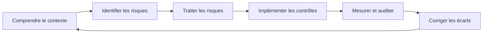
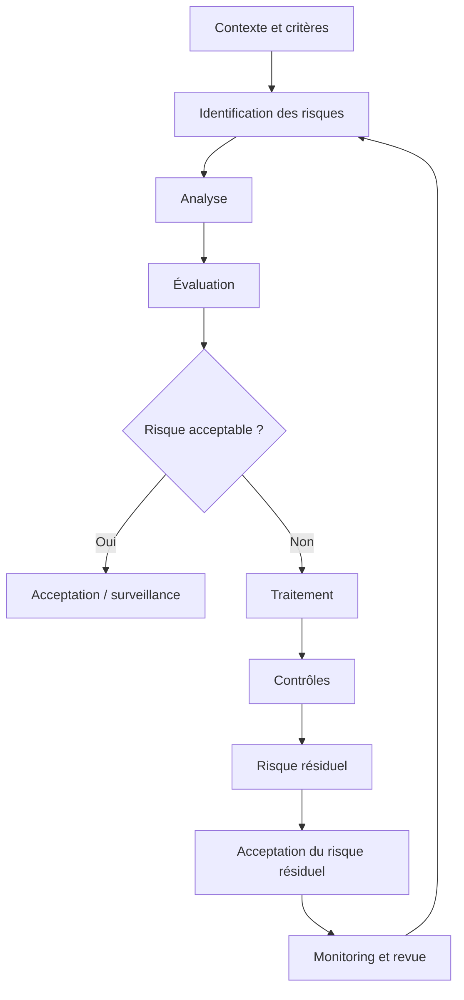

# Cours — ISO/IEC 2700X : SMSI, ISO 27001, ISO 27002 et ISO 27005

> **Objectif du cours :** comprendre la famille ISO/IEC 27000, savoir analyser un audit de sécurité, identifier des non-conformités, les rattacher correctement à ISO/IEC 27001, proposer des contrôles ISO/IEC 27002 adaptés, gérer les risques avec ISO/IEC 27005 et rédiger un rapport professionnel destiné au management.

---

## Table des matières

1. [Introduction à la famille ISO/IEC 27000](#1-introduction-à-la-famille-isoiec-27000)
2. [Les objectifs de la sécurité de l'information](#2-les-objectifs-de-la-sécurité-de-linformation)
3. [Le SMSI / ISMS](#3-le-smsi--isms)
4. [ISO/IEC 27001 : les exigences du SMSI](#4-isoiec-27001--les-exigences-du-smsi)
5. [L'Annexe A d'ISO/IEC 27001:2022](#5-lannexe-a-disoiec-270012022)
6. [ISO/IEC 27002 : mise en œuvre des contrôles](#6-isoiec-27002--mise-en-œuvre-des-contrôles)
7. [ISO/IEC 27005 : gestion des risques](#7-isoiec-27005--gestion-des-risques)
8. [Différences entre les versions 2013 et 2022](#8-différences-entre-les-versions-2013-et-2022)
9. [Analyser un audit et identifier une non-conformité](#9-analyser-un-audit-et-identifier-une-non-conformité)
10. [Asset management, sécurité physique et sauvegardes](#10-asset-management-sécurité-physique-et-sauvegardes)
11. [Actions correctives et amélioration continue](#11-actions-correctives-et-amélioration-continue)
12. [Exemples pratiques de contrôles ISO/IEC 27002](#12-exemples-pratiques-de-contrôles-isoiec-27002)
13. [Conformité : GDPR, HIPAA et PCI DSS](#13-conformité--gdpr-hipaa-et-pci-dss)
14. [Éthique, preuves et anonymisation](#14-éthique-preuves-et-anonymisation)
15. [Rédiger un vulnerability assessment report](#15-rédiger-un-vulnerability-assessment-report)
16. [Exemple complet d'analyse de non-conformités](#16-exemple-complet-danalyse-de-non-conformités)
17. [Partager correctement le rapport dans Google Docs](#17-partager-correctement-le-rapport-dans-google-docs)
18. [Fiche de révision](#18-fiche-de-révision)
19. [Questions de révision](#19-questions-de-révision)
20. [Références](#20-références)

---

# 1. Introduction à la famille ISO/IEC 27000

La famille **ISO/IEC 27000** regroupe des standards internationaux consacrés à la sécurité de l'information.

Elle ne concerne pas uniquement la cybersécurité technique.

Elle couvre notamment :

- la gouvernance ;
- les politiques ;
- la gestion des risques ;
- les ressources humaines ;
- les fournisseurs ;
- les actifs ;
- les locaux ;
- les systèmes informatiques ;
- les accès ;
- la cryptographie ;
- les incidents ;
- la continuité d'activité ;
- les sauvegardes ;
- les audits ;
- l'amélioration continue.

L'idée centrale est la suivante :

> Une organisation ne peut pas protéger correctement son information avec uniquement des outils techniques. Elle doit mettre en place un **système de management** permettant d'identifier ses risques, de sélectionner des mesures de sécurité adaptées, de vérifier leur efficacité et de les améliorer en permanence.

## 1.1 Les standards importants

| Standard | Rôle principal |
|---|---|
| **ISO/IEC 27000** | Vocabulaire et principes généraux de la famille 27000 |
| **ISO/IEC 27001** | Exigences pour établir et maintenir un SMSI |
| **ISO/IEC 27002** | Guide pratique des contrôles de sécurité |
| **ISO/IEC 27005** | Gestion des risques de sécurité de l'information |
| ISO/IEC 27017 | Contrôles de sécurité spécifiques au cloud |
| ISO/IEC 27018 | Protection des données personnelles dans le cloud public |
| ISO/IEC 27035 | Gestion des incidents de sécurité |
| ISO/IEC 27031 | Préparation des TIC à la continuité d'activité |
| ISO/IEC 27701 | Management de la protection de la vie privée |

Pour ce projet, les trois standards fondamentaux sont :

```text
ISO/IEC 27001
    ↓ définit les exigences du SMSI

ISO/IEC 27002
    ↓ explique comment appliquer des contrôles de sécurité

ISO/IEC 27005
    ↓ aide à identifier, analyser, évaluer et traiter les risques
```

---

# 2. Les objectifs de la sécurité de l'information

ISO/IEC 27001 s'appuie sur trois propriétés fondamentales.

## 2.1 Confidentialité

La **confidentialité** signifie que l'information n'est accessible qu'aux personnes, systèmes ou processus autorisés.

### Exemples de perte de confidentialité

- mot de passe exposé dans un fichier GitHub public ;
- base de données client accessible sans authentification ;
- document RH envoyé au mauvais destinataire ;
- sauvegarde non chiffrée volée ;
- utilisateur disposant de privilèges excessifs.

### Contrôles possibles

- contrôle d'accès ;
- MFA ;
- chiffrement ;
- classification des données ;
- gestion des droits ;
- segmentation réseau.

---

## 2.2 Intégrité

L'**intégrité** garantit que l'information reste correcte, complète et n'est pas modifiée de façon non autorisée.

### Exemples

- modification d'une facture ;
- altération d'un fichier système ;
- injection SQL modifiant une base de données ;
- malware modifiant des exécutables ;
- utilisateur modifiant des logs.

### Contrôles possibles

- contrôle des permissions ;
- signatures numériques ;
- hashing ;
- journalisation ;
- File Integrity Monitoring ;
- gestion des changements.

---

## 2.3 Disponibilité

La **disponibilité** signifie que l'information et les services sont accessibles lorsqu'ils sont nécessaires.

### Exemples de perte de disponibilité

- ransomware ;
- panne de serveur ;
- attaque DDoS ;
- panne électrique ;
- suppression accidentelle d'une base ;
- sauvegarde inutilisable.

### Contrôles possibles

- sauvegardes ;
- redondance ;
- haute disponibilité ;
- PCA/PRA ;
- protection DDoS ;
- supervision.

---

## 2.4 La triade CIA

Ces trois propriétés forment la célèbre **CIA Triad** :

```text
Confidentiality
      /\
     /  \
    /    \
Integrity ---- Availability
```

Selon le contexte, d'autres propriétés peuvent également être importantes :

- authenticité ;
- traçabilité ;
- responsabilité ;
- non-répudiation ;
- fiabilité.

---

# 3. Le SMSI / ISMS

**SMSI** signifie :

> **Système de Management de la Sécurité de l'Information**

En anglais :

> **ISMS — Information Security Management System**

Un SMSI n'est pas un logiciel.

Il s'agit d'un ensemble organisé de :

- politiques ;
- responsabilités ;
- procédures ;
- processus ;
- contrôles ;
- ressources ;
- indicateurs ;
- audits ;
- mécanismes d'amélioration.

## 3.1 But du SMSI

Le SMSI sert à :

1. comprendre le contexte de l'organisation ;
2. identifier les informations importantes ;
3. identifier les menaces et vulnérabilités ;
4. évaluer les risques ;
5. choisir comment traiter ces risques ;
6. mettre en place des contrôles adaptés ;
7. mesurer leur efficacité ;
8. corriger les problèmes ;
9. améliorer continuellement le niveau de sécurité.

---

## 3.2 Scope — périmètre du SMSI

Une organisation doit définir précisément le **scope**, c'est-à-dire le périmètre du SMSI.

Exemple :

> Le SMSI couvre la plateforme SaaS de l'entreprise, les serveurs de production, les employés techniques, les bureaux de Paris et les fournisseurs participant à l'hébergement du service.

Un mauvais scope serait :

> Le SMSI couvre la sécurité informatique.

C'est trop vague.

Un bon périmètre doit permettre de comprendre :

- quelles activités sont incluses ;
- quels sites sont concernés ;
- quelles équipes sont concernées ;
- quelles infrastructures sont concernées ;
- quels systèmes sont concernés ;
- quelles interfaces avec des tiers existent.

---

## 3.3 Cycle d'amélioration

Un SMSI fonctionne comme une boucle.



On retrouve souvent cette logique sous la forme **PDCA** :

- **Plan** : planifier ;
- **Do** : mettre en œuvre ;
- **Check** : vérifier ;
- **Act** : corriger et améliorer.

La norme 27001:2022 n'est pas simplement une checklist technique : elle impose surtout qu'un système de management cohérent fonctionne dans la durée.

---

# 4. ISO/IEC 27001 : les exigences du SMSI

## 4.1 Une distinction fondamentale

**ISO/IEC 27001** contient les exigences auxquelles un SMSI doit satisfaire.

C'est la norme utilisée pour la certification d'un SMSI.

**ISO/IEC 27002**, elle, fournit des recommandations pour les contrôles.

Retenir :

```text
27001 = WHAT / exigences
27002 = HOW / recommandations de contrôle
27005 = RISK / gestion du risque
```

---

# 4.2 Structure des clauses 4 à 10

Les exigences principales d'ISO/IEC 27001:2022 sont organisées autour des clauses :

| Clause | Sujet |
|---|---|
| **4** | Context of the organization |
| **5** | Leadership |
| **6** | Planning |
| **7** | Support |
| **8** | Operation |
| **9** | Performance evaluation |
| **10** | Improvement |

Les clauses 1 à 3 concernent principalement :

- scope ;
- références normatives ;
- termes et définitions.

---

# 4.3 Clause 4 — Context of the organization

Avant de protéger une organisation, il faut comprendre son contexte.

La clause 4 demande notamment de déterminer :

- les enjeux internes ;
- les enjeux externes ;
- les parties intéressées ;
- leurs exigences pertinentes ;
- le périmètre du SMSI ;
- les processus nécessaires au fonctionnement du SMSI.

## Exemple

Une entreprise SaaS peut avoir comme enjeux externes :

- obligations RGPD ;
- exigences contractuelles des clients ;
- cybermenaces ;
- dépendance à AWS ;
- exigences des assureurs.

Enjeux internes :

- petite équipe sécurité ;
- dette technique ;
- télétravail ;
- forte croissance ;
- utilisation de nombreux services cloud.

---

# 4.4 Clause 5 — Leadership

La sécurité ne doit pas être uniquement le problème de l'équipe IT.

La direction doit démontrer son implication.

Elle doit notamment :

- soutenir le SMSI ;
- établir une politique de sécurité ;
- attribuer des rôles et responsabilités ;
- fournir une direction claire ;
- s'assurer que les objectifs de sécurité sont compatibles avec ceux de l'entreprise.

### Mauvais exemple

> « Le RSSI s'occupe de toute la sécurité. La direction ne participe pas. »

### Bon exemple

La direction :

- approuve la politique de sécurité ;
- examine les risques majeurs ;
- accepte les risques résiduels appropriés ;
- attribue un budget ;
- participe aux revues de direction.

---

# 4.5 Clause 6 — Planning

La clause 6 est centrale.

Elle traite notamment :

- des risques et opportunités ;
- de l'évaluation des risques de sécurité ;
- du traitement des risques ;
- des objectifs de sécurité ;
- de la planification des changements.

## Clause 6.1.2 — Information security risk assessment

L'organisation doit disposer d'un processus cohérent pour :

- définir des critères de risque ;
- identifier les risques ;
- analyser les risques ;
- évaluer les risques ;
- identifier les propriétaires des risques.

## Clause 6.1.3 — Information security risk treatment

L'organisation doit ensuite décider comment traiter les risques.

Elle doit notamment :

1. sélectionner les options de traitement ;
2. déterminer les contrôles nécessaires ;
3. comparer les contrôles retenus avec l'Annexe A ;
4. produire la **Statement of Applicability** ;
5. établir un plan de traitement des risques ;
6. obtenir l'approbation appropriée.

---

# 4.6 Statement of Applicability — SoA

La **Statement of Applicability**, ou **Déclaration d'applicabilité**, est un document essentiel.

Elle explique notamment :

- quels contrôles sont nécessaires ;
- pourquoi ils sont nécessaires ;
- si les contrôles sont implémentés ;
- pourquoi certains contrôles de l'Annexe A ne sont pas applicables.

Exemple simplifié :

| Contrôle | Applicable ? | Justification | Statut |
|---|---:|---|---|
| A.5.9 Inventaire des actifs | Oui | Nécessaire pour gérer les actifs critiques | Implémenté |
| A.7.4 Surveillance physique | Oui | Salle serveur sur site | Partiel |
| A.8.13 Sauvegarde | Oui | Risque de perte de données | Implémenté |
| Contrôle sans rapport avec le contexte | Non | Pas d'activité concernée | N/A |

### Point important

Les 93 contrôles de l'Annexe A ne sont pas automatiquement tous obligatoires.

L'organisation doit sélectionner les contrôles nécessaires selon :

- son contexte ;
- ses risques ;
- ses obligations ;
- ses besoins métiers.

En revanche, elle doit justifier ses choix.

---

# 4.7 Clause 7 — Support

Un SMSI ne peut fonctionner sans ressources.

Cette clause traite notamment :

- ressources ;
- compétences ;
- sensibilisation ;
- communication ;
- documentation.

## Compétence

Une personne responsable d'une activité de sécurité doit avoir les compétences nécessaires.

Exemples :

- administrateur système formé au hardening ;
- analyste SOC capable d'analyser les alertes ;
- développeurs formés aux pratiques de secure coding.

## Awareness

Les employés doivent comprendre :

- la politique de sécurité ;
- leurs responsabilités ;
- les risques liés à leurs actions ;
- les conséquences du non-respect des règles.

## Documented information

La documentation doit être :

- identifiable ;
- maintenue ;
- protégée ;
- versionnée lorsque nécessaire ;
- accessible aux personnes autorisées.

---

# 4.8 Clause 8 — Operation

La clause 8 concerne l'exploitation réelle du SMSI.

Ce n'est plus seulement de la planification.

L'organisation doit exécuter ce qu'elle a prévu.

### 8.1 Operational planning and control

Les processus nécessaires doivent être :

- planifiés ;
- mis en œuvre ;
- contrôlés.

### 8.2 Information security risk assessment

Les évaluations de risque doivent être répétées :

- périodiquement ;
- après des changements importants.

### 8.3 Information security risk treatment

Les plans de traitement doivent réellement être exécutés.

---

# 4.9 Clause 9 — Performance evaluation

Il faut vérifier que le SMSI fonctionne réellement.

Cette clause couvre :

- monitoring ;
- measurement ;
- analysis ;
- evaluation ;
- internal audit ;
- management review.

## 9.1 Monitoring, measurement, analysis and evaluation

L'organisation doit déterminer :

- ce qu'elle doit mesurer ;
- comment ;
- à quelle fréquence ;
- qui mesure ;
- qui analyse ;
- comment les résultats sont utilisés.

### Exemples de KPI

- taux d'installation des patchs critiques sous 14 jours ;
- pourcentage d'employés ayant suivi la sensibilisation ;
- nombre d'incidents ;
- temps moyen de révocation d'un compte ;
- taux de succès des restaurations de sauvegarde ;
- nombre de vulnérabilités critiques ouvertes.

---

## 9.2 Internal audit

L'organisation doit réaliser des audits internes.

Le but est de vérifier que :

- le SMSI respecte les exigences internes ;
- le SMSI respecte ISO/IEC 27001 ;
- le SMSI est correctement implémenté et maintenu.

Un audit doit être :

- planifié ;
- objectif ;
- documenté ;
- réalisé par des personnes suffisamment indépendantes de l'activité auditée.

---

## 9.3 Management review

La direction doit périodiquement revoir le SMSI.

Elle peut examiner :

- résultats des audits ;
- incidents ;
- indicateurs ;
- risques ;
- actions correctives ;
- changements de contexte ;
- opportunités d'amélioration.

---

# 4.10 Clause 10 — Improvement

Deux idées principales :

- amélioration continue ;
- traitement des non-conformités.

## 10.1 Continual improvement

Le SMSI doit être continuellement amélioré.

## 10.2 Nonconformity and corrective action

Lorsqu'une non-conformité apparaît :

1. réagir ;
2. contrôler/corriger le problème ;
3. traiter les conséquences ;
4. rechercher la cause ;
5. déterminer si le problème peut apparaître ailleurs ;
6. mettre en place une action corrective ;
7. vérifier son efficacité ;
8. modifier le SMSI si nécessaire ;
9. conserver des preuves documentées.

---

# 5. L'Annexe A d'ISO/IEC 27001:2022

L'Annexe A contient un référentiel de contrôles de sécurité.

Dans l'édition 2022, les contrôles sont regroupés en quatre grandes familles.

| Famille | Type |
|---|---|
| **A.5** | Organizational controls |
| **A.6** | People controls |
| **A.7** | Physical controls |
| **A.8** | Technological controls |

L'édition 2022 contient **93 contrôles**.

Répartition :

- 37 contrôles organisationnels ;
- 8 contrôles liés aux personnes ;
- 14 contrôles physiques ;
- 34 contrôles technologiques.

---

## 5.1 Contrôles organisationnels

Ils concernent notamment :

- politiques ;
- rôles ;
- séparation des responsabilités ;
- threat intelligence ;
- gestion des actifs ;
- classification ;
- transfert d'information ;
- accès ;
- fournisseurs ;
- cloud ;
- incidents ;
- continuité ;
- exigences légales.

Exemples importants :

- inventaire des informations et actifs associés ;
- règles d'utilisation acceptable ;
- restitution des actifs ;
- classification de l'information ;
- gestion des fournisseurs ;
- sécurité des services cloud ;
- préparation des TIC à la continuité.

---

## 5.2 Contrôles liés aux personnes

Ils couvrent le facteur humain.

Exemples :

- vérifications préalables appropriées ;
- clauses contractuelles ;
- sensibilisation ;
- processus disciplinaire ;
- responsabilités après changement de poste ou départ ;
- accords de confidentialité ;
- télétravail ;
- signalement des événements de sécurité.

---

## 5.3 Contrôles physiques

Ils concernent la protection physique des informations et systèmes.

Exemples :

- périmètres de sécurité ;
- contrôle des entrées ;
- sécurisation des bureaux ;
- surveillance physique ;
- protection contre les menaces environnementales ;
- travail en zone sécurisée ;
- clean desk / clear screen ;
- protection des équipements ;
- actifs hors site ;
- supports de stockage ;
- alimentation et utilités ;
- câblage ;
- maintenance ;
- destruction ou réutilisation sécurisée.

---

## 5.4 Contrôles technologiques

Ils concernent les systèmes et technologies.

Exemples :

- endpoints ;
- comptes privilégiés ;
- restrictions d'accès ;
- accès au code source ;
- authentification ;
- capacité des systèmes ;
- protection contre les malwares ;
- vulnérabilités ;
- configuration ;
- suppression de données ;
- masking ;
- Data Loss Prevention ;
- sauvegardes ;
- redondance ;
- logging ;
- monitoring ;
- filtrage web ;
- cryptographie ;
- secure development ;
- secure coding ;
- tests ;
- séparation dev/test/prod ;
- change management.

---

# 6. ISO/IEC 27002 : mise en œuvre des contrôles

ISO/IEC 27002 ne remplace pas ISO/IEC 27001.

Elle complète l'Annexe A en donnant des indications pour comprendre et mettre en œuvre les contrôles.

## Exemple

ISO/IEC 27001 peut conduire à sélectionner le contrôle concernant les sauvegardes.

ISO/IEC 27002 aide à réfléchir à des questions comme :

- quelles données sauvegarder ?
- à quelle fréquence ?
- où stocker les copies ?
- combien de temps les conserver ?
- comment protéger leur confidentialité ?
- faut-il les chiffrer ?
- comment tester leur restauration ?
- comment surveiller les échecs ?

---

# 6.1 Les attributs des contrôles dans 27002:2022

La version 2022 introduit une approche permettant de catégoriser les contrôles selon différents attributs.

Cela permet par exemple de raisonner selon :

- le type de contrôle ;
- les propriétés de sécurité ;
- les concepts de cybersécurité ;
- les capacités opérationnelles ;
- les domaines de sécurité.

Exemple :

Un contrôle de sauvegarde contribue principalement à la **disponibilité**, mais peut aussi contribuer à l'intégrité.

Un contrôle de chiffrement contribue principalement à la **confidentialité** et parfois à l'intégrité.

---

# 6.2 Les 11 nouveaux contrôles marquants de 2022

Par rapport à la structure 2013, l'édition 2022 fait apparaître explicitement plusieurs sujets devenus essentiels :

1. threat intelligence ;
2. sécurité de l'utilisation des services cloud ;
3. préparation des TIC pour la continuité d'activité ;
4. surveillance physique ;
5. configuration management ;
6. information deletion ;
7. data masking ;
8. data leakage prevention ;
9. monitoring activities ;
10. web filtering ;
11. secure coding.

Ils reflètent l'évolution des environnements modernes :

- cloud ;
- DevSecOps ;
- surveillance ;
- protection contre l'exfiltration ;
- développement sécurisé ;
- résilience.

---

# 7. ISO/IEC 27005 : gestion des risques

La sécurité ISO est basée sur le **risque**.

On ne choisit pas un contrôle simplement parce qu'il « semble utile ».

On commence par comprendre les risques.

ISO/IEC 27005 fournit des lignes directrices pour la gestion des risques de sécurité de l'information.

> Note : les ressources de ce projet incluent ISO/IEC 27005:2018. Une édition ISO/IEC 27005:2022 existe aujourd'hui et remplace l'édition 2018. Les principes fondamentaux étudiés ici restent directement utiles.

---

# 7.1 Notions fondamentales

## Asset

Un actif est quelque chose ayant de la valeur pour l'organisation.

Exemples :

- données clients ;
- code source ;
- base de données ;
- serveur ;
- ordinateur ;
- contrat ;
- service cloud ;
- réputation ;
- processus métier.

---

## Threat

Une menace est une cause potentielle d'incident.

Exemples :

- cybercriminel ;
- ransomware ;
- employé malveillant ;
- erreur humaine ;
- incendie ;
- panne électrique ;
- fournisseur compromis.

---

## Vulnerability

Une vulnérabilité est une faiblesse exploitable.

Exemples :

- logiciel non patché ;
- mot de passe faible ;
- absence de MFA ;
- salle serveur non verrouillée ;
- backup accessible depuis le domaine Active Directory ;
- bucket cloud public.

---

## Risk

Un risque apparaît lorsqu'une menace peut exploiter une vulnérabilité et provoquer un impact.

Exemple :

```text
Actif :
Base clients

Menace :
Ransomware

Vulnérabilité :
Sauvegardes accessibles depuis les comptes administrateurs du domaine

Événement :
Le ransomware chiffre la production et les sauvegardes

Impact :
Indisponibilité du service + perte de données + impact financier

Risque :
Perte ou indisponibilité critique des données clients à la suite d'un ransomware
```

---

# 7.2 Processus de gestion du risque

Un processus simplifié peut être représenté ainsi :



---

# 7.3 Identifier le risque

Pour chaque risque, il faut comprendre :

- actif ;
- menace ;
- vulnérabilité ;
- scénario ;
- conséquences ;
- propriétaire du risque.

Une formulation claire est :

> En raison de **[vulnérabilité]**, **[menace]** pourrait provoquer **[événement]**, entraînant **[impact]** sur **[actif/processus]**.

---

# 7.4 Analyser le risque

Un modèle simple utilise :

```text
Risk score = Likelihood × Impact
```

Exemple :

| Niveau | Likelihood | Impact |
|---|---:|---:|
| Very Low | 1 | 1 |
| Low | 2 | 2 |
| Medium | 3 | 3 |
| High | 4 | 4 |
| Critical | 5 | 5 |

Exemple :

```text
Likelihood = 4
Impact = 5

Risk = 4 × 5 = 20 / 25
```

On pourrait décider :

| Score | Niveau |
|---:|---|
| 1–4 | Faible |
| 5–9 | Modéré |
| 10–14 | Élevé |
| 15–19 | Très élevé |
| 20–25 | Critique |

**Attention :** cette matrice est un exemple. ISO/IEC 27001 n'impose pas cette formule précise. L'organisation doit définir ses propres critères de risque cohérents.

---

# 7.5 Traitement du risque

Plusieurs stratégies existent.

## Réduire / modifier

Mettre en place des contrôles.

Exemple :

> MFA + PAM pour réduire le risque de compromission des comptes administrateurs.

## Éviter

Supprimer l'activité à l'origine du risque.

Exemple :

> Arrêter d'exposer un ancien service directement sur Internet.

## Partager / transférer

Partager une partie des conséquences avec un tiers.

Exemples :

- assurance cyber ;
- contrat avec un prestataire.

Cela ne fait pas disparaître toute responsabilité.

## Accepter / retenir

Décider que le risque résiduel est acceptable.

Cette décision doit être prise par la personne disposant de l'autorité appropriée.

---

# 7.6 Risque résiduel

Après la mise en place de contrôles, il reste généralement un risque.

```text
Risque initial
     ↓
Contrôles
     ↓
Risque résiduel
```

Exemple :

Avant MFA :

```text
Likelihood = 5
Impact = 5
Risk = 25
```

Après MFA + monitoring + conditional access :

```text
Likelihood = 2
Impact = 5
Risk = 10
```

Le contrôle réduit principalement la probabilité, mais l'impact potentiel d'un compte administrateur compromis reste élevé.

---

# 8. Différences entre les versions 2013 et 2022

Il est important de savoir reconnaître les deux versions car les documents de cours peuvent utiliser l'une ou l'autre.

## ISO/IEC 27001:2013

Annexe A :

- **114 contrôles** ;
- **14 domaines**.

Exemples de domaines :

- A.5 Information security policies ;
- A.6 Organization of information security ;
- A.7 Human resource security ;
- A.8 Asset management ;
- A.9 Access control ;
- A.10 Cryptography ;
- A.11 Physical and environmental security ;
- A.12 Operations security ;
- A.13 Communications security ;
- A.14 System acquisition, development and maintenance ;
- A.15 Supplier relationships ;
- A.16 Incident management ;
- A.17 Business continuity ;
- A.18 Compliance.

---

## ISO/IEC 27001:2022

Annexe A :

- **93 contrôles** ;
- **4 catégories**.

```text
A.5 Organizational
A.6 People
A.7 Physical
A.8 Technological
```

Le nombre de contrôles est plus faible parce que plusieurs anciens contrôles ont été :

- fusionnés ;
- réorganisés ;
- reformulés.

De nouveaux sujets modernes ont également été introduits.

---

# 8.1 Mapping pratique

| Sujet | Structure 2013 | Structure 2022 |
|---|---|---|
| Asset management | A.8 | Principalement A.5.9 à A.5.13 + contrôles connexes |
| Physical security | A.11 | A.7 |
| Backup | A.12.3 | A.8.13 |
| Cloud security | Plusieurs contrôles indirects | A.5.23 explicitement dédié |
| Secure coding | Réparti dans le développement | A.8.28 explicitement dédié |

---

# 9. Analyser un audit et identifier une non-conformité

C'est un point essentiel du projet.

## 9.1 Définition

Une **non-conformité** est le non-respect d'une exigence.

Dans un audit ISO/IEC 27001, il faut éviter d'écrire simplement :

> « Ce système n'est pas sécurisé. »

Il faut établir :

```text
Critère
   ↓
Preuve
   ↓
Écart
   ↓
Risque / conséquence
```

---

# 9.2 Les quatre éléments d'un finding solide

## 1. Criteria

Quelle exigence devait être respectée ?

Exemples :

- exigence ISO/IEC 27001 ;
- politique interne ;
- contrôle déclaré applicable dans la SoA ;
- procédure interne ;
- contrat ;
- obligation réglementaire.

## 2. Condition

Que constate-t-on réellement ?

Exemple :

> 17 ordinateurs portables actifs ne figurent pas dans l'inventaire des actifs.

## 3. Evidence

Quelles preuves démontrent cette situation ?

Exemples :

- export MDM ;
- fichier d'inventaire ;
- capture d'écran ;
- logs ;
- tickets ;
- entretiens ;
- configuration.

## 4. Impact / Risk

Pourquoi cela est-il important ?

> Des équipements non inventoriés peuvent ne pas recevoir les contrôles de sécurité attendus, ce qui augmente le risque de perte, de vol, de défaut de patching ou d'accès non autorisé.

---

# 9.3 Clause ISO vs contrôle Annex A

C'est un piège classique.

### Mauvaise formulation

> « L'entreprise viole la clause 5.9 d'ISO 27001. »

Pourquoi ?

Parce que **A.5.9 est un contrôle de l'Annexe A**, pas la clause 5.9 du corps principal de la norme.

### Meilleure formulation

> Le processus d'inventaire des actifs est incomplet. Le contrôle A.5.9, déclaré applicable dans la SoA, n'est pas correctement mis en œuvre. Cette situation remet également en cause l'efficacité du traitement du risque et des contrôles opérationnels associés.

Ensuite, selon les preuves, on peut rattacher le problème à des exigences du SMSI telles que :

- 6.1.2 — risk assessment ;
- 6.1.3 — risk treatment ;
- 8.1 — operational planning and control ;
- 9.1 — monitoring et evaluation ;
- 10.2 — corrective action, lorsque le problème est connu mais non corrigé.

---

# 9.4 Major, minor, observation

La terminologie exacte dépend de l'organisme d'audit, mais on rencontre généralement :

## Major non-conformity

Écart important ou défaillance systémique.

Exemples :

- absence complète de processus d'évaluation des risques ;
- aucun audit interne ;
- SoA inexistante ;
- processus essentiel du SMSI absent.

## Minor non-conformity

Écart limité ne remettant pas nécessairement en cause tout le système.

Exemple :

> Sur 100 comptes contrôlés, trois comptes d'anciens employés n'ont pas été désactivés selon le délai prévu par la procédure.

## Observation / Opportunity for improvement

Pas nécessairement une non-conformité, mais une faiblesse ou une possibilité d'amélioration.

---

# 9.5 Ne pas inventer une non-conformité

Une faiblesse technique n'est pas automatiquement une non-conformité ISO.

Il faut déterminer :

1. quel risque est concerné ;
2. quelles exigences internes existent ;
3. ce que dit la SoA ;
4. quels contrôles sont déclarés applicables ;
5. quelles preuves démontrent l'écart.

---

# 10. Asset management, sécurité physique et sauvegardes

Ce sont trois thèmes explicitement demandés dans les objectifs.

---

# 10.1 Asset management

## ISO/IEC 27001:2022 Annex A

Contrôles particulièrement pertinents :

### A.5.9 — Inventory of information and other associated assets

Objectif pratique :

> connaître les actifs, leur propriétaire et leur importance.

Un inventaire peut contenir :

| Champ | Exemple |
|---|---|
| Asset ID | LAP-00482 |
| Type | Laptop |
| Owner | IT Operations |
| User | employee-037 |
| Serial | anonymisé |
| OS | Windows 11 |
| Classification | Internal |
| Status | Active |
| Location | Paris |
| Last review | 2026-07-01 |

### A.5.10 — Acceptable use

Définir ce que les utilisateurs peuvent faire avec les actifs.

### A.5.11 — Return of assets

S'assurer que les actifs sont restitués lors :

- d'un départ ;
- d'un changement de poste ;
- de la fin d'un contrat.

### A.5.12 — Classification of information

Adapter la protection à la sensibilité.

Exemple :

```text
Public
Internal
Confidential
Restricted
```

### A.5.13 — Labelling of information

Mettre en œuvre un mécanisme de marquage approprié lorsque nécessaire.

---

## Exemple de non-conformité

### Finding

> Plusieurs laptops de production ne figurent pas dans l'inventaire officiel.

### Risques

- équipements oubliés lors des patchs ;
- actifs non chiffrés ;
- perte non détectée ;
- utilisateur non identifié ;
- mauvaise gestion du cycle de vie.

### Actions correctives

- centraliser l'inventaire ;
- synchroniser MDM/CMDB ;
- définir un asset owner ;
- imposer une procédure d'enregistrement ;
- revue mensuelle des écarts ;
- retirer les actifs inconnus du réseau.

---

# 10.2 Physical security

La sécurité de l'information ne concerne pas seulement les hackers.

Un attaquant qui entre physiquement dans une salle serveur peut contourner de nombreuses protections réseau.

## Famille A.7

Sujets importants :

- périmètres de sécurité ;
- contrôle des entrées ;
- sécurisation des locaux ;
- monitoring physique ;
- protection environnementale ;
- travail en zones sécurisées ;
- clean desk / clear screen ;
- emplacement et protection des équipements ;
- actifs hors site ;
- supports de stockage ;
- alimentation électrique ;
- câblage ;
- maintenance ;
- destruction/réutilisation.

---

## Exemple

### Constat

> La salle contenant les équipements réseau est accessible avec un badge standard attribué à l'ensemble des employés.

### Risque

Une personne non autorisée pourrait :

- débrancher un équipement ;
- connecter un rogue device ;
- voler un disque ;
- accéder à une console ;
- provoquer une interruption de service.

### Contrôles pertinents

- accès physique restreint ;
- journalisation des entrées ;
- badge spécifique ;
- vidéosurveillance selon le cadre légal ;
- revue régulière des autorisations ;
- visiteurs accompagnés.

---

# 10.3 Backup procedures

## Contrôle majeur

**A.8.13 — Information backup**

Une bonne stratégie de sauvegarde doit répondre à plusieurs questions :

- quoi sauvegarder ?
- à quelle fréquence ?
- où ?
- pendant combien de temps ?
- qui peut y accéder ?
- comment protéger les copies ?
- comment surveiller les échecs ?
- comment restaurer ?
- quand tester ?

---

## Le piège classique

> « Nous avons des backups, donc nous sommes protégés. »

Faux.

Une sauvegarde qui ne peut pas être restaurée est inutile.

Le processus doit inclure :

- vérification ;
- tests de restauration ;
- documentation ;
- gestion des erreurs ;
- protection contre les ransomwares.

---

## RPO et RTO

### RPO — Recovery Point Objective

Quantité maximale de données que l'organisation accepte potentiellement de perdre.

Exemple :

```text
RPO = 4 heures
```

Cela signifie que les sauvegardes ou mécanismes de réplication doivent permettre de revenir à un état vieux de 4 heures maximum selon le scénario prévu.

### RTO — Recovery Time Objective

Temps maximal visé pour remettre le service à disposition.

Exemple :

```text
RTO = 2 heures
```

---

## Stratégie 3-2-1

Une approche classique consiste à conserver :

- 3 copies des données ;
- sur 2 types de supports ou environnements distincts ;
- dont 1 copie séparée/off-site.

Dans les environnements modernes, on ajoute souvent :

- sauvegarde immutable ;
- séparation des identités ;
- stockage hors domaine ;
- copie offline lorsque le contexte le justifie.

---

## Contrôles connexes

### A.8.14 — Redundancy of information processing facilities

La redondance réduit le risque d'indisponibilité.

### A.5.30 — ICT readiness for business continuity

Préparer les systèmes informatiques à soutenir la continuité d'activité.

---

# 10.4 Quelles clauses ISO/IEC 27001 s'appliquent ?

Important :

Il n'existe pas dans les clauses 4 à 10 une clause appelée directement :

- « asset management » ;
- « physical security » ;
- « backup ».

Ces thèmes se trouvent surtout dans **l'Annexe A**.

En revanche, leur management peut être relié à plusieurs exigences de 27001 :

| Exigence | Application |
|---|---|
| **6.1.2** | Les risques liés aux actifs, locaux et pertes de données doivent être évalués |
| **6.1.3** | Les traitements et contrôles doivent être sélectionnés |
| **8.1** | Les mesures prévues doivent être exécutées |
| **8.2** | Les risques doivent être réévalués périodiquement ou après changements |
| **8.3** | Les plans de traitement doivent être mis en œuvre |
| **9.1** | L'efficacité doit être mesurée |
| **9.2** | Les processus doivent pouvoir être audités |
| **10.2** | Les non-conformités doivent être corrigées et leur cause traitée |

---

# 11. Actions correctives et amélioration continue

## 11.1 Correction vs corrective action

Ce n'est pas la même chose.

### Correction

Réparer le problème immédiatement.

Exemple :

> Désactiver le compte d'un ancien employé encore actif.

### Corrective action

Traiter la **cause racine** afin d'éviter que le problème se reproduise.

Exemple :

> Connecter automatiquement le processus RH de départ au système IAM afin de désactiver les comptes lors de l'offboarding.

---

# 11.2 Root cause analysis

Une action corrective efficace commence par comprendre pourquoi le problème est arrivé.

Une méthode simple :

## 5 Whys

Problème :

> Le compte d'un ancien employé est encore actif.

**Why 1:** pourquoi ?

> IT n'a pas reçu la demande de désactivation.

**Why 2:**

> RH a envoyé l'information par email.

**Why 3:**

> Il n'existe pas de workflow automatisé.

**Why 4:**

> Le processus d'offboarding n'a jamais été intégré à l'IAM.

**Root cause :**

> Processus RH/IT non intégré et absence de contrôle systématique.

Action corrective :

- workflow RH → IAM ;
- désactivation automatique ;
- revue quotidienne des départs ;
- contrôle périodique.

---

# 11.3 CAPA

On peut utiliser une logique **Corrective and Preventive Action**.

Exemple :

| Étape | Action |
|---|---|
| Finding | Backups jamais restaurés |
| Correction | Effectuer immédiatement un test |
| Root cause | Aucun test prévu dans la procédure |
| Corrective action | Ajouter un test trimestriel obligatoire |
| Owner | Infrastructure Manager |
| Due date | 30/09/2026 |
| Evidence | Rapport de restauration |
| Effectiveness | 100 % des tests trimestriels réussis |

---

# 11.4 Pourquoi l'amélioration continue est essentielle

Les risques évoluent.

Exemples :

- nouveaux logiciels ;
- nouvelles vulnérabilités ;
- nouveaux employés ;
- nouveaux fournisseurs ;
- migration cloud ;
- acquisitions ;
- nouvelles obligations ;
- évolution des attaquants.

Un SMSI figé devient rapidement obsolète.

---

# 11.5 Mécanismes d'amélioration

- audits internes ;
- audits externes ;
- pentests ;
- vulnerability scans ;
- exercices de crise ;
- post-mortems ;
- tests de restauration ;
- phishing simulations ;
- KPI/KRI ;
- risk reviews ;
- management reviews ;
- actions correctives ;
- retours d'incidents.

---

# 12. Exemples pratiques de contrôles ISO/IEC 27002

---

# 12.1 MFA

## Problème

Un mot de passe est compromis par phishing.

## Sans MFA

```text
Password stolen
    ↓
Attacker logs in
    ↓
Access granted
```

## Avec MFA

```text
Password stolen
    ↓
Second factor required
    ↓
Attack blocked in many common scenarios
```

### Risque réduit

- account takeover ;
- accès VPN ;
- accès aux outils cloud ;
- compromission administrative.

---

# 12.2 Least privilege

Chaque utilisateur ne reçoit que les droits nécessaires.

### Mauvais exemple

Tous les développeurs sont administrateurs de production.

### Bon exemple

- droits standard par défaut ;
- élévation temporaire ;
- approbation ;
- journalisation ;
- revue périodique.

---

# 12.3 Network segmentation

Architecture faible :

```text
Internet
   |
Firewall
   |
Flat LAN
   |
Everything
```

Si une machine est compromise, l'attaquant peut se déplacer plus facilement.

Architecture segmentée :

```text
Internet
   |
Firewall
   |
+-------------------+
| DMZ               |
+-------------------+
        |
Internal Firewall
        |
+-------+-------+---------+
| Users | Servers | Admin |
+-------+-------+---------+
```

---

# 12.4 Secure coding

Risques :

- SQL injection ;
- XSS ;
- command injection ;
- path traversal ;
- insecure deserialization ;
- broken access control.

Contrôles :

- guidelines secure coding ;
- code review ;
- SAST ;
- DAST ;
- dependency scanning ;
- secret scanning ;
- tests de sécurité ;
- formation développeurs.

---

# 12.5 Logging et monitoring

Exemples d'événements à surveiller :

- login failures ;
- ajout d'un compte admin ;
- modification d'une règle firewall ;
- désactivation d'un antivirus ;
- accès inhabituel ;
- téléchargement massif ;
- suppression de logs.

Les logs doivent eux-mêmes être protégés contre :

- suppression ;
- modification ;
- accès non autorisé.

---

# 12.6 Vulnerability management

Processus :

```text
Inventory
   ↓
Scan
   ↓
Validate
   ↓
Prioritize
   ↓
Remediate
   ↓
Verify
   ↓
Report
```

La priorité ne dépend pas uniquement du CVSS.

Exemple :

```text
CVSS élevé + serveur isolé + aucune donnée sensible
```

peut être moins urgent qu'une vulnérabilité légèrement moins élevée sur :

```text
VPN exposé à Internet + exploit public + privilèges élevés
```

Le contexte métier est essentiel.

---

# 13. Conformité : GDPR, HIPAA et PCI DSS

ISO/IEC 27001 n'existe pas dans le vide.

Une organisation peut devoir respecter :

- lois ;
- règlements ;
- contrats ;
- standards sectoriels.

## Important

> Être certifié ISO/IEC 27001 ne signifie pas automatiquement être conforme au GDPR, HIPAA ou PCI DSS.

La certification peut soutenir un programme de conformité mais ne remplace pas l'analyse juridique ou réglementaire.

---

# 13.1 GDPR / RGPD

Le règlement européen protège les données personnelles.

Pour la sécurité, des thèmes particulièrement importants sont :

- confidentialité ;
- intégrité ;
- disponibilité ;
- mesures techniques et organisationnelles ;
- gestion des risques ;
- résilience ;
- capacité à restaurer l'accès aux données ;
- tests et évaluation des mesures.

Pour une organisation européenne, ISO/IEC 27001 peut fournir une structure utile pour organiser ces mesures de sécurité.

Exemples de données personnelles :

- nom ;
- email ;
- IP lorsqu'elle permet d'identifier une personne dans le contexte ;
- identifiant client ;
- données RH ;
- données de localisation ;
- données de santé.

---

# 13.2 HIPAA

HIPAA concerne principalement le secteur de la santé aux États-Unis et la protection des informations de santé couvertes par son périmètre.

La Security Rule s'appuie notamment sur des safeguards :

- administratifs ;
- physiques ;
- techniques.

On retrouve donc des thèmes proches d'ISO :

- risk analysis ;
- access control ;
- physical security ;
- policies ;
- incident handling ;
- protection des informations électroniques de santé.

---

# 13.3 PCI DSS

PCI DSS concerne la protection des données de paiement.

Le standard établit une base d'exigences techniques et opérationnelles pour protéger les données de comptes de paiement.

Exemples de sujets :

- segmentation ;
- configurations sécurisées ;
- accès ;
- authentification ;
- chiffrement ;
- patching ;
- monitoring ;
- tests de sécurité.

ISO 27001 et PCI DSS peuvent être complémentaires mais ils ne sont pas équivalents.

---

# 13.4 Compliance matrix

Dans un rapport, on peut utiliser une matrice.

| Finding | ISO | GDPR | PCI DSS | HIPAA |
|---|---|---|---|---|
| Backups non testés | A.8.13 / A.5.30 | Potentiellement pertinent pour la disponibilité | Selon scope | Selon environnement ePHI |
| Accès excessif | Contrôles d'accès | Principe de protection appropriée | Très pertinent | Très pertinent |
| Salle serveur ouverte | A.7 | Mesure physique pertinente | Selon environnement | Physical safeguards |

**Attention :** ne jamais déclarer une violation légale uniquement sur la base d'un constat technique si l'analyse juridique n'a pas été réalisée.

---

# 14. Éthique, preuves et anonymisation

Un rapport de cybersécurité peut contenir des informations extrêmement sensibles.

Exemples :

- IP ;
- hostnames ;
- noms d'utilisateurs ;
- emails ;
- tokens ;
- API keys ;
- cookies ;
- secrets ;
- noms de clients ;
- captures d'écran de données ;
- architecture interne.

---

# 14.1 Principe du need-to-know

Une preuve doit montrer suffisamment d'informations pour démontrer le finding, mais pas davantage.

Mauvais :

```text
Admin password: SuperSecret123!
```

Bon :

```text
Admin password: [REDACTED]
```

---

# 14.2 Anonymiser les IP

Au lieu de :

```text
10.14.35.22
```

on peut écrire :

```text
APP-SRV-01
```

ou :

```text
10.14.x.x
```

si l'adresse complète n'est pas nécessaire.

---

# 14.3 Anonymiser les utilisateurs

Au lieu de :

```text
john.smith@company.com
```

utiliser :

```text
user-014@company.example
```

ou :

```text
[REDACTED USER]
```

---

# 14.4 Captures d'écran

Avant d'intégrer une capture :

- masquer les mots de passe ;
- masquer les tokens ;
- masquer les cookies ;
- masquer les données personnelles ;
- masquer les identifiants inutiles ;
- conserver uniquement la zone démontrant le problème.

---

# 14.5 Ne jamais altérer la signification

L'anonymisation ne doit pas détruire la valeur probante.

Exemple :

Si le problème est :

> plusieurs comptes sont administrateurs,

il faut montrer suffisamment d'éléments pour démontrer le nombre ou le type de comptes, sans nécessairement révéler leur identité réelle.

---

# 14.6 Éthique pendant l'audit

Bonnes pratiques :

- disposer d'une autorisation ;
- respecter le périmètre ;
- minimiser les impacts ;
- éviter les tests destructifs ;
- protéger les preuves ;
- signaler rapidement les risques critiques ;
- conserver la confidentialité ;
- respecter les règles d'engagement ;
- ne pas accéder à davantage de données que nécessaire.

---

# 15. Rédiger un vulnerability assessment report

Un bon rapport doit être utile à plusieurs publics :

### Direction

Veut savoir :

- quels sont les risques ;
- quel est l'impact métier ;
- quelles décisions prendre ;
- quelles priorités financer.

### IT / Security

Veut savoir :

- où est le problème ;
- comment le reproduire ;
- comment le corriger ;
- quelles preuves existent.

Un bon rapport doit donc combiner :

```text
Business impact
+
Technical evidence
+
ISO mapping
+
Corrective action
```

---

# 15.1 Structure recommandée

```text
1. Cover page
2. Document control
3. Executive summary
4. Scope
5. Objectives
6. Methodology
7. Risk rating methodology
8. Summary of findings
9. Detailed findings
10. ISO mapping
11. Corrective action plan
12. Residual risk
13. Compliance considerations
14. Continuous improvement
15. Conclusion
16. Appendices
```

---

# 15.2 Cover page

Exemple :

```text
INFORMATION SECURITY VULNERABILITY ASSESSMENT

Organization: Example Corp
Assessment type: Internal Security Assessment
Framework: ISO/IEC 27001:2022 / ISO/IEC 27002:2022
Classification: Confidential
Date: 19 August 2026
Author: Security Assessment Team
```

---

# 15.3 Document control

| Version | Date | Author | Change |
|---|---|---|---|
| 0.1 | 2026-08-18 | Analyst | Draft |
| 1.0 | 2026-08-19 | Analyst | Final |

Classification :

```text
CONFIDENTIAL
```

---

# 15.4 Executive summary

La direction ne doit pas avoir besoin de lire 30 pages pour comprendre le risque.

Exemple :

> The assessment identified three significant weaknesses affecting asset management, physical security and backup resilience. The most significant risk concerns the absence of tested restoration procedures for critical production data. Although backups are generated, evidence of periodic restoration tests was not available. This increases the risk that recovery could fail during a ransomware incident or infrastructure outage.

Puis :

```text
Critical: 1
High:     1
Medium:   1
Low:      0
```

---

# 15.5 Scope

Décrire exactement ce qui a été audité.

Exemple :

```text
In scope:
- Production environment
- Corporate endpoints
- Backup platform
- Main office server room
- Asset management process

Out of scope:
- Third-party payment platform
- Employee personal devices
- External SaaS platforms not administered by the organization
```

---

# 15.6 Methodology

Exemple :

- document review ;
- interviews ;
- configuration review ;
- log analysis ;
- asset inventory comparison ;
- physical inspection ;
- sample testing.

---

# 15.7 Finding template

Chaque finding doit utiliser une structure cohérente.

```markdown
## F-01 — Backup restoration process not periodically tested

**Severity:** Critical  
**Status:** Open

### Description

...

### Evidence

...

### Risk

...

### ISO/IEC 27001 mapping

...

### ISO/IEC 27002 controls

...

### Recommendation

...

### Corrective action

...

### Owner

...

### Target date

...

### Residual risk

...
```

---

# 15.8 Summary table

| ID | Finding | Severity | ISO control | Owner |
|---|---|---|---|---|
| F-01 | Backups not restore-tested | Critical | A.8.13 | Infrastructure |
| F-02 | Incomplete asset inventory | High | A.5.9 | IT Operations |
| F-03 | Excessive server-room access | Medium | A.7.2 | Facilities |

---

# 15.9 Formuler une recommandation

Une recommandation doit être :

- précise ;
- réalisable ;
- mesurable ;
- attribuable ;
- priorisée.

### Mauvais

> Improve backups.

### Bon

> Implement a documented quarterly restoration test for all Tier-1 systems. Each test should record the backup set used, restoration start/end time, success/failure status, achieved RPO/RTO, anomalies and remediation actions. Results should be reviewed by the Infrastructure Manager.

---

# 15.10 Management action plan

| Action | Owner | Priority | Deadline | Evidence |
|---|---|---|---|---|
| Tester restauration Tier-1 | Infrastructure | P1 | 30 days | Restore report |
| Réconcilier CMDB/MDM | IT Ops | P1 | 45 days | Inventory export |
| Restreindre badges salle serveur | Facilities | P2 | 30 days | Badge ACL |

---

# 16. Exemple complet d'analyse de non-conformités

Nous allons utiliser trois findings correspondant exactement aux sujets importants du projet.

---

# 16.1 Finding 1 — Inventaire des actifs incomplet

## Observation

L'équipe d'audit compare :

- MDM : 284 laptops ;
- inventaire officiel : 263 laptops.

21 appareils actifs ne sont donc pas correctement référencés.

## Evidence

```text
MDM active devices:        284
Asset register devices:    263
Difference:                 21
```

Les identifiants individuels sont anonymisés dans le rapport.

---

## Risk

Des actifs absents de l'inventaire peuvent :

- ne pas être patchés ;
- ne pas être surveillés ;
- conserver des données après un départ ;
- ne pas être détectés en cas de vol ;
- contourner les processus de cycle de vie.

---

## Mapping

### Annexe A

- A.5.9 — inventaire des informations et actifs associés ;
- A.5.11 — restitution des actifs, selon le scénario ;
- A.5.12 — classification, si les données ne sont pas associées à une classification.

### Exigences de management possibles

Selon le contexte et les preuves :

- 6.1.2 ;
- 6.1.3 ;
- 8.1 ;
- 9.1 ;
- 10.2.

---

## Corrective actions

1. définir une source de vérité ;
2. connecter le MDM et la CMDB ;
3. attribuer un propriétaire ;
4. créer une alerte en cas d'actif inconnu ;
5. effectuer une revue mensuelle ;
6. formaliser onboarding/offboarding ;
7. mesurer le taux de réconciliation.

### KPI proposé

```text
Asset reconciliation rate >= 99.5 %
```

---

# 16.2 Finding 2 — Salle serveur insuffisamment protégée

## Observation

Le badge standard employé permet l'accès au local réseau principal.

Aucune revue trimestrielle des droits n'est effectuée.

---

## Risk

Un utilisateur non autorisé pourrait :

- accéder aux équipements réseau ;
- déconnecter des câbles ;
- voler des supports ;
- connecter un appareil ;
- provoquer une interruption.

---

## ISO controls

Famille A.7, notamment les contrôles portant sur :

- entrées physiques ;
- sécurisation des locaux ;
- surveillance physique ;
- travail dans les zones sécurisées.

---

## Corrective actions

- limiter l'accès aux rôles autorisés ;
- badge spécifique ;
- journaliser les accès ;
- revue trimestrielle ;
- gestion formelle des visiteurs ;
- alerte en cas d'accès hors horaires ;
- vidéosurveillance si appropriée et légalement encadrée.

---

# 16.3 Finding 3 — Sauvegardes jamais testées

## Observation

Les backups sont créés chaque nuit.

Cependant, aucun rapport de restauration n'existe depuis 14 mois.

---

## Pourquoi c'est critique

L'existence d'un fichier de backup ne démontre pas que :

- les données sont complètes ;
- le fichier n'est pas corrompu ;
- les clés sont disponibles ;
- la procédure est correcte ;
- le RTO peut être respecté.

---

## ISO controls

- A.8.13 — sauvegarde ;
- A.5.30 — préparation des TIC à la continuité ;
- A.8.14 — redondance lorsque pertinente.

---

## Corrective actions

### Court terme

- tester immédiatement un système Tier-1 ;
- vérifier l'intégrité ;
- mesurer RPO/RTO ;
- documenter les résultats.

### Moyen terme

- tests trimestriels ;
- sauvegardes immutables ;
- séparation des privilèges ;
- monitoring des jobs ;
- alertes sur échec ;
- procédure de disaster recovery.

### Long terme

- exercices ransomware ;
- restauration complète en environnement isolé ;
- validation annuelle de l'architecture de backup.

---

# 16.4 Risque résiduel

Après correction :

```text
Before:
Likelihood 4 × Impact 5 = 20 / 25

After:
Likelihood 2 × Impact 5 = 10 / 25
```

Le risque n'est pas nul.

L'organisation doit :

- l'accepter ;
- le surveiller ;
- éventuellement ajouter des contrôles.

---

# 17. Partager correctement le rapport dans Google Docs

Dans le cadre du projet, le rapport final doit être accessible à l'évaluateur.

Procédure :

1. créer ou importer le rapport dans Google Docs ;
2. vérifier la mise en page ;
3. cliquer sur **Share** ;
4. ouvrir la partie **General access** ;
5. sélectionner **Anyone with the link** ;
6. sélectionner le rôle **Viewer** ;
7. copier le lien ;
8. ouvrir une fenêtre privée/incognito ;
9. coller le lien ;
10. vérifier que le document s'ouvre sans connexion supplémentaire.

Configuration attendue :

```text
General access:
Anyone with the link

Permission:
Viewer
```

## Erreur classique

Partager avec :

```text
Restricted
```

Dans ce cas, le correcteur ne pourra pas ouvrir le document.

---

# 18. Fiche de révision

## À connaître absolument

### ISO/IEC 27001

> Exigences d'un SMSI.

Certifiable.

### ISO/IEC 27002

> Guide de mise en œuvre des contrôles de sécurité.

Pas l'équivalent d'une certification 27001.

### ISO/IEC 27005

> Gestion des risques de sécurité de l'information.

---

## CIA

```text
C = Confidentiality
I = Integrity
A = Availability
```

---

## Clauses ISO/IEC 27001

```text
4 Context
5 Leadership
6 Planning
7 Support
8 Operation
9 Performance Evaluation
10 Improvement
```

Mnemonic possible :

```text
Context
Leadership
Planning
Support
Operation
Evaluation
Improvement
```

---

## Annex A 2022

```text
A.5 Organizational
A.6 People
A.7 Physical
A.8 Technological
```

93 contrôles.

---

## 2013 vs 2022

```text
2013:
114 controls
14 domains

2022:
93 controls
4 themes
```

---

## Trois contrôles à retenir pour le projet

```text
Assets:
A.5.9

Physical:
A.7.x

Backups:
A.8.13
```

---

## Risk

```text
Asset
+
Threat
+
Vulnerability
+
Impact
=
Risk scenario
```

---

## Traitement du risque

```text
Reduce
Avoid
Share / Transfer
Accept
```

---

## Non-conformity

```text
Requirement
+
Evidence
+
Gap
+
Risk
=
Finding
```

---

## Corrective action

```text
Finding
↓
Correction
↓
Root Cause
↓
Corrective Action
↓
Verification
↓
Closure
```

---

# 19. Questions de révision

## Q1

Quelle est la différence principale entre ISO/IEC 27001 et ISO/IEC 27002 ?

### Réponse

ISO/IEC 27001 définit les exigences du SMSI et sert de base à la certification. ISO/IEC 27002 fournit des recommandations permettant de mettre en œuvre les contrôles de sécurité.

---

## Q2

Qu'est-ce qu'un SMSI ?

### Réponse

Un Système de Management de la Sécurité de l'Information est un ensemble coordonné de politiques, processus, responsabilités, ressources, contrôles et mécanismes d'amélioration permettant à une organisation de gérer ses risques de sécurité de l'information.

---

## Q3

Quelles sont les trois propriétés de la CIA Triad ?

### Réponse

- Confidentiality ;
- Integrity ;
- Availability.

---

## Q4

À quoi sert la Statement of Applicability ?

### Réponse

Elle documente les contrôles de sécurité nécessaires au traitement des risques, leur statut d'implémentation et la justification des exclusions de contrôles de l'Annexe A.

---

## Q5

Combien de grandes catégories l'Annexe A 2022 contient-elle ?

### Réponse

Quatre :

- Organizational ;
- People ;
- Physical ;
- Technological.

---

## Q6

Quel contrôle 2022 concerne l'inventaire des actifs ?

### Réponse

A.5.9.

---

## Q7

Quelle famille concerne la sécurité physique ?

### Réponse

A.7.

---

## Q8

Quel contrôle concerne les sauvegardes ?

### Réponse

A.8.13.

---

## Q9

Une sauvegarde créée chaque nuit est-elle suffisante ?

### Réponse

Non. Il faut également s'assurer qu'elle est protégée, surveillée et restaurable. Des tests de restauration doivent être définis selon les besoins et risques de l'organisation.

---

## Q10

Quelle clause concerne l'amélioration et les actions correctives ?

### Réponse

Clause 10, notamment 10.2 pour les non-conformités et actions correctives.

---

## Q11

Quelle clause impose les audits internes ?

### Réponse

9.2.

---

## Q12

Quelle clause concerne l'évaluation des risques lors de la planification ?

### Réponse

6.1.2.

---

## Q13

Quelle clause concerne le traitement des risques lors de la planification ?

### Réponse

6.1.3.

---

## Q14

Une organisation doit-elle obligatoirement implémenter les 93 contrôles ?

### Réponse

Pas automatiquement. Elle doit déterminer les contrôles nécessaires selon ses risques et obligations, les comparer avec l'Annexe A, et documenter ses choix dans la Statement of Applicability.

---

## Q15

Pourquoi faut-il anonymiser les preuves ?

### Réponse

Pour démontrer le problème sans exposer inutilement des informations sensibles telles que mots de passe, tokens, IP internes, données personnelles ou données client.

---

# 20. Références

Documents principaux du projet :

- **ISO/IEC 27001:2022** — *Information security, cybersecurity and privacy protection — Information security management systems — Requirements.*
- **ISO/IEC 27002:2022** — *Information security, cybersecurity and privacy protection — Information security controls.*
- **ISO/IEC 27001:2013** — édition précédente de la norme de management.
- **ISO/IEC 27002:2013** — édition précédente du guide de contrôles.
- **ISO/IEC 27005:2018** — *Information technology — Security techniques — Information security risk management.*
- **ISO/IEC 27005:2022** — édition actuelle de la guidance sur la gestion des risques de sécurité de l'information.
- **ISO/IEC 27000:2018** — aperçu et vocabulaire des SMSI.

Références complémentaires :

- Règlement (UE) 2016/679 — **GDPR / RGPD**.
- U.S. Department of Health and Human Services — **HIPAA Security Rule**.
- PCI Security Standards Council — **PCI DSS v4.0.1**.

> **Note de version :** ISO/IEC 27001:2022 a reçu un amendement en 2024 relatif à la prise en compte du changement climatique dans le contexte des systèmes de management. Pour les exercices basés strictement sur les PDF fournis par l'école, utilise en priorité le texte et la numérotation de l'édition demandée dans l'énoncé.

---

# Conclusion

Pour comprendre la famille ISO 2700X, il faut surtout retenir la logique suivante :

```text
Business Context
      ↓
Assets
      ↓
Risks
      ↓
ISO 27001
Management requirements
      ↓
Risk Treatment
      ↓
Annex A controls
      ↓
ISO 27002
Implementation guidance
      ↓
Monitoring + Audit
      ↓
Non-conformities
      ↓
Corrective actions
      ↓
Continuous improvement
```

ISO/IEC 27001 ne cherche donc pas uniquement à déterminer si une organisation possède un firewall, un antivirus ou des backups.

La véritable question est :

> **L'organisation dispose-t-elle d'un système cohérent, documenté, mesurable et continuellement amélioré permettant de maintenir ses risques de sécurité de l'information à un niveau acceptable ?**

C'est cette logique qu'il faut appliquer aussi bien lors d'un audit ISO que lors de la rédaction d'un vulnerability assessment report destiné au management.
