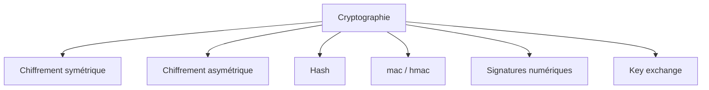

# Cryptography Basics (Cybersecurity) — Cours complet (Kali Linux)

> Objectif : te donner une base **solide, professionnelle et exploitable en lab** pour comprendre et manipuler la cryptographie en cybersécurité (concepts + outils : openssl, john the ripper, hashcat).  
> ⚠️ Éthique & légalité : les parties “cracking” sont **uniquement** pour des environnements autorisés (CTF, lab Holberton, pentest contractuel).

---

## Table des matières

1. [Définitions et rôles en cybersécurité](#1-définitions-et-rôles-en-cybersécurité)  
2. [Menaces que la crypto résout (et ne résout pas)](#2-menaces-que-la-crypto-résout-et-ne-résout-pas)  
3. [Les grandes familles](#3-les-grandes-familles)  
4. [Chiffrement : encryption / decryption](#4-chiffrement--encryption--decryption)  
5. [Asymétrique : clés publiques/privées, signatures, pki](#5-asymétrique--clés-publiquesprivées-signatures-pki)  
6. [Hash : définition, propriétés, sha, salage](#6-hash--définition-propriétés-sha-salage)  
7. [mac / hmac et intégrité](#7-mac--hmac-et-intégrité)  
8. [Key exchange, tls, ssh : crypto “en réseau”](#8-key-exchange-tls-ssh--crypto-en-réseau)  
9. [Stockage des mots de passe : bonnes pratiques](#9-stockage-des-mots-de-passe--bonnes-pratiques)  
10. [openssl : mémo + labs](#10-openssl--mémo--labs)  
11. [john the ripper : concepts, formats, usage, “advanced”](#11-john-the-ripper--concepts-formats-usage-advanced)  
12. [hashcat : concepts, modes d’attaque, usage](#12-hashcat--concepts-modes-dattaque-usage)  
13. [Comparer john vs hashcat](#13-comparer-john-vs-hashcat)  
14. [Pièges courants et debug](#14-pièges-courants-et-debug)  
15. [Cheat sheet (kali)](#15-cheat-sheet-kali)  
16. [Annexe : exigences holberton (scripts bash 2 lignes)](#16-annexe--exigences-holberton-scripts-bash-2-lignes)  
17. [Mini-quiz + exercices](#17-mini-quiz--exercices)

---

## 1) Définitions et rôles en cybersécurité

### Qu’est-ce que la cryptographie ?
La **cryptographie** est l’ensemble des techniques qui permettent de :
- **Confidentialité** : rendre une information illisible aux non-autorisés (chiffrement).
- **Intégrité** : détecter toute modification d’un message (hash, mac, signatures).
- **Authenticité** : prouver l’identité d’un acteur (certificats, signatures).
- **Non-répudiation** : empêcher un auteur de nier une action (signature numérique).

> En cybersécurité, la crypto est un **mécanisme** : elle renforce un système, mais ne remplace pas la sécurité applicative, le contrôle d’accès, la configuration, etc.

### “Cryptography in cybersecurity”
En pratique, tu la croises partout :
- **web** : https/tls (certificats, échanges de clés, chiffrement, intégrité)
- **ssh** : clés, signatures, chiffrement de session
- **stockage** : chiffrement disque (luks), secrets, sauvegardes
- **authentification** : hash de mots de passe (bcrypt/argon2), tokens signés (jwt)
- **logiciels** : signature de code, mises à jour signées
- **traçabilité** : signatures et journaux (log integrity)

---

## 2) Menaces que la crypto résout (et ne résout pas)

### Résout (souvent)
- écoute réseau (sniffing) → chiffrement (tls, vpn)
- modification en transit (mitm) → mac / signatures / tls
- usurpation d’identité serveur → certificats / pki / pinning
- fuite de disque → chiffrement au repos (at-rest)

### Ne résout pas
- **exfiltration** si l’attaquant a déjà accès au système en clair
- **faibles mots de passe** (crypto parfaite + mot de passe nul = compromis)
- **mauvaise implémentation** (rng faible, mode de chiffrement mauvais, mauvaises clés)
- **mauvaise gestion des clés** (clés exposées, secrets dans git, permissions laxistes)
- **logic bugs** (xss, sqli) : crypto ≠ patch.

---

## 3) Les grandes familles



### 3.1 Chiffrement symétrique
- **une seule clé** pour chiffrer et déchiffrer
- rapide (gros volumes)
- exemples : aes, chacha20  
- problème : comment échanger la clé **sans la divulguer** ?

### 3.2 Chiffrement asymétrique
- **deux clés** :
  - clé publique (partagée)
  - clé privée (secrète)
- usages :
  - chiffrement (rarement pour gros volumes)
  - **signature** (très courant)
  - échange de clés (ex: ecdh)
- exemples : rsa, ecc (courbes), ed25519 (signature)

### 3.3 Hash
- transforme une donnée en empreinte de taille fixe
- **non réversible**
- exemples : sha256, sha512  
- usages : intégrité, stockage de mots de passe (avec fonctions adaptées)

### 3.4 mac / hmac
- intégrité + authenticité **avec clé partagée**
- hmac = construction robuste basée sur un hash (ex: hmac-sha256)

### 3.5 Signatures numériques
- prouver qu’un message vient bien du détenteur de la clé privée
- garantit intégrité + authenticité + non-répudiation (selon contexte)

---

## 4) Chiffrement : encryption / decryption

### 4.1 Encryption (chiffrement)
Processus qui transforme un **plaintext** (texte clair) en **ciphertext** (texte chiffré) à l’aide d’une clé.

### 4.2 Decryption (déchiffrement)
Processus inverse qui récupère le plaintext depuis le ciphertext **avec la bonne clé**.

### 4.3 Termes indispensables
- **plaintext** : message en clair
- **ciphertext** : message chiffré
- **key** : clé
- **cipher** : algorithme de chiffrement
- **mode** : façon d’utiliser le cipher (ex: gcm, cbc). Important.

### 4.4 Les modes (idée)
- **cbc** : ancien, nécessite iv, attention aux padding oracles si mal implémenté
- **gcm** : moderne, apporte chiffrement + intégrité (aead)
- **aead** : “authenticated encryption with associated data” (ex: aes-gcm, chacha20-poly1305)

> En pratique : privilégier les modes aead (gcm / chacha20-poly1305).

---

## 5) Asymétrique : clés publiques/privées, signatures, pki

### 5.1 Intuition
- la clé publique “verrouille” / vérifie
- la clé privée “déverrouille” / signe

### 5.2 Signature numérique (concept)
1) tu hashes le message (empreinte)  
2) tu signes l’empreinte avec la clé privée  
3) n’importe qui peut vérifier avec la clé publique

### 5.3 pki et certificats
Un **certificat** lie une **clé publique** à une identité (domaine, org) via une **autorité de certification** (ca).

Ce que tls fait (simplifié) :
- le serveur présente un certificat
- le client vérifie la chaîne de confiance (ca → intermédiaires → serveur)
- ensuite ils négocient une clé de session (symétrique) + utilisent un chiffrement rapide

---

## 6) Hash : définition, propriétés, sha, salage

### 6.1 Qu’est-ce qu’un hash ?
Une fonction de hash calcule une empreinte :
- taille fixe
- rapide à calculer
- **non réversible**

### 6.2 Propriétés attendues (cryptographiques)
- **préimage** : difficile de retrouver un message pour un hash donné
- **seconde préimage** : difficile de trouver un autre message même hash
- **collision** : difficile de trouver 2 messages avec le même hash

### 6.3 sha : ça veut dire quoi ?
**sha = secure hash algorithm** (famille de fonctions de hash standardisées).  
Exemples : sha1 (déconseillé), sha256, sha512.

### 6.4 Hash ≠ chiffrement
- chiffrement : réversible avec clé
- hash : non réversible

### 6.5 Salage (salt) et pepper
- **salt** : valeur aléatoire unique par mot de passe, stockée avec le hash
  - empêche les rainbow tables génériques
  - force un recalcul par utilisateur
- **pepper** : secret global (comme une clé) stocké côté serveur (idéalement hsm/env)

### 6.6 Pourquoi sha256 seul n’est pas adapté aux mots de passe ?
Parce que c’est **trop rapide** → cracking rapide.  
Pour les mots de passe, on veut des fonctions **lentes** :
- bcrypt
- scrypt
- argon2
- pbkdf2

---

## 7) mac / hmac et intégrité

### 7.1 mac
Un mac est une preuve d’intégrité **avec une clé secrète partagée**.

### 7.2 hmac
Construction robuste : hmac(hash, key, message).  
Exemple : hmac-sha256 est très utilisé (apis, tokens, webhooks).

---

## 8) Key exchange, tls, ssh : crypto “en réseau”

### 8.1 Problème : comment établir une clé partagée sur un réseau non sûr ?
Solution : échange de clés (ex: diffie-hellman, ecdh)  
→ permet d’obtenir un secret partagé sans l’envoyer en clair.

### 8.2 tls (idée)
- authentifie le serveur via certificats
- négocie paramètres cryptos
- établit une clé de session symétrique
- chiffre + protège l’intégrité du trafic

### 8.3 ssh
- échange de clés + chiffrement de session
- authentification via mot de passe **ou** clés (souvent ed25519)

---

## 9) Stockage des mots de passe : bonnes pratiques

✅ recommandations :
- stocker **argon2** (ou bcrypt) avec salt unique
- limiter tentatives (rate limit)
- mfa quand possible
- politique de mots de passe réaliste + gestionnaire recommandé

❌ à éviter :
- sha256(password) en base
- md5
- salt global unique pour tous

---

## 10) openssl : mémo + labs

### 10.1 Vérifier la version
```bash
openssl version -a
```

### 10.2 Calculer des hash
```bash
echo -n "hello" | openssl dgst -sha256
echo -n "hello" | openssl dgst -sha512
```

### 10.3 Générer du random
```bash
openssl rand -hex 16
openssl rand -base64 32
```

### 10.4 Chiffrer / déchiffrer un fichier (symétrique)
```bash
openssl enc -aes-256-cbc -salt -in secret.txt -out secret.enc
openssl enc -d -aes-256-cbc -in secret.enc -out secret.dec.txt
```

### 10.5 Clés et signature (rsa + sha256)
```bash
openssl genpkey -algorithm rsa -pkeyopt rsa_keygen_bits:2048 -out private_rsa.pem
openssl pkey -in private_rsa.pem -pubout -out public_rsa.pem
openssl dgst -sha256 -sign private_rsa.pem -out file.sig file.txt
openssl dgst -sha256 -verify public_rsa.pem -signature file.sig file.txt
```

### 10.6 Inspecter un certificat tls
```bash
openssl s_client -connect example.com:443 -servername example.com </dev/null 2>/dev/null | openssl x509 -noout -subject -issuer -dates -fingerprint -sha256
```

---

## 11) john the ripper : concepts, formats, usage

### 11.1 Vérifier et lister les formats
```bash
john --version
john --list=formats | head
```

### 11.2 Wordlist + rules
```bash
john --wordlist=rockyou.txt --rules hash.txt
john --show hash.txt
```

### 11.3 Masque et bruteforce
```bash
john --mask='?u?l?l?l?l?l?l?d?d' hash.txt
john --incremental hash.txt
```

### 11.4 Extracteur zip
```bash
zip2john secret.zip > zip.hash
john --wordlist=rockyou.txt zip.hash
```

---

## 12) hashcat : concepts, modes d’attaque, usage

### 12.1 Wordlist / rules / mask
```bash
hashcat -m <mode> -a 0 hash.txt rockyou.txt
hashcat -m <mode> -a 0 hash.txt rockyou.txt -r rules/best64.rule
hashcat -m <mode> -a 3 hash.txt '?u?l?l?l?l?l?l?d?d'
```

### 12.2 Show / session
```bash
hashcat -m <mode> --show hash.txt
hashcat -m <mode> -a 0 hash.txt rockyou.txt --session myrun
hashcat --restore --session myrun
```

---

## 13) Comparer john vs hashcat

| Critère | john the ripper | hashcat |
|---|---|---|
| prise en main | simple | plus “paramétrable” |
| performance | très bon cpu | top perf (gpu) |
| extracteurs fichiers | excellent | variable |

---

## 14) Pièges courants
- mauvais format/mode
- hash mal copié (espaces, `:`)
- bruteforce trop large

---

## 15) Cheat sheet (kali)
```bash
openssl dgst -sha256 file
openssl rand -hex 16
john --wordlist=rockyou.txt --rules hash.txt
hashcat -m <mode> -a 0 hash.txt rockyou.txt
```

---

## 16) Annexe : exigences holberton (scripts bash 2 lignes)

- 2 lignes exactement
- ligne 1 : `#!/bin/bash`
- ligne 2 : une commande (pas de backticks, pas de `&&`, pas de `||`, pas de `;`)
- exécutable + newline final

Exemple :
```bash
#!/bin/bash
openssl dgst -sha256 "$1"
```

---

## 17) Mini-quiz + exercices
1) chiffrement vs hash ?  
2) pourquoi salt ?  
3) pourquoi sha256 n’est pas un bon hash mot de passe ?  
4) john : `--rules` sert à quoi ?  
5) hashcat : différence entre `-m` et `-a` ?
