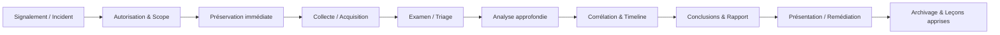

# Forensic Ethics & Methodologies (Forensic numérique) — Cours ultra complet (Linux / Étudiants)

> Objectif : comprendre **comment mener une investigation numérique** de manière **éthique, rigoureuse, reproductible et juridiquement défendable**, du premier signalement jusqu’au rapport final.

---

## 0) Pré-requis (à connaître avant)
- Bases Linux (FS, permissions, logs, commandes de base).
- Notions réseau (TCP/IP, DNS, HTTP(S), TLS, ports).
- Notions cybersécurité (incident, IOC, SIEM, EDR, vulnérabilité).
- Attitude pro : rigueur, traçabilité, neutralité.

---

## 1) Définitions clés (à apprendre par cœur)

### 1.1 Digital forensics (forensique numérique)
Discipline visant à **identifier, collecter, préserver, analyser et présenter** des données numériques de façon **fiable** et **admissible** (justice, procédure disciplinaire, assurance, audit, etc.).

👉 **But** : répondre à des questions factuelles (qui ? quoi ? quand ? comment ? impact ?) avec des preuves traçables.

### 1.2 DFIR (Digital Forensics & Incident Response)
DFIR = forensique + réponse à incident.
- **Incident Response (IR)** : contenir/éradiquer/reprendre l’activité au plus vite.
- **Forensics** : comprendre ce qui s’est passé, **préserver** et **expliquer**.

➡️ Tension fréquente :
- IR veut aller vite (redémarrer, patcher, supprimer).
- Forensics veut préserver (ne rien altérer sans justification).

Bon DFIR = **équilibre** : préserver l’essentiel, agir vite, documenter tout.

### 1.3 SIEM (et pas “SEIM”)
**SIEM** = Security Information and Event Management.  
Plateforme qui **centralise les logs**, corrèle des événements, déclenche des alertes, et aide à la chasse (threat hunting).

Exemples : Splunk, Elastic SIEM, QRadar, Sentinel.

### 1.4 Preuve numérique (digital evidence)
Information stockée/transmise/traitée par un système numérique, pouvant établir ou infirmer un fait.

### 1.5 Intégrité (Integrity)
Garantie que la donnée n’a pas été altérée de manière non autorisée.  
En forensics, on prouve l’intégrité via :
- **hash cryptographique** (SHA-256 typiquement),
- **write-blocking** (bloquer l’écriture),
- **chaîne de possession** (chain of custody).

---

## 2) Pourquoi l’éthique est non négociable en forensics ?

Sans éthique :
- résultats biaisés → mauvaises décisions,
- preuves rejetées (inadmissibles),
- atteintes à la vie privée (RGPD),
- pertes de confiance (client/justice),
- risques pénaux / disciplinaires.

En forensics, ton travail est jugé sur :
1) **Ce que tu as fait**  
2) **Comment tu l’as fait** (méthode + traçabilité)  
3) **Si quelqu’un d’autre peut le reproduire** (reproductibilité)  
4) **Si tu es resté neutre** (objectivité)

---

## 3) Principes d’éthique en investigation numérique

### 3.1 Intégrité et honnêteté
- Ne pas embellir, ne pas “forcer” une conclusion.
- Séparer **faits**, **interprétations**, **hypothèses**.
- Mentionner limites, angles morts, incertitudes.

### 3.2 Objectivité (neutralité)
**Objectivité** = être un instrument de mesure, pas un avocat.
- Éviter le “cherry picking” (sélection de preuves qui arrangent).
- Rechercher aussi les éléments **contradictoires**.
- Garder l’esprit “test d’hypothèses”.

**Technique simple** :  
> Toujours écrire au moins **2 hypothèses alternatives** et chercher à les invalider.

### 3.3 Confidentialité et minimisation
- Accès “need to know”.
- Ne collecter que ce qui est nécessaire à l’objectif.
- Protéger données sensibles (mots de passe, santé, intimité, secrets d’affaires).

### 3.4 Légalité / autorisation
Avant toute acquisition :
- mandat / ordre / contrat / consentement / politique interne,
- périmètre (scope) clairement défini,
- conformité : RGPD, droit du travail, pénal, procédures internes.

### 3.5 Compétence et diligence
- Utiliser des méthodes reconnues, outils validés.
- Documenter versions, paramètres, conditions.
- Faire vérifier (peer review) si possible.

### 3.6 Conflits d’intérêts
- Déclarer toute situation qui compromet l’impartialité (ex : enquête sur un proche, intérêt financier).

### 3.7 Respect de la chaîne de preuve
- Toute manipulation doit être traçable.
- “If it wasn’t logged, it didn’t happen.”

---

## 4) Problèmes éthiques fréquents (cas réels typiques)

1. **Scope creep** : “au passage, regarde ses messages privés”.
2. **Pression managériale** : “prouve que X est coupable”.
3. **Data over-collection** : capturer tout sans raison.
4. **Altération involontaire** : démarrer une machine, lancer un antivirus.
5. **Outils non maîtrisés** : mauvaise interprétation, faux positifs.
6. **Chaîne de possession cassée** : transfert non documenté.
7. **Rapports orientés** : conclusions non supportées par des faits.

---

## 5) Standards, guides et organismes (références incontournables)

### 5.1 ACPO (principes historiques, UK)
Le guide de bonnes pratiques (digital evidence) formalise des principes de base : ne pas altérer, personne compétente si altération nécessaire, audit trail complet, responsabilité globale.

> Même si le terme “ACPO” est historique, ses principes restent une base culturelle en forensics.  
Réf : Good Practice Guide for Digital Evidence (v5).  

### 5.2 SWGDE (USA) — bonnes pratiques opérationnelles
Recommandations très pratiques : acquisition, collecte distante, documentation de chain of custody, etc.

### 5.3 NIST (USA) — approche “process” + incident response
- NIST SP 800-86 : intégration des techniques forensiques dans l’IR.
- NIST SP 800-61r2 : incident handling, et références sur la préservation.

### 5.4 ISO/IEC 27037 (international)
Guide l’**identification, collecte, acquisition, préservation** de preuves numériques.

### 5.5 DFRWS (Digital Forensic Research Workshop)
Communauté et modèles de processus forensique (modèle DFRWS : identification → preservation → collection → examination → analysis → presentation).

### 5.6 ISFCE / IJDE / Forensic Focus
- ISFCE (certifications, ex : CFCE),
- IJDE (revue),
- Forensic Focus (communauté, veille, retours d’expérience).

---

## 6) Méthodologies standards en forensics

### 6.1 Pourquoi une méthodologie ?
Une “méthodo” sert à :
- garantir la **reproductibilité**,
- assurer la **traçabilité**,
- réduire l’arbitraire,
- faciliter l’admissibilité et la relecture (peer review).

### 6.2 Modèle DFRWS (classique)
1. **Identification**  
2. **Preservation**  
3. **Collection**  
4. **Examination**  
5. **Analysis**  
6. **Presentation**

➡️ Simple et pédagogique : excellent pour structurer tes rapports.

### 6.3 Modèle NIST SP 800-86 (vision IR)
- Collecter les données pertinentes
- Examiner / analyser
- Rapporter
- Le tout en respectant la préparation organisationnelle (capacité forensique)

### 6.4 SANS / “6 étapes” (version terrain)
1) Preparation  
2) Identification  
3) Containment  
4) Eradication  
5) Recovery  
6) Lessons Learned

➡️ Plus IR que forensics, mais utile en DFIR (et pour expliquer le “contexte incident”).

### 6.5 ISO/IEC 27037 (focus preuve)
- Identification / Collection / Acquisition / Preservation
➡️ Très utile pour justifier tes procédures de **préservation**.

---

## 7) La règle d’or : l’intégrité avant tout

### 7.1 Imaging vs analyse sur original
- Analyse sur l’original = risque d’altération = souvent **à éviter**.
- Bonne pratique : **imager** (copie bit-à-bit) puis travailler sur l’image.

### 7.2 Hashing (preuve d’intégrité)
- Calculer un hash avant/après : SHA-256 recommandé en pratique.
- Conserver les valeurs dans le dossier d’enquête.

Exemple de logique (sans commande imposée) :
- hash de la source (si possible sans écriture),
- acquisition,
- hash de l’image,
- comparaison.

### 7.3 Write blockers
Matériel/logiciel empêchant d’écrire sur le support source.  
Principe : tu peux lire, pas modifier.

---

## 8) Chaîne de possession (Chain of Custody)

### 8.1 Définition
Journal chronologique documentant **qui** a eu **quoi**, **quand**, **pourquoi**, **où**, **comment**, et dans quel état.

Pourquoi c’est crucial :
- crédibilité,
- admissibilité,
- protection contre accusations de falsification.

### 8.2 Champs minimum recommandés (pratique)
- Identifiant unique de la preuve
- Description (type, marque, n° série)
- Date/heure de collecte
- Collecteur (nom, signature)
- Lieu de collecte
- Condition/état (scellé, dégâts)
- Hash (si applicable)
- Transferts (de/vers, date/heure, motif)
- Stockage (armoire scellée, coffre, etc.)

### 8.3 Modèle de formulaire (template)
Copie-colle ce modèle dans ton README / dossier d’affaire :

```text
CASE ID:
EVIDENCE ID:
DATE/TIME COLLECTED:
COLLECTED BY:
LOCATION:
DESCRIPTION:
SERIAL / IDENTIFIERS:
CONDITION (sealed?):
ACQUISITION TYPE (physical/logical/live):
HASHES (SHA-256 / others):
STORAGE LOCATION:
NOTES:

TRANSFER LOG:
- Date/Time | From | To | Purpose | Signature
- ...
```

---

## 9) Les étapes complètes d’une investigation forensique (workflow réaliste)

### Vue d’ensemble (mental model)
Tu peux voir une enquête comme un pipeline :



### 9.1 Signalement & cadrage (Scope + légal)
- Qui demande ? (autorité)
- Quel objectif ? (ex : intrusion, fraude, exfiltration)
- Périmètre : systèmes, comptes, dates
- Contraintes : production critique, indisponibilité acceptable, urgence
- Autorisations : politique interne, consentement, mandat, contrat

✅ Livrables :
- “Case opening note” (note d’ouverture)
- Scope écrit (ce qui est inclus/exclu)
- Liste des systèmes

### 9.2 Préservation immédiate (First response)
But : éviter la perte/altération.
- isoler (réseau) si nécessaire,
- capturer volatil (RAM, connexions) si justifié,
- sécuriser logs (SIEM, syslog, cloud audit logs),
- figer snapshots (VM/cloud), geler comptes.

⚠️ Attention : toute action sur un système vivant peut modifier des artefacts.  
➡️ Justifie chaque action, documente.

### 9.3 Acquisition / collecte
Objectif : obtenir une copie fiable des données pertinentes.
- disque/partition (image physique),
- acquisitions logiques (dossiers, logs),
- mémoire (dump RAM),
- artefacts réseau (pcap, NetFlow),
- logs (auth, web, proxy, DNS, EDR, IAM).

Bon réflexe : **multisource** (host + réseau + identité + cloud).

### 9.4 Triage (examen rapide)
Le triage sert à orienter l’analyse :
- quels systèmes sont compromis ?
- quels IOCs ?
- quel timeline approximatif ?
- prioriser : “patient zéro”, DC/AD, serveur sensible, endpoint.

### 9.5 Analyse approfondie
Selon le cas :
- analyse FS (MFT, inode, timestamps),
- logs (auth, sudo, ssh, web),
- persistence (crons, services, systemd, run keys),
- malware (hash, YARA, strings, sandbox),
- mémoire (process, injections),
- réseau (C2, exfiltration).

### 9.6 Corrélation & Timeline
Construire une timeline fiable :
- “quand le premier accès ?”
- “comment l’attaquant a persisté ?”
- “quelles actions ?”
- “quelles données touchées ?”

### 9.7 Rapport & présentation
Rapport = produit final.
- fait/impact/recommandations
- niveau exécutif + niveau technique
- annexes : preuves, hashes, logs, timeline, commandes/outils.

### 9.8 Archivage / conservation
- conserver images + hashes + chain of custody
- stocker de façon sécurisée
- politique de rétention (légal / contrat)

---

## 10) Live forensics vs Dead-box forensics (et le dilemme DFIR)

### 10.1 Dead-box (idéal forensique)
Machine éteinte, support extrait/imagé :
- moins de modifications
- meilleure intégrité
- plus défendable en justice

### 10.2 Live response (réalité DFIR)
Sur un système en production :
- capturer volatil (RAM, connexions)
- mais tu modifies forcément des artefacts (process, caches, timestamps)

➡️ Règle : live response seulement si :
- nécessité opérationnelle,
- volatil critique,
- justification écrite + audit trail strict.

---

## 11) Méthodologie Unix/Linux : artefacts à connaître (base)

### 11.1 Questions typiques
- Y a-t-il eu des connexions SSH suspectes ?
- L’attaquant a-t-il utilisé sudo ?
- Une persistence a-t-elle été installée ?
- Des fichiers ont-ils été créés/modifiés/exfiltrés ?
- Y a-t-il des traces de malware ?

### 11.2 Sources de logs courantes
- `/var/log/auth.log` (Debian/Ubuntu) : SSH, sudo, auth
- `/var/log/syslog` / `/var/log/messages`
- journald (`journalctl`)
- logs applicatifs : nginx/apache, docker, etc.

### 11.3 Persistence typique sous Linux
- cron : `/etc/crontab`, `/etc/cron.*`, crontab user
- systemd : services/timers, `~/.config/systemd/user/`
- scripts shell dans profils : `~/.bashrc`, `~/.profile`
- SSH authorized_keys : `~/.ssh/authorized_keys`
- modules kernel / LD_PRELOAD (plus avancé)

---

## 12) Documentation : comment écrire “comme un forensic analyst”

### 12.1 Le cahier de labo (case notes)
Tu dois pouvoir répondre :
- qu’ai-je fait ?
- quand ?
- avec quel outil/version ?
- sur quel fichier (hash) ?
- quel résultat ?
- quelle décision ensuite ?

Modèle de note :

```text
[DATE/TIME TZ] Action:
Tool/Version:
Input (path/hash):
Command/Parameters:
Output (path/hash):
Observation:
Next step:
```

### 12.2 Les 3 niveaux de rédaction d’un rapport
1) **Executive summary** (non-tech)  
2) **Technical narrative** (tech détaillé)  
3) **Annexes** (preuves, hashes, timeline, exports)

### 12.3 Faits vs interprétations (règle stricte)
- **Fait** : “le compte X s’est authentifié via SSH depuis l’IP Y à 03:12 UTC (log …)”
- **Interprétation** : “probable compromission”
- **Hypothèse** : “l’IP pourrait être un VPN utilisé par …”
Toujours marquer ce qui est quoi.

---

## 13) Admissibilité : comment rendre la preuve défendable

Checklist “admissibilité” :
- Autorisation légale claire (scope)
- Méthodologie reconnue (NIST/ISO/DFRWS)
- Chaîne de possession complète
- Intégrité prouvée (hash)
- Outils/versions documentés
- Reproductibilité (étapes, paramètres)
- Stockage sécurisé (accès contrôlé)
- Rapport clair : faits + preuves + limites

---

## 14) Outils courants en forensics (orientation Linux)

### 14.1 Acquisition / imaging
- dd (basique), dc3dd (forensic-friendly)
- Guymager (GUI imaging)
- write blockers (matériel) quand possible

### 14.2 Analyse disque / FS
- The Sleuth Kit (TSK) + Autopsy (GUI)
- `file`, `strings`, `hexdump`, `xxd`
- outils timeline (voir plus bas)

### 14.3 Mémoire (RAM)
- Volatility / Volatility3 (process, DLLs, modules, artefacts)
- Rekall (selon cas)

### 14.4 Timeline / logs
- Plaso / log2timeline
- Timesketch (exploration)
- `journalctl`, parsing syslog
- SIEM (Elastic/Splunk) pour corrélation

### 14.5 Réseau
- Wireshark, tshark
- tcpdump
- Zeek (réseau + logs)

### 14.6 Malware triage
- YARA (règles)
- hashing + lookup interne (attention : confidentialité si services externes)
- sandbox interne (si dispo)

**Important** : outil ≠ vérité.  
Tu dois comprendre **ce que l’outil fait** et **ce qu’il peut rater**.

---

## 15) Qualité, validation, reproductibilité

### 15.1 Validation croisée (cross-validation)
Ne jamais conclure sur une seule source si possible.
- Log d’auth + artefacts système + réseau + EDR
- Au moins 2 signaux indépendants.

### 15.2 Gestion des biais (anti-biais)
- écrire tes hypothèses au début,
- tenter de les falsifier,
- faire relire par un pair,
- documenter ce qui manque.

### 15.3 Erreurs classiques d’étudiants
- oublier timezone / horodatage (UTC vs local),
- confondre modification et accès,
- ignorer rotations de logs,
- oublier de documenter versions,
- “nettoyer” le système avant d’acquérir.

---

## 16) Aspects légaux (vision pratique, non-juridique)
⚠️ Les règles exactes dépendent du pays, du contrat, et du contexte (entreprise/justice).

À retenir :
- l’accès à des données doit être **autorisé**,
- respecter le **principe de minimisation**,
- protéger les données personnelles (RGPD en UE),
- conserver de manière sécurisée,
- limiter diffusion (need-to-know),
- traçabilité des accès (audit).

---

## 17) Comment rester à jour (technos qui évoluent)
- Suivre des communautés : Forensic Focus, DFRWS, publications NIST, SWGDE.
- Pratiquer sur labs (images disque, challenges DFIR).
- Se former aux environnements modernes :
  - cloud (AWS/Azure/GCP logs),
  - conteneurs (Docker/K8s),
  - EDR/SIEM,
  - chiffrement et artefacts mémoire.

---

## 18) Mini-cas pratique (exercice pédagogique)
**Scénario** : suspicion d’accès non autorisé sur un serveur Ubuntu.

Objectifs :
1) prouver/infirmer intrusion,
2) établir timeline,
3) identifier vecteur/persistence,
4) produire un mini-rapport.

Plan :
- définir scope (serveur + période),
- préserver : logs + snapshot,
- collecter : auth logs + journald + liste users + crons + services,
- triage : connexions SSH, sudo, nouveaux comptes,
- timeline : événements clés,
- conclusion : probable/possible/improbable + preuves.

---

## 19) README.md (exigence projet) — template prêt à l’emploi

# Forensic Ethics & Methodologies — README

## Contexte
- Case ID:
- Date:
- Environnement (Linux distro/version):
- Objectif de l’analyse:

## Scope & Autorisation
- Autorité / cadre:
- Systèmes inclus:
- Systèmes exclus:
- Fenêtre temporelle:
- Contraintes:

## Evidence Inventory
| Evidence ID | Type | Source | Acquisition | Hash | Storage |
|---|---|---|---|---|---|

## Chain of Custody
(ajouter le log des transferts)

## Methodology
- Références: (DFRWS / NIST / ISO 27037)
- Procédure suivie:

## Findings (faits)
- Fait 1 (preuve + référence)
- Fait 2 ...

## Analysis (interprétation)
- Hypothèses testées:
- Corrélations:

## Timeline (résumé)
- ...

## Conclusion
- Ce qui est certain:
- Ce qui est probable:
- Ce qui est inconnu:
- Limites:

## Recommendations
- Containment:
- Eradication:
- Hardening:
- Monitoring:

## Annexes
- Hashes
- Logs / exports
- Tool versions

---

## 20) Références (à citer dans tes livrables)
- NIST SP 800-86 — Guide to Integrating Forensic Techniques into Incident Response
- NIST SP 800-61r2 — Computer Security Incident Handling Guide
- ISO/IEC 27037 — Guidelines for identification, collection, acquisition, and preservation of digital evidence
- ACPO Good Practice Guide for Digital Evidence (v5)
- SWGDE — Best Practices (Evidence collection, acquisitions, remote collection)
- DFRWS — Digital Forensic Process model
- Forensic Focus (veille et retours d’expérience)

---

## 21) Checklist “terrain” (à imprimer mentalement)

**Avant de toucher un système**
- [ ] Autorisation + scope écrit
- [ ] Plan de préservation
- [ ] Journal de notes prêt (date/time/timezone)
- [ ] Outils validés + versions notées

**Pendant**
- [ ] Minimisation (collecter le nécessaire)
- [ ] Hash / intégrité
- [ ] Chaîne de possession à jour
- [ ] Photos / captures si besoin (état, scellés, écrans)

**Après**
- [ ] Timeline et corrélation
- [ ] Faits vs interprétations séparés
- [ ] Rapport + annexes + reproductibilité
- [ ] Archivage sécurisé

---

### Fin du cours
Si tu veux, tu peux m’envoyer :
- ton README (brouillon),
- ton scope,
- ton template de chain of custody,
et je te fais une relecture “mode forensic analyst” (rigueur + admissibilité + clarté).
