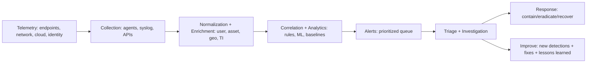

# Offensive vs Defensive Security (Red Team vs Blue Team) — A Practical, End-to-End Guide

> **Audience:** tech‑savvy learners (students, junior analysts, junior pentesters)  
> **Goal:** be able to explain *and apply* offensive vs defensive security concepts **without Google**.

---

## Table of Contents
1. [Why the “Offense vs Defense” split exists](#1-why-the-offense-vs-defense-split-exists)
2. [Core definitions (Offensive, Defensive, Assurance)](#2-core-definitions-offensive-defensive-assurance)
3. [Red Team, Blue Team, Purple Team](#3-red-team-blue-team-purple-team)
4. [Ethical hacking vs penetration testing (and why wording matters)](#4-ethical-hacking-vs-penetration-testing-and-why-wording-matters)
5. [Vulnerability Assessment vs Penetration Testing](#5-vulnerability-assessment-vs-penetration-testing)
6. [Attack methodology: Cyber Kill Chain + MITRE ATT&CK](#6-attack-methodology--cyber-kill-chain--mitre-attck)
7. [Defensive foundations: prevention, detection, response](#7-defensive-foundations-prevention-detection-response)
8. [SOC, SIEM, and the detection pipeline](#8-soc-siem-and-the-detection-pipeline)
9. [Threat hunting (how it actually works)](#9-threat-hunting-how-it-actually-works)
10. [Incident Response phases (and what “good” looks like)](#10-incident-response-phases-and-what-good-looks-like)
11. [Common offensive tools vs defensive controls](#11-common-offensive-tools-vs-defensive-controls)
12. [Awareness training: the “human control plane”](#12-awareness-training-the-human-control-plane)
13. [Putting it together: a realistic Red/Blue/Purple scenario](#13-putting-it-together-a-realistic-redbluepurple_scenario)
14. [Cheat sheets: quick explanations + interview answers](#14-cheat-sheets-quick-explanations--interview-answers)
15. [Resource list (expanded + high‑signal)](#15-resource-list-expanded--high-signal)

---

## 1) Why the “Offense vs Defense” split exists

Cybersecurity has two constant truths:

- **Attackers only need one weak link** (a forgotten asset, weak password, misconfigured bucket, vulnerable plugin).
- **Defenders must protect everything** (people + process + technology) continuously.

That’s why the industry splits work into:
- **Offensive security**: *simulate attackers* to discover and prove impact.
- **Defensive security**: *reduce likelihood & impact* of attacks via controls, monitoring, and response.

In mature orgs, offense and defense are not enemies; they form a **feedback loop**:
- Offense finds weakness → Defense fixes + detects → Offense retests → Defense hardens.

---

## 2) Core definitions (Offensive, Defensive, Assurance)

### Offensive security (the “break it safely” side)
Offensive security is the practice of **authorized** adversarial testing: exploring, exploiting, and demonstrating real risk.

**Outcome:** actionable proof (e.g., “I obtained admin access, exfiltrated sample data, and showed the path used.”)

**Typical outputs:**
- Exploit paths and evidence
- Impact statements (CIA impact + business impact)
- Remediation guidance + verification steps

### Defensive security (the “keep it safe” side)
Defensive security focuses on **preventing, detecting, and responding** to malicious activity.

**Outcome:** fewer incidents, faster containment, minimal blast radius.

**Typical outputs:**
- Hardened configs, patched systems, secured identity
- Detections (alerts), dashboards, threat intel mapping
- Incident response playbooks and drills

### Security assurance / governance (the “prove it” side)
Often paired with defense:
- risk management, compliance, policies, audits, security architecture
- ensures the organization can explain *why* it’s secure and *how* it stays secure

---

## 3) Red Team, Blue Team, Purple Team

### Red Team
A Red Team is an offensive group that **emulates real adversaries** to test detection + response + human factors.

- **Scope:** broad (technical + physical + social engineering sometimes)
- **Focus:** stealth, realism, objectives (e.g., domain dominance, data access)
- **Deliverable:** “attack narrative” + gaps (prevention/detection/response)

### Blue Team
A Blue Team defends:
- monitoring, alert triage, containment
- hardening, patching, identity, network segmentation
- incident response and post‑incident improvement

### Purple Team
Purple Team is **collaboration**: combine red findings with blue telemetry in near-real time to improve defenses fast.
It’s often a *method* more than a permanent team.

**Key idea:** Purple team accelerates learning loops (attack → detect → fix → retest).

---

## 4) Ethical hacking vs penetration testing (and why wording matters)

### Ethical hacking
“Ethical hacking” is a broad umbrella: doing hacker-style work **with permission** and within rules.

### Penetration testing
Penetration testing is a structured form of ethical hacking with a defined scope, rules of engagement, and deliverables.

A widely used definition: penetration testing verifies how well a system resists active attempts to compromise it. citeturn2search8  
NIST SP 800‑115 provides guidance for planning and conducting security testing/assessment (including penetration tests). citeturn2search5turn2search3

**Why the wording matters:**
- “Ethical hacking” can include many activities (training labs, bug bounty, research).
- “Pen test” implies **contractual scope**, reporting, and a professional methodology.

---

## 5) Vulnerability Assessment vs Penetration Testing

Think of it like medicine:

- **Vulnerability Assessment (VA)** = *screening test*  
  Find a broad set of weaknesses (known CVEs, misconfigs, risky exposures).
- **Penetration Test (PT)** = *surgery simulation*  
  Use a subset of weaknesses to prove access/impact and show realistic attack paths.

### Quick comparison table

| Dimension | Vulnerability Assessment | Penetration Testing |
|---|---|---|
| Goal | Find many weaknesses | Prove exploitability and impact |
| Depth | Broad | Deep and scenario-driven |
| Output | List of vulnerabilities (prioritized) | Attack narrative + evidence + remediation |
| Tools | Heavier automation | Automation + manual creativity |
| Risk | Lower | Higher (must be controlled) |

**Rule of thumb:** VA tells you “what could be wrong”, PT tells you “what can be *done* with it”.

---

## 6) Attack methodology: Cyber Kill Chain + MITRE ATT&CK

To defend well, you need a mental model of how attacks unfold.

### 6.1 Cyber Kill Chain (7 stages)
Lockheed Martin’s Cyber Kill Chain breaks intrusions into stages defenders can disrupt. citeturn0search6turn0search10

1. Reconnaissance  
2. Weaponization  
3. Delivery  
4. Exploitation  
5. Installation  
6. Command & Control (C2)  
7. Actions on Objectives  

**Strength:** easy “timeline” view of attacks.  
**Limitation:** not all modern attacks are linear.

### 6.2 MITRE ATT&CK (tactics & techniques)
MITRE ATT&CK is a knowledge base of real-world adversary tactics and techniques, widely used to build threat-informed defense. citeturn0search0turn0search4

- **Tactics** = attacker goals (e.g., Initial Access, Persistence)
- **Techniques** = how they do it (e.g., phishing, credential dumping)

**Strength:** very detailed and practical for detections and controls.  
**Usage:** map incidents, validate controls, design purple-team exercises.

### 6.3 How to use both together
- Use **Kill Chain** for a simple “attack story”  
- Use **ATT&CK** to describe exact behaviors and build detections

---

## 7) Defensive foundations: prevention, detection, response

A modern defense is layered:

### Prevention (make attacks harder)
- patch management
- secure configurations (CIS baselines)
- identity hardening (MFA, least privilege)
- network segmentation
- secure software lifecycle (SAST/DAST, dependencies)

### Detection (see what you missed)
- logs + telemetry + alerting
- endpoint detection and response (EDR)
- network detection (NDR), DNS monitoring
- anomaly detection for identity and cloud activity

### Response (limit damage fast)
- playbooks + incident command structure
- isolation / containment workflows
- forensics and recovery procedures
- post-incident improvements

---

## 8) SOC, SIEM, and the detection pipeline

### 8.1 What is a SOC?
A **Security Operations Center** is the function/team responsible for:
- monitoring, triage, investigation
- coordinating response and containment
- improving detections and resilience over time

ENISA provides practical guidance for setting up SOC/CSIRT capabilities. citeturn2search7  
MITRE also published “11 Strategies of a World-Class SOC” guidance. citeturn2search16

### 8.2 What is a SIEM?
A SIEM aggregates logs/events, correlates them, and supports detection + investigation.
One definition: SIEM combines security information management and event management to improve detection and remediation. citeturn1search1

NIST SP 800‑92 covers sound log management practices, which SIEM programs heavily depend on. citeturn1search13turn1search9

### 8.3 Detection pipeline (from raw events to decisions)

**Key insight:** SIEM is not “magic.” Quality depends on:
- correct logging coverage
- enrichment (asset inventory, identity mapping)
- tuning (reduce false positives)
- good response workflows

---

## 9) Threat hunting (how it actually works)

Threat hunting is **proactive** searching for unknown or undetected threats. citeturn2search15  
It complements SIEM alerts, because alerts only catch what you already modeled.

### 9.1 Two common hunting styles

**(A) Hypothesis-driven hunting**
- Start with a hypothesis: “An attacker may be using stolen credentials to access VPN at odd hours”
- Collect evidence (logs/telemetry)
- Confirm or refute; then refine detections

SANS discusses hypothesis generation as a key human contribution to hunting. citeturn2search19

**(B) Analytics-driven hunting**
- Start from anomalies (rare processes, unusual DNS, spikes in auth failures)
- Pivot into deeper context (what host/user/app?)

### 9.2 Typical hunting loop

1. Pick a hunting question (from ATT&CK, threat intel, internal incidents)  
2. Define data sources (EDR, auth logs, DNS, cloud audit, proxy)  
3. Query and pivot (time windows, entity graphs)  
4. Validate (is it malicious or benign?)  
5. Convert to improvements: new alert, new block, new hardening step  

Microsoft describes “advanced hunting” as query-based exploration over raw telemetry. citeturn2search9

---

## 10) Incident Response phases (and what “good” looks like)

A classic lifecycle uses 6 phases (SANS model): preparation, identification, containment, eradication, recovery, lessons learned. citeturn0search11turn0search7turn0search15

NIST SP 800‑61 Rev.2 historically provided IR guidance (now archived/withdrawn as of April 3, 2025, but still widely referenced). citeturn1search0turn1search4

### 10.1 Phase-by-phase checklist

**1) Preparation**
- logging + time sync (NTP)
- asset inventory, criticality tags
- access to EDR/SIEM, incident channels
- playbooks, on-call rotation, tabletop exercises

**2) Identification**
- confirm “is this an incident?”
- scope: affected users/hosts/apps
- severity: business impact + data types + exposure

**3) Containment**
- short-term: isolate endpoints, disable accounts, block IoCs
- long-term: segment, rotate secrets, deploy fixes safely

**4) Eradication**
- remove malware/persistence
- patch exploited paths, fix misconfigs
- hunt for related activity across environment

**5) Recovery**
- restore services
- verify integrity and monitor for re-compromise

**6) Lessons learned**
- timeline + root cause analysis
- what detections failed? what controls worked?
- update runbooks, training, and architecture

---

## 11) Common offensive tools vs defensive controls

### 11.1 Offensive tools (examples)
> Tools are not “the job” — they are amplifiers for methodology.

- Recon: OSINT, subdomain discovery, DNS enumeration
- Scanning: Nmap, masscan (where authorized)
- Web testing: Burp Suite, OWASP ZAP
- Exploitation frameworks: Metasploit (careful in scope)
- Password attacks: Hashcat, John the Ripper
- AD testing: BloodHound (authorized enterprise testing)
- Cloud: vendor CLIs + misconfig scanners

### 11.2 Defensive measures (examples)
- Identity: MFA, phishing-resistant auth, least privilege
- EDR + endpoint hardening
- Logging: centralized logs, retention, integrity
- Network segmentation + egress controls
- Vulnerability management + patch SLAs
- Security baselines (CIS), configuration management
- Backups with immutability + recovery drills
- Email security + DMARC/SPF/DKIM
- Application security: WAF, secure SDLC, dependency scanning

### 11.3 Mapping offense to defense (mini examples)

| Offensive action | Defensive countermeasures |
|---|---|
| Credential stuffing / brute force | MFA, rate limiting, lockout, monitoring auth failures |
| Phishing | awareness training + email controls + detection for suspicious logins |
| Privilege escalation | least privilege, patching, EDR behavioral detections |
| Lateral movement | segmentation, admin tiering, logging + ATT&CK detections |
| Data exfiltration | DLP, egress monitoring, anomaly detection |

---

## 12) Awareness training: the “human control plane”

Security awareness training matters because humans interact with the system every day:
- phishing and social engineering target behavior and trust
- misconfigurations often come from misunderstanding or shortcuts

NIST SP 800‑50 (and updates) provides structured guidance on building security awareness and training programs. citeturn1search3turn1search11

**Key principle:** training must be role-based:
- developers: secure coding + secrets management
- IT: hardening + patching + identity
- executives: risk decisions + incident leadership
- all users: phishing, password hygiene, reporting

---

## 13) Putting it together: a realistic Red/Blue/Purple scenario

### Scenario: “Phishing → token theft → cloud data access”
**Objective:** test whether the org can detect and stop a realistic path.

**Red Team steps**
1. Recon: identify likely targets and email patterns
2. Delivery: send a controlled phishing simulation (authorized)
3. Exploit: capture tokens/credentials (in a safe way)
4. Actions: attempt access to cloud storage and exfiltrate **synthetic** data

**Blue Team tasks**
- detect unusual sign-in patterns (geo, device, impossible travel)
- correlate email + auth + endpoint telemetry in SIEM
- contain: disable account, revoke tokens, isolate endpoint
- eradicate: fix mail rules, reset secrets, patch, improve controls

**Purple Team layer**
- map observed behaviors to **MITRE ATT&CK tactics/techniques**
- tune detections: reduce false positives, add missing logs
- write a mini playbook: “Token theft response”
- retest the same path to confirm improvements

---

## 14) Cheat sheets: quick explanations + interview answers

### 14.1 One-liners
- **Offensive security:** authorized testing to prove impact and find weaknesses before attackers do.
- **Defensive security:** prevention + detection + response to minimize likelihood and impact of attacks.
- **Red Team:** realistic adversary emulation.
- **Blue Team:** monitoring, hardening, incident response.
- **Purple Team:** collaboration to improve detection and hardening faster.
- **SIEM:** centralized log correlation + investigation support.
- **Threat hunting:** proactive search for threats that aren’t triggering alerts.

### 14.2 Common interview Q → tight answers

**Q: What’s the difference between VA and PT?**  
VA is broad discovery and prioritization of weaknesses; PT is deep exploitation to prove real impact and attack paths.

**Q: What is the Cyber Kill Chain?**  
A 7-stage model describing how intrusions typically progress and where defenders can disrupt them. citeturn0search6turn0search2

**Q: Why use MITRE ATT&CK?**  
Because it maps real-world attacker behaviors; you can design detections, tests, and incident reporting around a shared vocabulary. citeturn0search0turn0search4

**Q: How does a SIEM help?**  
It centralizes and correlates telemetry, enabling detection, triage, and investigation at scale. citeturn1search1turn1search13

---

## 15) Resource list (expanded + high‑signal)

### Your starting resources (kept + contextualized)
- MITRE ATT&CK Framework citeturn0search0  
- NIST Guide to Intrusion Detection and Prevention Systems (SP 800‑94) citeturn0search13turn0search9  
- Understanding the Cyber Kill Chain (Lockheed Martin) citeturn0search6turn0search10  
- Incident response lifecycle (SANS model references) citeturn0search11turn0search7  
- SIEM overview + definition citeturn1search1turn1search13  

### Recommended additions (high‑signal)
- **NIST SP 800‑115**: Technical guide to security testing & assessment (includes pen testing methodology). citeturn2search5turn2search3  
- **ENISA**: “How to setup CSIRT and SOC” (practical operational guidance). citeturn2search7  
- **MITRE**: “11 Strategies of a World‑Class SOC” (SOC maturity guidance). citeturn2search16  
- **NIST SP 800‑92**: log management fundamentals for SIEM programs. citeturn1search13turn1search9  
- **Threat hunting**: Microsoft overview + hunting playbooks concepts. citeturn2search15turn2search6turn2search9  
- **Security awareness & training**: NIST SP 800‑50 / updates. citeturn1search3turn1search11  

---

## Optional: a 7‑day self‑study plan (fast mastery)

**Day 1:** Offense vs defense mental models + VA vs PT  
**Day 2:** Kill Chain + ATT&CK mapping exercises  
**Day 3:** Logging basics + SIEM pipeline + alert lifecycle  
**Day 4:** SOC triage and investigation workflow  
**Day 5:** Threat hunting: hypothesis-driven hunts  
**Day 6:** Incident response tabletop: “phishing → token theft”  
**Day 7:** Write a blog post summary + create a purple-team checklist

---
