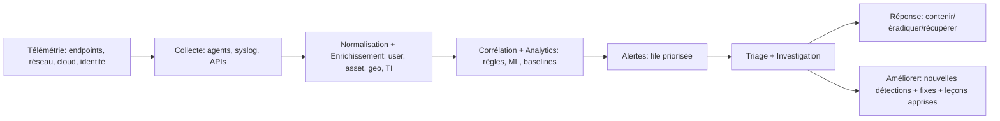

# Sécurité Offensive vs Sécurité Défensive (Red Team vs Blue Team) — Guide pratique de bout en bout

> **Public :** apprenants tech‑savvy (étudiants, analystes juniors, pentesters juniors)  
> **Objectif :** être capable d’expliquer **et d’appliquer** les concepts de sécurité offensive vs défensive **sans Google**.

---

## Sommaire
1. [Pourquoi la séparation “Offense vs Defense” existe](#1-pourquoi-la-séparation-offense-vs-defense-existe)
2. [Définitions clés (Offensive, Défensive, Assurance)](#2-définitions-clés-offensive-défensive-assurance)
3. [Red Team, Blue Team, Purple Team](#3-red-team-blue-team-purple-team)
4. [Ethical hacking vs pentest (pourquoi les mots comptent)](#4-ethical-hacking-vs-pentest-pourquoi-les-mots-comptent)
5. [Vulnerability Assessment vs Penetration Testing](#5-vulnerability-assessment-vs-penetration-testing)
6. [Méthodologie d’attaque : Cyber Kill Chain + MITRE ATT&CK](#6-méthodologie-dattaque--cyber-kill-chain--mitre-attck)
7. [Fondations défensives : prévention, détection, réponse](#7-fondations-défensives-prévention-détection-réponse)
8. [SOC, SIEM, et pipeline de détection](#8-soc-siem-et-pipeline-de-détection)
9. [Threat hunting (comment ça marche vraiment)](#9-threat-hunting-comment-ça-marche-vraiment)
10. [Incident Response : phases et critères de “bon” niveau](#10-incident-response--phases-et-critères-de-bon-niveau)
11. [Outils offensifs courants vs contrôles défensifs](#11-outils-offensifs-courants-vs-contrôles-défensifs)
12. [Sensibilisation (awareness) : le “plan de contrôle humain”](#12-sensibilisation-awareness--le-plan-de-contrôle-humain)
13. [Assembler le tout : scénario réaliste Red/Blue/Purple](#13-assembler-le-tout--scénario-réaliste-redbluepurple)
14. [Cheat sheets : explications rapides + réponses d’entretien](#14-cheat-sheets--explications-rapides--réponses-dentretien)
15. [Ressources (étendues + haute valeur)](#15-ressources-étendues--haute-valeur)

---

## 1) Pourquoi la séparation “Offense vs Defense” existe

La cybersécurité repose sur deux vérités permanentes :

- **Les attaquants n’ont besoin que d’un seul maillon faible** (un actif oublié, un mot de passe faible, un bucket mal configuré, un plugin vulnérable).
- **Les défenseurs doivent protéger l’ensemble** (personnes + process + techno) en continu.

D’où la séparation naturelle :
- **Sécurité offensive** : *simuler les attaquants* pour découvrir et démontrer l’impact.
- **Sécurité défensive** : *réduire la probabilité et l’impact* via des contrôles, la supervision et la réponse.

Dans les organisations matures, offense et defense ne sont pas opposées : elles forment une **boucle d’amélioration** :
- L’offense trouve une faiblesse → La défense corrige + détecte → L’offense reteste → La défense durcit.

---

## 2) Définitions clés (Offensive, Défensive, Assurance)

### Sécurité offensive (le côté “casser… proprement”)
La sécurité offensive consiste à mener des tests adversariaux **autorisés** : explorer, exploiter et démontrer un risque réel.

**Résultat attendu :** une preuve actionnable (ex : “j’ai obtenu un accès admin, exfiltré des données *fictives* et documenté le chemin.”)

**Livrables typiques :**
- chemins d’exploitation + preuves (screenshots, logs, requêtes, hashes)
- description de l’impact (CIA + impact métier)
- recommandations de remédiation + étapes de vérification

### Sécurité défensive (le côté “protéger et résister”)
La sécurité défensive vise à **prévenir, détecter et répondre** à l’activité malveillante.

**Résultat attendu :** moins d’incidents, confinement plus rapide, rayon d’impact minimal.

**Livrables typiques :**
- configurations durcies, patching, identité sécurisée
- détections (alertes), dashboards, mapping avec la threat intel
- playbooks d’incident response, exercices et retours d’expérience

### Assurance / Gouvernance (le côté “prouver et piloter”)
Souvent associée à la défense :
- gestion des risques, conformité, politiques, audits, architecture sécurité
- capacité à expliquer *pourquoi* c’est sécurisé et *comment* ça le reste

---

## 3) Red Team, Blue Team, Purple Team

### Red Team
Une Red Team est un groupe offensif qui **émule un adversaire réel** pour tester la détection + la réponse + parfois les facteurs humains.

- **Périmètre :** large (technique + parfois physique + social engineering selon contrat)
- **Focus :** furtivité, réalisme, objectifs (ex : accès à un domaine, accès données sensibles)
- **Livrable :** “narratif d’attaque” + écarts (prévention/détection/réponse)

### Blue Team
La Blue Team défend :
- monitoring, triage d’alertes, investigation
- durcissement, patching, identité, segmentation réseau
- incident response et amélioration continue post-incident

### Purple Team
La Purple Team est la **collaboration** : combiner les constats Red avec la télémétrie Blue en quasi temps réel pour améliorer la défense rapidement.
C’est souvent une *méthode* plus qu’une équipe permanente.

**Idée clé :** Purple Team accélère les boucles d’apprentissage (attaque → détecter → corriger → retester).

---

## 4) Ethical hacking vs pentest (pourquoi les mots comptent)

### Ethical hacking
“Ethical hacking” est un terme large : faire des activités “hacker” **avec autorisation** et dans un cadre défini.

### Penetration testing (pentest)
Le pentest est une forme structurée d’ethical hacking avec un périmètre, des règles d’engagement et des livrables.

Une définition souvent citée : un pentest vérifie la résistance d’un système à des tentatives actives de compromission. citeturn2search8  
Le NIST SP 800‑115 fournit des orientations pour planifier et conduire des tests/évaluations de sécurité (incluant le pentest). citeturn2search5turn2search3

**Pourquoi c’est important :**
- “Ethical hacking” peut recouvrir plein d’activités (labs, bug bounty, recherche).
- “Pentest” implique **cadre contractuel**, méthode, reporting, contraintes de risque.

---

## 5) Vulnerability Assessment vs Penetration Testing

Pense “médecine” :

- **Vulnerability Assessment (VA)** = *dépistage*  
  Découvrir un grand nombre de faiblesses (CVE connues, mauvaises configs, expositions).
- **Penetration Test (PT)** = *simulation chirurgicale*  
  Utiliser un sous-ensemble de faiblesses pour démontrer l’accès/l’impact et les chemins réalistes.

### Tableau comparatif rapide

| Dimension | Vulnerability Assessment | Penetration Testing |
|---|---|---|
| Objectif | Trouver beaucoup de faiblesses | Prouver exploitabilité et impact |
| Profondeur | Large | Profond et scénarisé |
| Sortie | Liste de vulnérabilités (priorisées) | Narratif d’attaque + preuves + remédiation |
| Outils | Automatisation forte | Automatisation + créativité manuelle |
| Risque | Plus faible | Plus élevé (doit être maîtrisé) |

**Règle simple :** VA dit “ce qui pourrait être mauvais”, PT dit “ce qu’on peut *faire* avec”.

---

## 6) Méthodologie d’attaque : Cyber Kill Chain + MITRE ATT&CK

Pour bien défendre, il faut un modèle mental de progression des attaques.

### 6.1 Cyber Kill Chain (7 étapes)
La Cyber Kill Chain de Lockheed Martin découpe une intrusion en étapes où les défenseurs peuvent interrompre l’attaque. citeturn0search6turn0search10

1. Reconnaissance  
2. Weaponization (armement)  
3. Delivery (livraison)  
4. Exploitation  
5. Installation  
6. Command & Control (C2)  
7. Actions on Objectives (actions sur l’objectif)  

**Force :** vision “timeline” simple.  
**Limite :** les attaques modernes ne sont pas toujours linéaires.

### 6.2 MITRE ATT&CK (tactiques & techniques)
MITRE ATT&CK est une base de connaissances sur les tactiques/techniques observées chez des attaquants réels, utilisée pour une défense “threat‑informed”. citeturn0search0turn0search4

- **Tactiques** = objectifs (ex : Initial Access, Persistence)
- **Techniques** = moyens (ex : phishing, credential dumping)

**Force :** très détaillé et opérationnel pour detections/controls.  
**Usage :** mapper des incidents, valider des contrôles, construire des exercices Purple Team.

### 6.3 Les utiliser ensemble
- **Kill Chain** = récit d’attaque simple  
- **ATT&CK** = description précise des comportements + base pour détections

---

## 7) Fondations défensives : prévention, détection, réponse

Une défense moderne est **en couches** :

### Prévention (rendre l’attaque plus difficile)
- patch management
- configurations durcies (CIS baselines)
- durcissement identité (MFA, moindre privilège)
- segmentation réseau
- sécurité applicative (Secure SDLC : SAST/DAST, dépendances)

### Détection (voir ce qui a échappé)
- logs + télémétrie + alerting
- EDR (Endpoint Detection & Response)
- NDR, surveillance DNS
- détection d’anomalies (identité, cloud)

### Réponse (limiter les dégâts vite)
- playbooks + structure de commandement
- isolation / containment
- forensic + procédures de récupération
- amélioration continue post-incident

---

## 8) SOC, SIEM, et pipeline de détection

### 8.1 Qu’est-ce qu’un SOC ?
Un **Security Operations Center** est la fonction/équipe chargée de :
- supervision, triage, investigation
- coordination de la réponse et du confinement
- amélioration continue des détections et de la résilience

ENISA fournit des guides opérationnels pour mettre en place des capacités SOC/CSIRT. citeturn2search7  
MITRE a aussi publié des recommandations “World‑Class SOC”. citeturn2search16

### 8.2 Qu’est-ce qu’un SIEM ?
Un SIEM agrège les logs/événements, les corrèle, et aide à la détection + investigation.
Une définition courante : le SIEM combine des fonctions de gestion de l’info sécurité et des événements pour améliorer détection et remédiation. citeturn1search1

Le NIST SP 800‑92 couvre les bonnes pratiques de log management (fondation essentielle d’un SIEM). citeturn1search13turn1search9

### 8.3 Pipeline de détection (des événements bruts aux décisions)

**Idée clé :** le SIEM n’est pas “magique”. La qualité dépend de :
- la couverture de logging
- l’enrichissement (inventaire, identité)
- le tuning (réduire les faux positifs)
- des workflows de réponse efficaces

---

## 9) Threat hunting (comment ça marche vraiment)

Le threat hunting est une recherche **proactive** de menaces inconnues ou non détectées. citeturn2search15  
Il complète le SIEM : les alertes ne détectent que ce que tu as déjà modélisé.

### 9.1 Deux styles courants

**(A) Hunting “hypothesis-driven”**
- partir d’une hypothèse : “un attaquant utilise des identifiants volés sur le VPN hors horaires”
- collecter des preuves (logs/télémétrie)
- confirmer / infirmer puis transformer en détection

SANS mentionne l’importance des hypothèses dans la contribution humaine au hunting. citeturn2search19

**(B) Hunting “analytics-driven”**
- partir d’anomalies (process rares, DNS étrange, pics d’échecs auth)
- pivoter vers le contexte (host/user/app)

### 9.2 Boucle typique de hunting

1. Choisir une question (ATT&CK, threat intel, incidents internes)  
2. Définir les sources (EDR, auth logs, DNS, cloud audit, proxy)  
3. Requêter et pivoter (fenêtres temporelles, graphes d’entités)  
4. Valider (malveillant ou bénin ?)  
5. Transformer en amélioration : alerte, blocage, durcissement  

Microsoft décrit l’“advanced hunting” comme une exploration par requêtes sur télémétrie brute. citeturn2search9

---

## 10) Incident Response : phases et critères de “bon” niveau

Un cycle classique utilise 6 phases (modèle SANS) : préparation, identification, confinement, éradication, récupération, leçons apprises. citeturn0search11turn0search7turn0search15

Le NIST SP 800‑61 Rev.2 a longtemps servi de référence IR (désormais archivé/retiré depuis le 3 avril 2025, mais encore largement cité). citeturn1search0turn1search4

### 10.1 Checklist phase par phase

**1) Préparation**
- logging + synchro temps (NTP)
- inventaire + criticité
- accès SIEM/EDR, canaux d’incident
- playbooks, astreinte, tabletop exercises

**2) Identification**
- confirmer “est‑ce un incident ?”
- périmètre : users/hosts/apps touchés
- sévérité : impact métier + types de données + exposition

**3) Confinement**
- court terme : isoler endpoints, désactiver comptes, bloquer IoCs
- long terme : segmenter, rotation secrets, déploiement de fixes

**4) Éradication**
- supprimer malware/persistance
- patcher la faille exploitée, corriger la config
- chasser l’activité liée ailleurs

**5) Récupération**
- restaurer les services
- vérifier l’intégrité, monitorer la re‑compromission

**6) Leçons apprises**
- timeline + RCA (root cause analysis)
- quelles détections ont manqué ? quels contrôles ont marché ?
- mise à jour runbooks, formation, architecture

---

## 11) Outils offensifs courants vs contrôles défensifs

### 11.1 Outils offensifs (exemples)
> Les outils ne font pas le métier : ils amplifient une méthode.

- Recon : OSINT, subdomains, DNS enum
- Scan : Nmap, masscan (si autorisé)
- Web : Burp Suite, OWASP ZAP
- Exploit : Metasploit (avec grande prudence)
- Password : Hashcat, John the Ripper
- AD : BloodHound (tests autorisés en entreprise)
- Cloud : CLIs + scanners de mauvaise configuration

### 11.2 Mesures défensives (exemples)
- Identité : MFA, auth résistante au phishing, moindre privilège
- EDR + durcissement endpoints
- Logging centralisé + rétention + intégrité
- Segmentation réseau + egress control
- Vuln management + SLA patch
- Baselines CIS + config management
- Backups immutables + drills de restauration
- Sécurité email + DMARC/SPF/DKIM
- AppSec : WAF, Secure SDLC, scanning dépendances

### 11.3 Mapper offense → defense (mini exemples)

| Action offensive | Contre‑mesures défensives |
|---|---|
| Credential stuffing / brute force | MFA, rate limiting, lockout, monitoring échecs auth |
| Phishing | awareness + contrôles email + détection logins suspects |
| Privilege escalation | moindre privilège, patching, détections comportementales EDR |
| Lateral movement | segmentation, admin tiering, logs + détections ATT&CK |
| Exfiltration | DLP, egress monitoring, détection d’anomalies |

---

## 12) Sensibilisation (awareness) : le “plan de contrôle humain”

La sensibilisation est critique car l’humain interagit avec le SI au quotidien :
- le phishing/social engineering cible le comportement et la confiance
- des erreurs de configuration viennent souvent d’incompréhensions ou de raccourcis

Le NIST SP 800‑50 (et ses mises à jour) donne un cadre pour bâtir des programmes de sensibilisation/formation. citeturn1search3turn1search11

**Principe clé :** formation **par rôle** :
- devs : secure coding + secrets management
- IT : hardening + patching + identité
- direction : décisions de risque + pilotage de crise
- tous : phishing, hygiène mots de passe, signalement

---

## 13) Assembler le tout : scénario réaliste Red/Blue/Purple

### Scénario : “Phishing → vol de token → accès données cloud”
**Objectif :** tester si l’orga détecte et stoppe un chemin réaliste.

**Étapes Red Team**
1. Recon : identifier cibles probables et patterns email
2. Delivery : simulation contrôlée de phishing (autorisée)
3. Exploit : capture token/cred en mode “safe”
4. Actions : tentative d’accès stockage cloud + exfil **données synthétiques**

**Tâches Blue Team**
- détecter anomalies de connexion (geo, device, impossible travel)
- corréler email + auth + endpoint dans le SIEM
- contenir : désactiver compte, révoquer tokens, isoler endpoint
- éradiquer : corriger règles mail, reset secrets, patch, durcir contrôles

**Couche Purple Team**
- mapper les comportements sur **MITRE ATT&CK**
- tuner les détections (moins de faux positifs, logs manquants)
- écrire un mini playbook : “Réponse à vol de token”
- retester le même chemin pour confirmer

---

## 14) Cheat sheets : explications rapides + réponses d’entretien

### 14.1 One‑liners
- **Sécurité offensive :** tests autorisés pour prouver l’impact et trouver les failles avant les attaquants.
- **Sécurité défensive :** prévention + détection + réponse pour réduire probabilité et impact.
- **Red Team :** émulation d’adversaire réaliste.
- **Blue Team :** supervision, durcissement, incident response.
- **Purple Team :** collaboration pour améliorer vite détection + durcissement.
- **SIEM :** centralisation/corrélation des logs + support investigation.
- **Threat hunting :** recherche proactive de menaces qui ne déclenchent pas d’alertes.

### 14.2 Questions d’entretien → réponses nettes

**Q : Différence VA vs PT ?**  
VA = découverte large et priorisation ; PT = exploitation profonde pour prouver impact et chemins.

**Q : Qu’est‑ce que la Cyber Kill Chain ?**  
Un modèle en 7 étapes décrivant une intrusion et où on peut la casser côté défense. citeturn0search6turn0search2

**Q : Pourquoi MITRE ATT&CK ?**  
Parce que ça décrit des comportements réels d’attaquants et sert de vocabulaire commun pour détections/tests/rapports. citeturn0search0turn0search4

**Q : Comment un SIEM aide ?**  
Il centralise et corrèle la télémétrie pour détecter, trier et investiguer à l’échelle. citeturn1search1turn1search13

---

## 15) Ressources (étendues + haute valeur)

### Tes ressources de départ (conservées + contextualisées)
- MITRE ATT&CK Framework citeturn0search0  
- NIST Guide to Intrusion Detection and Prevention Systems (SP 800‑94) citeturn0search13turn0search9  
- Cyber Kill Chain (Lockheed Martin) citeturn0search6turn0search10  
- Incident response lifecycle (références SANS) citeturn0search11turn0search7  
- SIEM : aperçu + définition citeturn1search1turn1search13  

### Ajouts recommandés (haute valeur)
- **NIST SP 800‑115** : guide technique de tests/évaluation de sécurité (inclut méthodo pentest). citeturn2search5turn2search3  
- **ENISA** : “How to setup CSIRT and SOC” (guidage opérationnel). citeturn2search7  
- **MITRE** : “11 Strategies of a World‑Class SOC” (maturité SOC). citeturn2search16  
- **NIST SP 800‑92** : fondamentaux de gestion des logs (base SIEM). citeturn1search13turn1search9  
- **Threat hunting** : overview + concepts de playbooks. citeturn2search15turn2search6turn2search9  
- **Awareness & training** : NIST SP 800‑50 / mises à jour. citeturn1search3turn1search11  

---

## Optionnel : plan d’étude en 7 jours (maîtrise rapide)

**Jour 1 :** modèles offense vs defense + VA vs PT  
**Jour 2 :** Kill Chain + exercices de mapping ATT&CK  
**Jour 3 :** bases logs + pipeline SIEM + cycle de vie d’une alerte  
**Jour 4 :** workflow SOC triage/investigation  
**Jour 5 :** threat hunting : hunts “hypothesis-driven”  
**Jour 6 :** tabletop IR : “phishing → vol de token”  
**Jour 7 :** écrire une synthèse (blog) + checklist Purple Team
