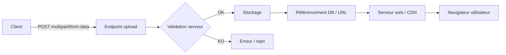

# Upload Vulnerabilities (File Upload Security) — Cours ultra détaillé (WebSec)

> **Contexte** : les fonctionnalités d’upload (photo de profil, pièces jointes, import CSV/ZIP, etc.) sont parmi les surfaces d’attaque les plus **dangereuses** d’une application web. Une validation insuffisante peut mener à du **RCE**, du **Stored XSS**, du **vol de données**, des **écritures de fichiers arbitraires**, ou du **DoS**.

---

## Sommaire
1. [Définitions et enjeux](#1-définitions-et-enjeux)  
2. [Pourquoi l’upload est risqué](#2-pourquoi-lupload-est-risqué)  
3. [Le “cycle de vie” d’un fichier uploadé](#3-le-cycle-de-vie-dun-fichier-uploadé)  
4. [Grandes familles d’attaques (carte mentale)](#4-grandes-familles-dattaques-carte-mentale)  
5. [MIME, extensions, “magic bytes” et entêtes HTTP](#5-mime-extensions-magic-bytes-et-entêtes-http)  
6. [Contrôles côté client vs côté serveur](#6-contrôles-côté-client-vs-côté-serveur)  
7. [Bypass de restrictions (comment ça marche)](#7-bypass-de-restrictions-comment-ça-marche)  
8. [Méthodologie de test (pentest) en conditions réelles](#8-méthodologie-de-test-pentest-en-conditions-réelles)  
9. [Bonnes pratiques de défense (10+ règles solides)](#9-bonnes-pratiques-de-défense-10-règles-solides)  
10. [Checklist “Upload Security” (prête à coller dans un README)](#10-checklist-upload-security-prête-à-coller-dans-un-readme)  
11. [FAQ / Questions d’examen (≥ 14) + réponses](#11-faq--questions-dexamen--14--réponses)  
12. [Mini-glossaire](#12-mini-glossaire)

---

## 1) Définitions et enjeux

### Qu’est-ce qu’un “unrestricted file upload” ?
Un **unrestricted file upload** (upload non restreint) survient quand une application permet à un utilisateur d’envoyer un fichier **sans contrôles robustes** sur :
- **le type réel** du fichier (format / contenu),
- **le nom** (filename) et son chemin (path),
- **la taille** et la complexité,
- **la destination** de stockage,
- **la manière** dont il sera servi au client (download vs rendu),
- **les permissions** sur le serveur.

📌 Résultat : l’attaquant peut parfois faire accepter un fichier qui sera **exécuté** (ou interprété) par le serveur, ou bien exploiter l’upload comme vecteur indirect (XSS, injection, DoS, exfiltration, overwrite…).

### Pourquoi c’est “high impact” ?
Parce qu’un upload est un **pont** entre un contenu contrôlé par l’utilisateur et :
- ton **système de fichiers**,
- ton **serveur web**,
- tes **bibliothèques** (image processing, PDF, unzip…),
- ton **SI** (antivirus, stockage, CDN),
- et parfois ton **moteur d’exécution** (PHP, Python, Node, templates).

---

## 2) Pourquoi l’upload est risqué

### Un fichier n’est pas “un fichier”
Un fichier, c’est :
- un **contenu** (bytes) qui peut contenir des payloads,
- un **métadonnée** (nom, type, taille),
- un **format** qui peut déclencher des parsers (images, PDF, XML…),
- un **objet stocké** qui sera ensuite :
  - consulté,
  - transformé (thumbnail),
  - indexé,
  - téléchargé,
  - ou affiché dans le navigateur.

👉 Donc l’upload est **multi-étapes** : chaque étape = surface d’attaque.

### Deux erreurs classiques
1) **“Je filtre en JS donc c’est bon.”** → tout contrôle client est contournable.  
2) **“Je vérifie l’extension.”** → l’extension n’est qu’une chaîne de caractères.

---

## 3) Le cycle de vie d’un fichier uploadé

Une bonne manière de raisonner (et de tester) :



À chaque nœud :
- **B** : parsing multipart, headers, champs, taille
- **C** : contrôles (extension/MIME/contenu)
- **D** : chemin, permissions, collision, overwrite
- **F/G** : rendu navigateur (XSS), exécution (RCE), téléchargement (Content-Disposition)

---

## 4) Grandes familles d’attaques (carte mentale)

En pratique (et comme sur ton schéma) on regroupe souvent :

### A) Injection via upload
- **SQL Injection** : ex. import CSV/Excel dont les champs finissent en DB sans validation.
- **XSS** : ex. upload de fichiers “actifs” (SVG/HTML) servis inline.
- **XXE** : ex. upload de XML (ou formats contenant du XML) parsé côté serveur.
- **CSV Injection** : ex. fichiers ouverts par Excel/LibreOffice (formules malicieuses).
- **Command Injection** : ex. le serveur appelle `convert`, `ffmpeg`, `unzip`, `pdftotext` avec des paramètres construits depuis le filename.

🎯 Idée clé : l’upload sert de **conteneur** à une charge utile, mais l’exécution se produit **plus tard** lors du traitement.

### B) Bypass de restrictions
- **Double extension** : `fichier.jpg.<autre>` (selon serveurs/routers).
- **Content-Type** : spoof du type déclaré (multipart part header).
- **Magic bytes** : début de fichier “ressemble à” une image, mais contient autre chose.
- **Special chars** : unicode, espaces, points, séparateurs, etc. qui cassent les parsers.

🎯 Idée clé : tu trompes une validation **fragile** en jouant sur la différence entre ce que *l’app croit* et ce que *le serveur / navigateur interprète*.

### C) DoS (Denial of Service)
- **Large files** : saturation disque/bande passante.
- **Pixel flood** : images très lourdes à décoder (dimensions énormes).
- **Long strings in filename** : crash/bugs, logs énormes, dépassements.

🎯 Idée clé : pas besoin d’exécuter du code : tu épuises CPU/RAM/disque.

### D) Autres attaques “spécifiques upload”
- **ImageTragick** (famille de vulnérabilités ImageMagick historiques) : traitement d’image dangereux.
- **EXIF leakage** : métadonnées exposant GPS, device, infos sensibles.
- **File overwrite** : écriture sur un fichier existant (collision nom).
- **Path Traversal** : `../` et variantes → écriture hors répertoire prévu.
- **ZipSlip** : traversal dans une archive ZIP lors de l’extraction.

---

## 5) MIME, extensions, “magic bytes” et entêtes HTTP

### 5.1 Extension ≠ type réel
- L’extension (`.jpg`, `.png`) est une **convention**.
- Le serveur peut décider du traitement selon :
  - extension,
  - MIME,
  - “sniffing”,
  - configuration (ex: Apache/Nginx),
  - règles de l’application.

**À retenir** : la défense “extension only” est insuffisante.

### 5.2 MIME type : c’est quoi ?
Le **MIME type** (ex: `image/jpeg`, `application/pdf`) décrit le type de contenu.

Où il apparaît ?
- Dans l’entête HTTP de la réponse (`Content-Type: image/png`)
- Dans l’upload multipart, sur **chaque part** :

Exemple simplifié (structure) :
```http
POST /upload HTTP/1.1
Content-Type: multipart/form-data; boundary=----XYZ

------XYZ
Content-Disposition: form-data; name="file"; filename="photo.png"
Content-Type: image/png

...bytes...
------XYZ--
```

⚠️ Le `Content-Type` de la part est **déclaratif** : un client peut mentir.

### 5.3 Content-Disposition : pourquoi c’est critique ?
`Content-Disposition` contient souvent :
- le **nom du champ** (`name="file"`)
- le **filename** (`filename="..."`)

Risques :
- filename contenant des **chemins**,
- caractères spéciaux,
- très longs noms,
- collisions,
- injections si le filename est réutilisé (logs, shell, DB, HTML).

### 5.4 “Magic bytes” (signature de fichier)
Beaucoup de formats ont une signature au début (ex: PNG commence par une séquence fixe).
On peut vérifier un fichier via :
- `file` (libmagic) sous Linux,
- bibliothèques dédiées (Pillow, imagemagick *mais attention*),
- parsing strict.

⚠️ Une signature correcte ne garantit pas l’absence de contenu dangereux (polyglot, contenu additionnel).

---

## 6) Contrôles côté client vs côté serveur

### Côté client (bypassable)
- attribut HTML `accept="image/*"`
- validation JS avant envoi
- restrictions UI

➡️ L’attaquant peut :
- envoyer la requête à la main (curl),
- modifier via Burp,
- utiliser une autre app / script.

### Côté serveur (indispensable)
Tu dois contrôler :
- **type réel** (sniff / parsing),
- **extension** (allow-list),
- **taille** (limites strictes),
- **nom** (normalisation + renommage),
- **destination** (répertoire sûr),
- **mode de délivrance** (download, CSP, nosniff),
- **permissions**.

---

## 7) Bypass de restrictions (comment ça marche)

> Objectif pédagogique : comprendre les *mécanismes* des bypass, sans se limiter à “trucs” à réciter.

### 7.1 Double extension & confusion de routage
Certains stacks :
- vérifient uniquement la **dernière** extension,
- ou au contraire s’arrêtent à la **première**,
- ou interprètent différemment selon le composant (app vs serveur web).

➡️ Bypass possible si :
- l’app valide “.jpg” mais le serveur exécute “.php” (ou équivalent) selon sa config,
- ou si le stockage/serving ne correspond pas à la validation.

### 7.2 Content-Type spoofing
Si le serveur fait confiance à `Content-Type: image/png` envoyé par le client → c’est fragile.
La validation robuste doit :
- ignorer le `Content-Type` client,
- déterminer le type via parsing ou sniff.

### 7.3 Magic bytes vs parsing réel
“Magic bytes” seul = souvent mieux que rien, mais insuffisant :
- un fichier peut “commencer comme” une image, puis contenir d’autres données.
Défense plus forte :
- décoder le fichier avec une lib safe,
- **ré-encoder** vers un format “propre” (strip metadata, recompress).

### 7.4 Special characters et normalisation
Problèmes fréquents :
- espaces, points, unicode “look-alike”,
- séparateurs de chemin,
- encodages différents (UTF-8 vs legacy),
- normalisation inconsistent entre app / OS / FS.

Défense :
- **renommer** côté serveur (UUID),
- refuser tout filename “fourni” pour le stockage.

---

## 8) Méthodologie de test (pentest) en conditions réelles

### 8.1 Recon : comprendre la fonctionnalité
Checklist “réalité du flux” :
- L’upload va où ? (local disk, S3, DB blob, CDN)
- Le fichier devient-il accessible via URL ?
- Est-il **rendu** dans le navigateur ou forcé en **download** ?
- Y a-t-il un traitement (thumbnail, unzip, OCR, conversion) ?
- Quelles réponses/erreurs donnent des indices (extensions autorisées, taille max) ?

### 8.2 Tester la robustesse des validations
Tu testes **séparément** :
1) **Extension** (allow-list vs deny-list)
2) **MIME déclaré** (part header)
3) **Type détecté** (sniff/parsing)
4) **Nom / chemin** (traversal, collisions)
5) **Stockage & exposition** (exécutable ? headers ?)
6) **Limites** (taille, dimensions, zip bombs)
7) **Post-traitement** (image libs, unzip, converters)

### 8.3 Outils pratiques (Kali / WebSec)
- Burp Suite (Proxy/Repeater) : modifier filename, headers, champs multipart
- `curl` : reproduire précisément l’upload
- `file` : vérifier le type détecté
- `exiftool` : lire/évaluer les métadonnées
- `strings`, `hexdump/xxd` : inspecter rapidement

Exemples de commandes **safe** (diagnostic) :
```bash
file --mime-type -b uploaded.bin
exiftool image.jpg | head
xxd -l 32 file.bin
```

### 8.4 Signaux d’alarme (vulnérabilité probable)
- Le serveur **accepte** n’importe quoi si l’extension “passe”.
- Les fichiers sont servis depuis `/uploads/` et sont **rendus inline**.
- Le répertoire d’upload est sous le **web root**.
- Les noms de fichiers originaux sont conservés (collisions).
- Pas de limite de taille / pas de rate limit.
- L’app dézippe côté serveur sans validations de chemin.
- L’app génère des miniatures avec des libs “dangereuses” / non patchées.

---

## 9) Bonnes pratiques de défense (10+ règles solides)

### Règle 1 — Allow-list stricte (et pas deny-list)
Autoriser explicitement une courte liste (ex: `png`, `jpg`, `pdf`), refuser le reste.

### Règle 2 — Validation serveur “multi-couches”
- check extension (allow-list)
- check MIME détecté (libmagic/parsing)
- check parsing réel (ex: décoder l’image)
- check taille + dimensions
- check contenu (si possible)

### Règle 3 — Renommer côté serveur (UUID) + ignorer le filename utilisateur
Stocker sous un nom sûr :
- sans espaces
- sans caractères spéciaux
- sans chemins
- sans collisions

### Règle 4 — Stocker **hors web root**
Ne jamais stocker sous un dossier directement servi par le serveur web, sauf si tu contrôles **parfaitement** l’exposition.

### Règle 5 — Si stockage servi : domaine séparé + “download” par défaut
- idéal : **static domain** isolé (pas de cookies de session)
- servir en `Content-Disposition: attachment` quand possible
- ajouter `X-Content-Type-Options: nosniff`
- CSP restrictive si rendu (sinon, éviter le rendu)

### Règle 6 — Upload directory **non-exécutable**
Configurer le serveur :
- pas d’exécution de scripts
- pas d’interprétation server-side
- pas de CGI
- permissions minimales

### Règle 7 — Permissions minimales
- répertoire upload : écriture par le process applicatif, lecture contrôlée
- pas de droits “execute”
- pas d’accès global inutile

### Règle 8 — Limites : taille, fréquence, quotas
- taille max (hard limit serveur + app)
- rate limiting (par IP / compte)
- quotas (par utilisateur)
- timeouts

### Règle 9 — Neutraliser les formats “actifs”
- ne pas accepter HTML, SVG, JS
- attention aux documents riches (ex: certains formats peuvent embarquer scripts/macros)
- re-encoder les images (strip metadata)

### Règle 10 — Traitements server-side safe
- éviter d’appeler des binaires via shell avec filename utilisateur
- si conversion : utiliser des libs patchées, sandboxer, limiter ressources (CPU/RAM)

### Règle 11 — Scanner / analyser
Selon contexte :
- antivirus / scanner
- détection de contenu suspect
- logs & alerting

### Règle 12 — Logging & monitoring
Tracer :
- user id / IP
- type détecté
- taille
- nom original (en log, pas en stockage)
- résultat des validations

---

## 10) Checklist “Upload Security” (prête à coller dans un README)

```text
[ ] Validation côté serveur (pas seulement client)
[ ] Allow-list extensions
[ ] Détection type réel (libmagic/parsing) + cohérence extension/MIME
[ ] Taille max + dimensions max + timeouts
[ ] Renommage côté serveur (UUID) ; filename utilisateur non utilisé pour le stockage
[ ] Stockage hors web root (ou domaine statique isolé)
[ ] Répertoire upload non-exécutable + permissions minimales
[ ] Content-Disposition = attachment par défaut, nosniff activé
[ ] Protection path traversal / overwrite / collisions
[ ] Extraction ZIP sécurisée (anti ZipSlip) + limites anti zip bomb
[ ] Neutralisation métadonnées (EXIF) si images
[ ] Rate limiting / quotas
[ ] Logs, alerting, monitoring
[ ] Tests réguliers (unit tests + tests sécurité)
```

---

## 11) FAQ / Questions d’examen (≥ 14) + réponses

### 1) Qu’est-ce qu’un unrestricted file upload ?
C’est une fonctionnalité d’upload qui n’applique pas de contrôles robustes sur le type, le nom, la taille, le stockage et/ou la manière de servir le fichier. Elle peut mener à des impacts majeurs (RCE, XSS, overwrite, DoS).

### 2) Pourquoi les uploads sont un risque sécurité ?
Parce qu’ils permettent à un attaquant d’injecter un contenu arbitraire dans ton système (filesystem + traitements + rendu navigateur). Chaque étape du pipeline peut être exploitée.

### 3) Comment un formulaire d’upload peut être exploité ?
En faisant accepter un fichier qui :
- sera interprété/exécuté côté serveur,
- déclenchera une vulnérabilité lors du traitement (conversion, parsing),
- sera rendu dans le navigateur (XSS),
- écrira au mauvais endroit (traversal / overwrite),
- saturera les ressources (DoS).

### 4) C’est quoi un web shell ?
Un **web shell** est un script placé sur un serveur (via upload ou autre faille) qui offre une interface pour exécuter des actions côté serveur (lecture fichiers, commandes, etc.).  
➡️ En défense, l’objectif est de rendre **impossible** l’upload + exécution d’un script côté serveur.

### 5) Quel lien entre MIME types et sécurité upload ?
Le MIME type influence comment :
- le serveur web sert le fichier (`Content-Type`),
- le navigateur l’interprète (rendu vs download),
- l’application valide.  
Mais le MIME “déclaré” par le client peut être falsifié : il faut détecter côté serveur.

### 6) Qu’est-ce que le content-type spoofing ?
C’est le fait de mentir sur `Content-Type` (ex: déclarer `image/png` alors que le contenu n’est pas une image). Si le serveur fait confiance à ce header, on bypass la validation.

### 7) Comment la validation côté serveur réduit les risques ?
Elle force des règles non contournables par un client :
- allow-list extension,
- détection type réel,
- parsing/ré-encodage,
- limites de taille,
- renommage,
- stockage sûr.

### 8) Pourquoi le filtrage d’extension est important ?
Parce que certains serveurs/configurations traitent certaines extensions comme “exécutables” ou “actives”. Filtrer aide, mais doit être combiné à d’autres contrôles car l’extension est facilement manipulable.

### 9) Comment les checks côté client peuvent être bypassés ?
En envoyant directement une requête HTTP (curl), en modifiant une requête dans un proxy (Burp), ou en désactivant le JS. Le serveur doit donc être la source de vérité.

### 10) Quelles pratiques d’upload sécurisé sont essentielles ?
Allow-list, validation multi-couches, renommage UUID, stockage hors web root, répertoire non-exécutable, permissions minimales, limites taille/fréquence, serving en download, nosniff, logs/monitoring.

### 11) En quoi limiter la taille aide la sécurité ?
Ça réduit :
- saturation disque/bande passante,
- CPU/RAM sur parsing/conversion,
- attaques type zip bomb / images énormes,
- coûts (storage/CDN).

### 12) Quels risques à stocker sur le même domaine que l’app ?
- cookies de session potentiellement envoyés au domaine statique,
- risque de XSS/HTML rendu qui touche le domaine principal,
- confusion de politiques (CSP, CORS),
- surface d’attaque “mélangée”.

### 13) Comment les permissions impactent la sécurité ?
Si le process peut écrire/exec partout → gros risque.  
Des permissions minimales empêchent :
- overwrite de fichiers critiques,
- exécution,
- escalade via fichiers.

### 14) Pourquoi le dossier d’upload ne doit pas être exécutable ?
Parce que si un fichier “actif” (script) y est uploadé, un serveur mal configuré peut l’exécuter. Interdire l’exécution coupe une classe entière d’attaques (RCE via upload).

### 15) C’est quoi ZipSlip ?
C’est une traversal lors de l’extraction d’une archive : des entrées dans le ZIP contiennent des chemins permettant d’écrire hors du dossier d’extraction. Défense : canonicalisation + blocage des chemins sortants.

### 16) C’est quoi “EXIF leakage” ?
Les métadonnées d’images peuvent contenir :
- coordonnées GPS,
- modèle de téléphone,
- dates, etc.  
Si tu publies l’image brute, tu peux exposer des infos sensibles. Défense : strip EXIF / ré-encoder.

---

## 12) Mini-glossaire
- **Allow-list** : liste d’éléments autorisés (plus sûr qu’une deny-list).
- **Deny-list** : liste d’éléments interdits (souvent contournable).
- **Web root** : répertoire servi publiquement par le serveur web.
- **nosniff** : directive empêchant le navigateur de “deviner” un autre type.
- **Zip bomb** : archive compressée qui explose en taille à l’extraction.
- **Polyglot** : fichier valide pour plusieurs formats (ex: image + autre).

---

## Bonus — Rappel “projet Holberton” (requirements)

- **Kali Linux** : tous les scripts testés là-dessus.
- **1 ligne par script** : `wc -l file` doit afficher `1`.
- **Fichiers terminent par un newline** : standard POSIX, évite des surprises dans `cat`, `diff`, linters, et certains outils de correction automatique.
- **README.md obligatoire** à la racine du dossier.
- **Focus** : target **Cyber - WebSec 0x05** (méthodo + compréhension > recettes).

---
