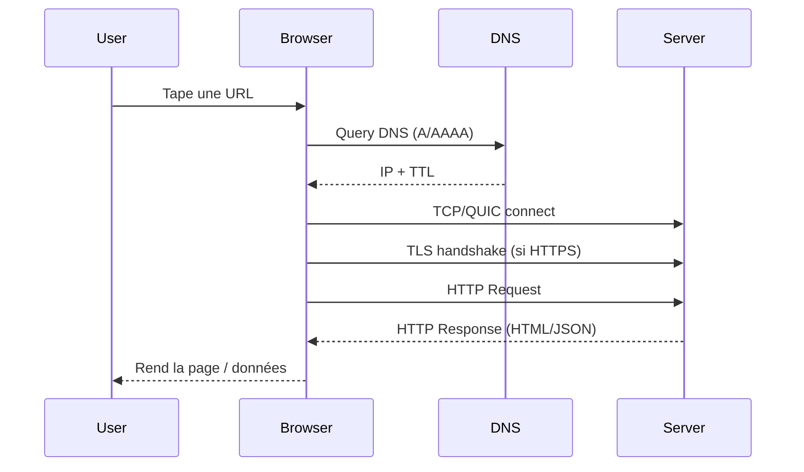
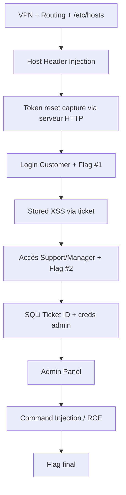

# Web Fundamentals (Cours ultra complet) — Kali / Pentest / Web Apps

> Objectif : comprendre *comment le Web fonctionne* (technique) + *comment les apps web sont construites* (frontend/backend) + *les risques sécurité majeurs* (OWASP) + *comment tester* + *bug bounty / VDP*.
>
> Contexte labo : Kali Linux 2023.3, scripts Bash courts (souvent 2 lignes), outils clés `curl` et `sqlmap`.

---

## Table des matières

1. [Le Web en 1 phrase](#le-web-en-1-phrase)  
2. [Comment le Web fonctionne (de l’URL au pixel)](#comment-le-web-fonctionne-de-lurl-au-pixel)  
3. [HTTP/HTTPS : vocabulaire essentiel](#httphttps--vocabulaire-essentiel)  
4. [DNS : la “téléphonie” d’Internet](#dns--la-téléphonie-dinternet)  
5. [Cookies, sessions, tokens](#cookies-sessions-tokens)  
6. [Caching, CDN, compression](#caching-cdn-compression)  
7. [Exemples d’applications Web](#exemples-dapplications-web)  
8. [Web 1.0 vs Web 2.0 vs Web 3.0](#web-10-vs-web-20-vs-web-30)  
9. [PWA : Progressive Web Apps](#pwa--progressive-web-apps)  
10. [Frontend ↔ Backend : comment ça communique ?](#frontend--backend--comment-ça-communique-)  
11. [Stateful vs Stateless](#stateful-vs-stateless)  
12. [Données structurées vs non-structurées](#données-structurées-vs-non-structurées)  
13. [Sécurité Web : menaces & modèles](#sécurité-web--menaces--modèles)  
14. [OWASP Top 10 : comprendre chaque catégorie](#owasp-top-10--comprendre-chaque-catégorie)  
15. [Tester la sécurité d’une app Web](#tester-la-sécurité-dune-app-web)  
16. [CORS : comprendre et tester](#cors--comprendre-et-tester)  
17. [Bug bounty & VDP : comment ça marche](#bug-bounty--vdp--comment-ça-marche)  
18. [Mini-labs Kali : curl & scripts Bash 2 lignes](#mini-labs-kali--curl--scripts-bash-2-lignes)  
19. [Cheat-sheet](#cheat-sheet)  
20. [Ressources officielles (liens)](#ressources-officielles-liens)  

---

## Le Web en 1 phrase

Le Web est un système **client–serveur** où un **client** (navigateur / app) demande des **ressources** (HTML, CSS, JS, JSON, images…) à un **serveur** via des protocoles (DNS + TCP/QUIC + TLS + HTTP), puis **affiche** une page en exécutant du code.

---

## Comment le Web fonctionne (de l’URL au pixel)

### 1) URL : ce que tu tapes
Exemple :
- `https://api.example.com:443/v1/users?id=42#profile`

Découpage :
- `https` : schéma (HTTP sécurisé)
- `api.example.com` : nom DNS (domaine)
- `:443` : port (souvent implicite)
- `/v1/users` : chemin (route)
- `?id=42` : query string (paramètres)
- `#profile` : fragment (utilisé côté client, pas envoyé au serveur)

### 2) Résolution DNS
Le client demande : “Quelle IP correspond à `api.example.com` ?”  
Le DNS renvoie une ou plusieurs IP (A/AAAA) + TTL.

### 3) Connexion réseau
- HTTP/1.1 et HTTP/2 : généralement **TCP**  
- HTTP/3 : **QUIC** (sur UDP)  
Ensuite, si HTTPS : **handshake TLS** (certificat, chiffrement).

### 4) Requête HTTP
Le client envoie :
- une **méthode** (GET/POST/PUT/PATCH/DELETE…)
- un **chemin** et des **headers**
- parfois un **body** (JSON, form-data…)

### 5) Réponse HTTP
Le serveur renvoie :
- un **status code** (200, 301, 404, 500…)
- des **headers**
- un **body** (HTML/JSON/…)

### 6) Rendu dans le navigateur
Pour une page web classique :
1. Télécharge HTML  
2. Parse HTML → DOM  
3. Télécharge CSS/JS/images…  
4. Exécute JS → manipule DOM (SPAs)  
5. Paint → affichage

> **Idée clé** : une “page” est souvent un *assemblage de dizaines/centaines de requêtes*.

### Diagramme (sequence)

---

## HTTP/HTTPS : vocabulaire essentiel

### Méthodes (à connaître *par cœur*)
- **GET** : lire (idéalement sans effet de bord)
- **POST** : créer / action
- **PUT** : remplacer
- **PATCH** : modifier partiellement
- **DELETE** : supprimer
- **OPTIONS** : “qu’est-ce qui est autorisé ?” (souvent CORS preflight)
- **HEAD** : comme GET sans body (headers only)

### Codes de statut (les plus utiles)
- **2xx** : succès (200, 201 Created, 204 No Content)
- **3xx** : redirection (301, 302, 307, 308)
- **4xx** : erreur client (400, 401, 403, 404, 429)
- **5xx** : erreur serveur (500, 502, 503)

### Headers très importants
- `Host` (HTTP/1.1), `:authority` (HTTP/2)
- `Content-Type`, `Accept`
- `Authorization: Bearer <token>`
- `Cookie: session=...`
- `Set-Cookie: ...; HttpOnly; Secure; SameSite=...`
- `Cache-Control`, `ETag`
- `Origin`, `Access-Control-Allow-Origin` (CORS)
- `Location` (redirection)

### HTTPS : ce que ça garantit (et ce que ça ne garantit pas)
✅ Chiffrement + intégrité + authentification du serveur (certificat).  
❌ Ne garantit pas que le site est “safe”, juste que la connexion est sécurisée.

---

## DNS : la “téléphonie” d’Internet

### Records communs
- **A** : IPv4
- **AAAA** : IPv6
- **CNAME** : alias
- **MX** : mail
- **NS** : serveurs DNS
- **TXT** : SPF/DKIM/DMARC, vérifs, etc.

### Attaques / risques côté pentest
- **Subdomain enumeration** (surface d’attaque)
- **Dangling DNS / subdomain takeover**
- **Info leak** via TXT (tokens, configs), zone transfers (AXFR) si mal configuré
- **Cache poisoning** (plus rare aujourd’hui côté app, mais concept important)

---

## Cookies, sessions, tokens

### Cookies
Un cookie = petite donnée stockée côté navigateur et renvoyée automatiquement au serveur (selon domaine/chemin).

Attributs essentiels :
- `HttpOnly` : inaccessible via JS (protection XSS partielle)
- `Secure` : uniquement en HTTPS
- `SameSite` : réduit CSRF (Lax/Strict/None)

### Session “classique” (stateful)
- Cookie contient un identifiant (`session_id`)
- Le serveur garde l’état (en mémoire/Redis/DB)

### Tokens (souvent stateless)
- **JWT** : token signé (parfois chiffré), contient des claims
- Avantages : pas besoin de stocker session côté serveur
- Risques : durée de vie, révocation, mauvaise validation, stockage côté client

---

## Caching, CDN, compression

### Pourquoi le cache existe
- Réduit latence, bande passante, charge serveur
- Accélère l’UX

### Côté navigateur
- `Cache-Control: max-age=...`
- `ETag` + `If-None-Match` → 304 Not Modified

### CDN (Content Delivery Network)
- Réseau de serveurs “proches” des utilisateurs
- Sert static assets (images, JS, CSS), parfois protège contre DDoS/WAF

### Compression
- `gzip`, `br` (Brotli) — attention aux attaques type BREACH (selon contexte)

---

## Exemples d’applications Web

- **Site vitrine** (HTML/CSS statiques)  
- **Blog / CMS** (WordPress, Ghost)  
- **Web app SaaS** (Notion, Trello, Figma)  
- **E-commerce** (Shopify-like)  
- **API-only backend** + frontend SPA (React/Vue)  
- **Mobile app** qui consomme une API (REST/GraphQL)  
- **Admin panels** / backoffice  
- **Microservices** derrière API Gateway

---

## Web 1.0 vs Web 2.0 vs Web 3.0

### Web 1.0 (≈ “read-only”)
- Pages statiques
- Peu d’interactions
- Auteur → lecteur

### Web 2.0 (≈ “read-write”)
- Interactions, réseaux sociaux, UGC (user generated content)
- APIs + apps riches (AJAX, SPAs)
- Plateformes centralisées (GAFA)

### Web 3.0 (vision “read-write-own”)
- Narratif : décentralisation (blockchain, dApps, wallets)
- Idée : propriété des actifs numériques, identité, data
- **Important** : le terme est souvent marketing — garde l’esprit critique.

---

## PWA : Progressive Web Apps

Une PWA = web app qui se comporte “comme une app” :
- installable (icône, “Add to Home Screen”)
- offline / réseau instable (service worker + cache)
- notifications, background sync (selon permissions)

### 3 composants clés
1. **HTTPS obligatoire**
2. **Web App Manifest** (`manifest.webmanifest`)
3. **Service Worker** (script qui intercepte requêtes, gère cache)

### Pourquoi c’est important en sécu
- Service worker = puissant : si compromis (XSS + SW), persistance possible
- PWA mal configurée peut cacher des comportements (phishing UX-like)

---

## Frontend ↔ Backend : comment ça communique ?

### 1) REST (le plus courant)
- URL = ressource (`/users/42`)
- Méthodes HTTP + JSON
- Avantages : simple, standard, cache-friendly
- Risques : auth, rate limit, BOLA/BFLA, injection, CORS…

### 2) GraphQL
- Un endpoint (`/graphql`), query language
- Avantage : évite over/under-fetch
- Risques : introspection, complexité, DoS par requêtes profondes

### 3) WebSockets
- Connexion persistante bidirectionnelle
- Usage : chat, trading, realtime
- Risques : auth au handshake, contrôles de message, injection

### 4) SSE (Server-Sent Events)
- Flux server → client (unidirectionnel)
- Plus simple que WebSocket pour “realtime lecture”

### 5) gRPC (plutôt inter-services)
- Proto + HTTP/2, souvent backend-to-backend

---

## Stateful vs Stateless

### Stateless (sans état côté serveur)
Chaque requête doit contenir tout ce qui est nécessaire (ex: token).
- 👍 scalabilité horizontale facile
- 👍 moins de dépendances sessions
- 👎 révocation token plus dure
- 👎 sécurité du stockage côté client critique

### Stateful (état conservé côté serveur)
Session côté serveur (cookie session_id côté client).
- 👍 révocation simple (tu supprimes la session)
- 👍 contrôle fin, rotation
- 👎 scalabilité (sticky sessions / store partagé type Redis)

### Exemple concret
- **API stateless** : `Authorization: Bearer JWT...`
- **Web app stateful** : `Cookie: session_id=...`

---

## Données structurées vs non-structurées

### Données structurées
- Schéma fixe (tables, colonnes)
- SQL, relationnel
- Ex : utilisateurs (id, email, role), commandes, paiements

### Données non-structurées
- Pas de schéma rigide
- Ex : textes libres, documents, images, vidéos, logs bruts

### Entre-deux : semi-structuré
- JSON, XML (structure flexible)
- Très courant dans les APIs modernes

> Sécu : le type de data influence **stockage**, **requêtage**, **fuites**, **conformité** (PII), et **surface d’injection**.

---

## Sécurité Web : menaces & modèles

### “La vraie question”
À chaque fois que tu vois une feature web, demande :
1) **Qui est l’utilisateur ?** (authentifié ? rôle ?)
2) **Que peut-il faire ?** (autorisation)
3) **Qu’est-ce qui est un input ?** (tout ce qui vient du client)
4) **Où ça va ?** (DB, filesystem, services, templates)
5) **Qu’est-ce qui est exposé ?** (réponses, logs, erreurs)
6) **Quel est le pire scénario ?** (impact)

### Principes de défense
- Least privilege (minimiser permissions)
- Secure defaults
- Validation côté serveur
- Segmentation + rate limiting
- Logs + monitoring + alerting
- Defense in depth

---

## OWASP Top 10 : comprendre chaque catégorie

> L’OWASP Top 10 “2021” est la version officiellement *la plus largement référencée*. L’OWASP a également publié une **Top Ten 2025** (au moins en Release Candidate / nouvelle édition) : garde l’habitude de vérifier la version.

### A01 — Broken Access Control
- Ex : accéder à `/api/users/2` alors qu’on est user 1 (**BOLA/IDOR**)
- Symptômes : contrôles côté client, vérif “role” absente, endpoints oubliés

### A02 — Cryptographic Failures
- HTTPS absent/mal configuré, stockage mdp en clair, hashing faible
- Confondre “encoding” et “encryption”

### A03 — Injection
- SQLi, NoSQLi, Command injection, template injection
- Cause : concaténation d’inputs non filtrés

### A04 — Insecure Design
- Problème de conception : logique métier exploitable
- Ex : pas de limite tentative, pas de workflow sécurisé

### A05 — Security Misconfiguration
- Debug ON, headers absents, permissions S3, CORS wildcard, directory listing…

### A06 — Vulnerable and Outdated Components
- Dépendances vulnérables (CVE), plugins, librairies
- Défense : SBOM, patching, SCA

### A07 — Identification & Authentication Failures
- Weak passwords, reset password weak, sessions mal gérées
- MFA absent, brute force possible

### A08 — Software & Data Integrity Failures
- Supply chain, CI/CD, updates non signées
- Ex : dépendances compromises, pipeline modifié

### A09 — Security Logging & Monitoring Failures
- Pas de logs utiles, pas d’alertes, pas de corrélation
- Incident response difficile

### A10 — SSRF (Server-Side Request Forgery)
- Le serveur fait une requête vers une URL contrôlée par l’attaquant
- Peut toucher metadata cloud, intranet, services internes

---

## Tester la sécurité d’une app Web

### La méthodologie “simple mais solide”
1. **Recon** (surface) : domaines, sous-domaines, endpoints, tech stack
2. **Mapping** : auth flows, rôles, pages, APIs, paramètres
3. **Test** : OWASP Top 10 en check-list
4. **Exploit contrôlé** : POC minimal + preuve d’impact
5. **Rapport** : reproduction, impact, recommandations

### Outils (classiques)
- Interception : Burp Suite, OWASP ZAP
- HTTP CLI : curl
- Scanners : nuclei (attention), nikto (bruyant)
- SQLi : sqlmap (à utiliser avec autorisation)
- JS analysis : devtools, sourcemaps, grep, linkfinder
- Auth tests : jwt-tool, session analysis

### Attention au “bruit”
En pentest réel, tu veux :
- **contrôler** ce que tu envoies
- **minimiser** les perturbations (DoS involontaire, logs)
- **documenter**

---

## CORS : comprendre et tester

### Pourquoi CORS existe
Le navigateur applique la **Same-Origin Policy** (SOP).  
CORS est un mécanisme basé sur des **headers HTTP** pour autoriser certains accès cross-origin.

### Preflight (OPTIONS)
Quand une requête est “non simple” (méthode non standard, headers custom, JSON…), le navigateur envoie :
- `OPTIONS /endpoint`
- avec `Origin`, `Access-Control-Request-Method`, `Access-Control-Request-Headers`

Le serveur doit répondre avec :
- `Access-Control-Allow-Origin`
- `Access-Control-Allow-Methods`
- `Access-Control-Allow-Headers`

### Mauvaises configs courantes
- `Access-Control-Allow-Origin: *` avec données sensibles
- “reflect origin” (renvoyer l’Origin sans validation)
- `Access-Control-Allow-Credentials: true` combiné à des origines trop larges

---

## Bug bounty & VDP : comment ça marche

### VDP (Vulnerability Disclosure Program/Policy)
- Politique qui explique **comment** reporter une vulnérabilité, périmètre, délais, safe harbor.
- Objectif : rendre la disclosure “propre” et gérable.

### Bug bounty
- Souvent un VDP + **récompense financière**
- Le scope est strict : *ce qui est autorisé / interdit*.
- Très orienté preuves : POC, impact, reproduction.

### Plateformes populaires (exemples)
- HackerOne, Bugcrowd, Intigriti, YesWeHack, Synack, Immunefi (crypto)…

### Conseils pour débuter (safe)
1. Lire scope + règles
2. Commencer sur des programmes “beginner friendly” / labs légaux
3. Faire des POC minimalistes, éviter data exfil
4. Être clair et pro dans le report

---

## Mini-labs Kali : curl & scripts Bash 2 lignes

### Installer les outils
```bash
sudo apt install curl
sudo apt install sqlmap
```
### Pourquoi “tous les fichiers finissent par une newline” ?
Sur Unix, un “fichier texte” se termine traditionnellement par `\n`.  
Sans newline :
- certains outils concatènent mal la dernière ligne
- `cat`, `diff`, `wc`, parsers, linters peuvent se comporter bizarrement
- c’est un standard POSIX de fait

### Pattern “script 2 lignes” (shebang + commande)
```bash
#!/bin/bash
curl -sS -I "http://$1" | head
```
> Astuce : tu peux souvent faire du “1-liner” puissant avec `curl | grep | awk | cut | sed`.

### Exemples éducatifs (à adapter à tes tâches)

#### 1) Récupérer les headers HTTP
```bash
#!/bin/bash
curl -sS -I "http://$1" | sed -n '1,20p'
```
#### 2) Voir le code HTTP final (avec redirections)
```bash
#!/bin/bash
curl -sS -o /dev/null -w "%{http_code}\n" -L "http://$1"
```
#### 3) Tester un endpoint JSON
```bash
#!/bin/bash
curl -sS "http://$1/api" -H "Accept: application/json" | head
```
#### 4) Déclencher un preflight CORS (OPTIONS)
```bash
#!/bin/bash
curl -sS -X OPTIONS "http://$1/api" -H "Origin: http://evil.local" -H "Access-Control-Request-Method: POST" -i | head -n 30
```
#### 5) Vérifier rapidement présence de quelques headers sécurité
```bash
#!/bin/bash
curl -sS -I "https://$1" | grep -Ei "strict-transport-security|content-security-policy|x-frame-options|x-content-type-options|referrer-policy"
```
### SQLmap (rappel sécurité)
SQLmap est un outil d’audit automatisé de SQL injection.
- À utiliser **uniquement** avec autorisation (labo/CTF/pentest légal).
- Commencer par *détecter* (faible risque) avant d’extraire des données.

Exemples de démarche (conceptuelle) :
1. Identifier une requête avec paramètres (`?id=...`)
2. Tester manuellement (payloads simples, erreurs)
3. Si autorisé, automatiser avec sqlmap (limiter, `--risk`, `--level`, `--batch`, `--technique`, etc.)

---

## Cheat-sheet

### “Que regarder” quand tu vois une requête
- URL + paramètres
- Méthode
- Auth (cookie / bearer)
- Headers (Origin/CORS, content-type)
- Body (JSON ? form ?)
- Réponse : status + erreurs + temps + données

### Indices rapides de vulnérabilités
- IDs incrémentaux / UUID exposés → tester BOLA/IDOR
- Erreurs SQL visibles → piste injection
- Debug endpoints → misconfig
- Upload fichier → RCE potentielle
- URLs fetch côté serveur → SSRF

---

## Ressources officielles (liens)

### Comprendre le Web
- MDN — How the Web works: https://developer.mozilla.org/en-US/docs/Learn_web_development/Getting_started/Web_standards/How_the_web_works  
- MDN — HTTP Overview: https://developer.mozilla.org/en-US/docs/Web/HTTP/Guides/Overview  

### PWA
- web.dev — Learn PWA: https://web.dev/learn/pwa/  
- MDN — Progressive Web Apps: https://developer.mozilla.org/en-US/docs/Web/Progressive_web_apps  

### Sécurité Web / tests
- OWASP Top 10 (2021): https://owasp.org/Top10/2021/  
- OWASP Top 10 (2025): https://owasp.org/Top10/2025/  
- OWASP WSTG: https://owasp.org/www-project-web-security-testing-guide/  

### CORS
- MDN — CORS Guide: https://developer.mozilla.org/en-US/docs/Web/HTTP/Guides/CORS  
- OWASP WSTG — Testing CORS: https://owasp.org/www-project-web-security-testing-guide/latest/4-Web_Application_Security_Testing/11-Client-side_Testing/07-Testing_Cross_Origin_Resource_Sharing  

### Bug bounty / VDP
- Bug Bounty Community of Interest (framework): https://bugbountycoi.org/framework/chapter-1/  
- CISA — Vulnerability Disclosure Policy (BOD 20-01): https://www.cisa.gov/news-events/directives/bod-20-01-develop-and-publish-vulnerability-disclosure-policy  

---

# Web Application Security — 0x00 Web Fundamentals  
**Récapitulatif complet du module (parcours, logique d’attaque, preuves, apprentissages, remédiations)**

> Ce document décrit un **lab pédagogique autorisé** (Holberton).  
> Il explique **la logique** derrière les vulnérabilités rencontrées, **les preuves observées**, et **les mesures de défense**, sans fournir de “recettes” réutilisables pour compromettre un système réel.

---

## Sommaire
1. [Vue d’ensemble du module](#vue-densemble-du-module)
2. [Contexte & architecture du lab](#contexte--architecture-du-lab)
3. [Préparation & vérifications réseau](#préparation--vérifications-réseau)
4. [Chaîne d’attaque globale](#chaîne-dattaque-globale)
5. [Vulnérabilité 1 — Host Header Injection](#vulnérabilité-1--host-header-injection)
6. [Vulnérabilité 2 — Stored XSS (ticketing)](#vulnérabilité-2--stored-xss-ticketing)
7. [Vulnérabilité 3 — SQL Injection (Ticket ID)](#vulnérabilité-3--sql-injection-ticket-id)
8. [Vulnérabilité 4 — Command Injection / RCE (Admin Ping)](#vulnérabilité-4--command-injection--rce-admin-ping)
9. [Problèmes rencontrés & résolutions](#problèmes-rencontrés--résolutions)
10. [Indicateurs, logs & preuves](#indicateurs-logs--preuves)
11. [Remédiations (OWASP) — le “comment corriger”](#remédiations-owasp--le-comment-corriger)
12. [Conclusion & compétences validées](#conclusion--compétences-validées)

---

## Vue d’ensemble du module
Le module “0x00 Web Fundamentals” guide l’exploitation de 4 failles majeures qu’on retrouve fréquemment en audit Web :

- **Host Header Injection** : manipulation d’en-têtes HTTP pour influencer des URLs générées par le serveur.
- **Stored XSS (Cross‑Site Scripting)** : injection de JavaScript persistée qui s’exécute chez une victime (support/admin).
- **SQL Injection** : exploitation d’un paramètre pour interagir avec la base de données sans contrôle.
- **Command Injection / RCE** : exécution de commandes serveur via une fonctionnalité d’admin mal sécurisée.

L’objectif pédagogique est de comprendre :
- **où** se situe la faiblesse,
- **pourquoi** elle existe,
- **comment** on la prouve,
- **quel impact** elle a,
- et **comment** on la corrige.

---

## Contexte & architecture du lab
### Infrastructure (lab)
- **Machine attaquante** : Kali Linux (poste local)
- **VPN OpenVPN** : accès au réseau d’exercice
- **Réseau cible** : `10.42.0.0/16` (machines/containers du lab)
- **Cible Web** : application `web0x00.hbtn` (support center)
- **Machine “pivot / intermédiaire”** : environnement Ubuntu (cod) accessible en SSH, présent sur le réseau du lab  
  (utile pour recevoir certains callbacks internes)

### Pourquoi il y a une “machine intermédiaire” ?
Dans certains labs, l’attaquant peut **accéder** aux cibles via VPN, mais les cibles ne peuvent pas forcément initier
des connexions vers la Kali (restriction volontaire).  
On utilise alors un hôte **dans le même réseau que la cible** pour recevoir des connexions sortantes (pivot).

---

## Préparation & vérifications réseau
### 1) Vérifier l’interface VPN `tun0`
Commande utilisée :
```bash
ip a show tun0
```

Ce que ça prouve :
- `tun0` **UP** → le tunnel VPN est actif
- Adresse IPv4 du type `10.8.x.x` → IP “attaquant” côté VPN
- Permet d’identifier l’IP à utiliser quand un service du lab doit “rappeler” l’attaquant

### 2) Vérifier le routage
Commande utilisée :
```bash
ip route | head -n 30
```

Lecture importante :
- Route `10.42.0.0/16 dev tun0` → la plage lab est atteignable via le VPN.
- Présence d’exceptions pour certaines IPs → évite de casser des accès (ex : SSH cod).

### 3) Résolution DNS via `/etc/hosts`
Le lab impose un domaine (`web0x00.hbtn`). On l’associe à l’IP cible du moment.
Vérification :
```bash
getent hosts web0x00.hbtn
```

Objectif :
- s’assurer que `web0x00.hbtn` pointe bien vers l’IP du container cible

### 4) Test de connectivité HTTP
Commande utilisée :
```bash
curl -I http://web0x00.hbtn/login
```

Interprétation :
- `200` : page accessible
- `302` : redirection (souvent vers `/home` ou `/login`)
- `502` : backend indisponible, crash, ou session/instance instable (souvent temporaire en lab)

---

## Chaîne d’attaque globale
L’exploitation s’est faite en “escalier”, chaque étape débloquant la suivante :

1. **Host Header Injection** → détourner le lien de reset vers un host contrôlé → capturer le token.
2. **Accès Customer** (ex : compte “yosri”) → récupérer un flag (preuve de compromission du workflow reset).
3. **Stored XSS** via ticket → prouver exécution chez un rôle supérieur (support/manager) via logs HTTP.
4. **SQLi** sur Ticket ID → extraction d’infos sensibles (dont des creds admin) → accès Admin Panel.
5. **Command injection / RCE** sur ping admin → exécution de commandes serveur → contrôle maximal (flag final).

---

## Vulnérabilité 1 — Host Header Injection
### Le problème
L’application génère des liens (ex : “Try to sign in again”, lien de reset) en se basant sur l’en‑tête HTTP `Host`
fourni par le client.  
Si ce header n’est pas validé, un attaquant peut forcer la génération de liens pointant vers un domaine/IP qu’il contrôle.

### Pourquoi c’est dangereux
- Détournement de liens de reset password
- Redirection vers un serveur contrôlé (phishing interne)
- Capture de tokens si l’application construit les URLs de reset avec `Host`

### Ce qui a été fait (logique)
- Déclencher un **reset password** en envoyant un `POST` sur `/reset_password`
- Remplacer le header `Host` par une valeur contrôlée
- Observer dans la réponse HTML un lien `http://<host_choisi>/...`

### Preuve observée
- La page affichait un lien vers `http://<NEW_HOST>/login` (au lieu du domaine normal)

### Impact
- Contrôle du “workflow” de reset (un des flux les plus sensibles)
- Possibilité de capture de token si un bot/victime clique automatiquement

### Défense (à retenir)
- Valider/whitelister les hosts autorisés
- Ne jamais construire des URLs de sécurité à partir du header `Host`
- Utiliser des `SERVER_NAME`/config fixes côté serveur

---

## Vulnérabilité 2 — Stored XSS (ticketing)
### Le problème
Une entrée utilisateur (contenu du ticket) est stockée puis affichée dans une page consultée par un rôle sensible
(support/manager/admin), **sans échappement** correct.

### Ce qui a été prouvé
- Le JavaScript injecté s’est exécuté et a déclenché un appel HTTP vers un serveur contrôlé.
- On l’a vu via les logs du serveur de réception.

### Preuve observée (logs)
Sur le serveur HTTP de réception, on a vu des requêtes du type :
- `GET /... HTTP/1.1`
- émanant d’IP(s) internes du lab (`10.42.x.x`, `10.43.x.x`)

Interprétation :
- Au moins un navigateur (victime/bot) a consulté la page contenant le ticket
- Le script a été exécuté, preuve solide de XSS

### Pourquoi on fait ça dans un audit
L’objectif n’est pas “le JavaScript”, mais l’impact :
- Exécution de code dans le navigateur de la victime
- Capacité à faire des requêtes au nom de la victime
- Risque de fuite de données accessibles via JS (si cookies non protégés)

### Défense (à retenir)
- Échapper systématiquement le contenu (output encoding)
- Utiliser des templates sûrs
- Activer une **CSP** stricte
- Cookies de session avec `HttpOnly`, `Secure`, `SameSite`

---

## Vulnérabilité 3 — SQL Injection (Ticket ID)
### Le problème
Le paramètre `id` (Ticket ID) dans l’interface support est “suspect” :
- il est manipulé côté serveur
- et potentiellement concaténé dans une requête SQL sans paramétrage

### Méthode (logique)
1. Capturer la requête HTTP associée au chargement du ticket via :
   - DevTools → Network (dans le navigateur)
2. Sauvegarder la requête dans un fichier (`5-ticket.txt`) pour la rejouer/tester.
3. Tester l’injection avec un outil d’audit automatisé **en environnement autorisé**.

### Pourquoi cette étape est cruciale
- La requête capturée contient souvent :
  - cookies de session
  - headers nécessaires
  - format exact attendu par l’application
- Sans ça, un test SQLi peut échouer même si la faille existe.

### Impact attendu
- Lecture de données (dump tables)
- Contournement d’authentification / récupération d’identifiants admin
- Accès au panneau `/admin`

### Défense (à retenir)
- Requêtes paramétrées (prepared statements)
- Validation de type (un ID doit être un entier strict)
- Principes de moindre privilège côté DB

---

## Vulnérabilité 4 — Command Injection / RCE (Admin Ping)
### Le problème
Dans le panneau admin, une fonctionnalité “ping check” prend une entrée utilisateur et l’exécute côté serveur.
Typiquement, le serveur fait quelque chose comme :
- construire une commande système (ping)
- y concaténer l’input
- l’exécuter via un shell

Si l’input n’est pas strictement validé, on peut déclencher l’exécution de commandes arbitraires :
→ **RCE (Remote Code Execution)**.

### Ce qui a été fait (logique)
- Observer que la réponse renvoyait des sorties système (symptôme d’exécution serveur).
- Valider la RCE avec une commande non destructive (ex : afficher des infos système).
- Puis, dans le cadre du lab, enchaîner des actions montrant la prise de contrôle (preuve).

### Symptômes observés
- Sortie de commandes visible dans la page
- Parfois `502 Bad Gateway` quand le backend “bloque” ou change de flux (classique en lab)

### Impact
- Compromission complète du serveur (lecture/écriture fichiers, exécution, escalade)
- Accès aux secrets (flags dans `/root` dans le lab)

### Défense (à retenir)
- Ne jamais exécuter un shell avec des strings concaténées
- Utiliser des APIs sans shell (ex : execve avec args séparés)
- Allowlist stricte : un ping n’accepte que des IP/hostnames validés
- Isoler le service (container + permissions minimales)

---

## Problèmes rencontrés & résolutions
### 1) Topologie réseau (callbacks vers Kali impossibles)
- Kali pouvait atteindre le lab (sortant)
- Le lab ne pouvait pas forcément initier une connexion vers Kali (entrant)
✅ Résolution : utiliser l’environnement Ubuntu/cod (dans le réseau lab) comme point de réception.

### 2) Outils manquants dans l’environnement Ubuntu
- Certains containers n’ont pas les outils installés par défaut
✅ Résolution : installer les paquets nécessaires dans l’environnement autorisé.

### 3) Erreurs 502 (instabilité / backend)
- `502` indique souvent que :
  - la requête fait planter un handler
  - le backend redémarre
  - ou une action bloque/timeout
✅ Résolution : retester proprement, vérifier session/cookies, repartir sur une fenêtre privée.

### 4) Git corrompu (objets .git vides)
- Erreurs “object file … is empty”
✅ Résolution : recloner un dépôt propre et recopier uniquement les fichiers de travail (sans `.git`).

---

## Indicateurs, logs & preuves
### Preuve Host Header Injection
- HTML qui contient un lien généré vers `http://<host_choisi>/...`

### Preuve Bot / Reset token
- Log HTTP sur le serveur de réception :
  - `GET /reset_password/<token>`

### Preuve XSS
- Log HTTP prouvant l’exécution :
  - un navigateur “victime” déclenche une requête entrante vers ton serveur

### Preuve RCE
- La page admin renvoie la sortie d’une commande système.

---

## Remédiations (OWASP) — le “comment corriger”
### OWASP Top 10 (liens conceptuels)
- Injection (SQLi / Command injection) → A03
- XSS (fait partie des injections) → A03
- Security misconfiguration → A05
- Identification & auth failures (si session hijack) → A07

### Fixes concrets
**Host Header Injection**
- Liste blanche de domaines
- Construction d’URLs sensibles via config statique
- Reverse proxy correctement configuré (X‑Forwarded‑Host validé)

**Stored XSS**
- Output encoding partout
- Sanitizer HTML si besoin d’autoriser un sous‑ensemble
- CSP restrictive
- Cookies session : `HttpOnly`, `Secure`, `SameSite=Lax/Strict`

**SQLi**
- Prepared statements / ORM sûr
- Validation stricte de type (ID numérique)
- Droits DB minimaux

**Command Injection / RCE**
- Interdire l’appel au shell avec concaténation
- Paramètres séparés (pas de string)
- Allowlist + regex strictes (IP/hostname)
- Sandbox / seccomp / user non‑root
- Logging & alerting

---

## Conclusion & compétences validées
Ce module t’a fait pratiquer **un enchaînement réaliste** :
- Recon / validation réseau (tun0, routes, hosts)
- Compréhension des flux web (reset password, tickets, admin)
- Preuves “auditables” via logs et captures
- Analyse d’impact (du “simple détournement” jusqu’à RCE)
- Réflexe défense : corrections + hygiène de dev

### Livrables (repo)
- `1-host_header_injection.sh`
- `2-flag.txt`
- `3-xss_payload.txt`
- `4-flag.txt`
- `5-ticket.txt`
- `6-flag.txt`
- `7-rce_payload.txt`
- `8-flag.txt`
- `README.md` + documentation

---

## Annexes
### Diagramme de parcours (simplifié)

