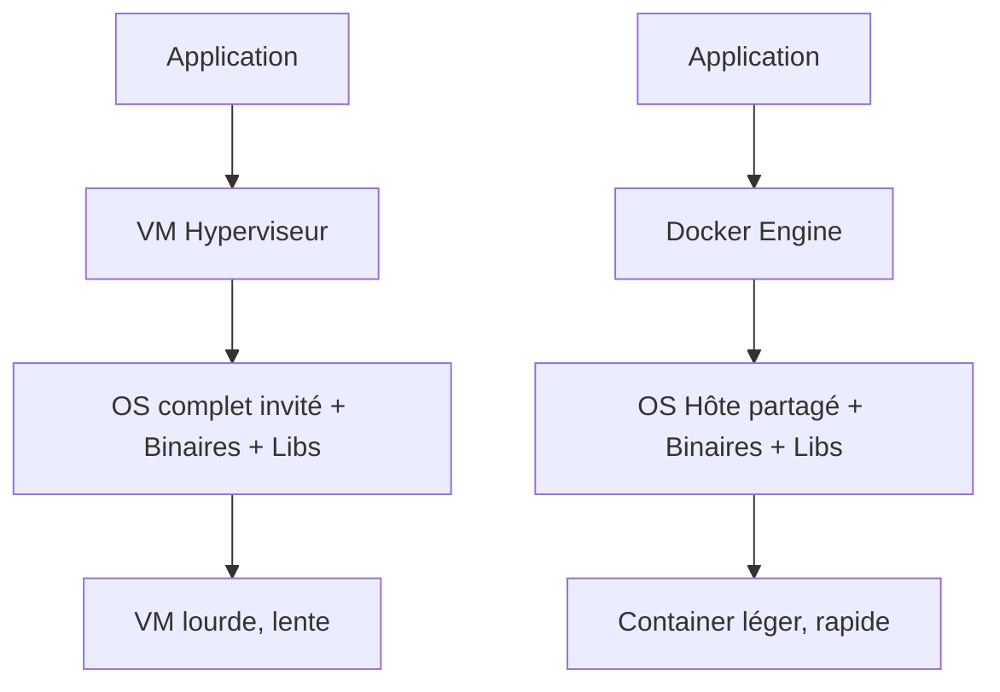
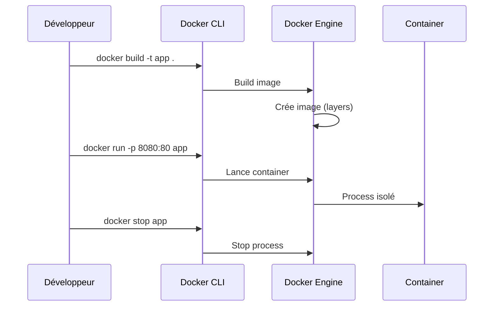
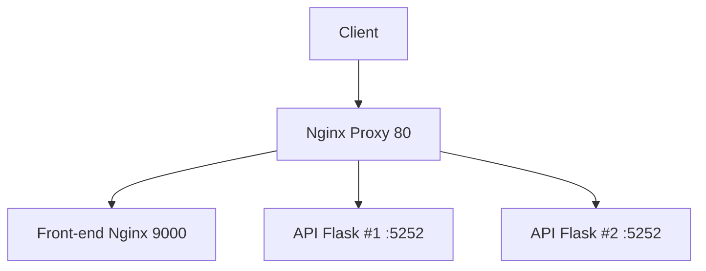

# 🚢 Docker — Cours ULTRA complet, pédagogique & schématique

> **Objectif**
> Comprendre et maîtriser Docker de A à Z, puis construire **une infrastructure complète** : Proxy inverse (Nginx), **load balancer Round-Robin**, **plusieurs API Flask**, et **un front statique** — d’abord en images séparées, puis avec **Docker Compose**, enfin avec **scaling horizontal**.

---

## 📚 Sommaire

- [🚢 Docker — Cours ULTRA complet, pédagogique \& schématique](#-docker--cours-ultra-complet-pédagogique--schématique)
  - [📚 Sommaire](#-sommaire)
  - [📝 Introduction \& Contexte](#-introduction--contexte)
  - [🖥️ Docker vs Machines Virtuelles](#️-docker-vs-machines-virtuelles)
  - [⚙️ Concepts Clés](#️-concepts-clés)
  - [🔄 Cycle de Vie Docker](#-cycle-de-vie-docker)
  - [🏗️ Écrire un Dockerfile (basique → avancé)](#️-écrire-un-dockerfile-basique--avancé)
    - [Exemple simple (Hello World)](#exemple-simple-hello-world)
    - [Bonnes pratiques](#bonnes-pratiques)
    - [Exemple Multi-stage (Node + Nginx)](#exemple-multi-stage-node--nginx)
  - [🌐 Gestion des Réseaux Docker](#-gestion-des-réseaux-docker)
  - [💾 Volumes \& Persistance](#-volumes--persistance)
  - [🧩 Docker Compose (orchestration locale)](#-docker-compose-orchestration-locale)
  - [🔀 Proxy Inverse \& Load Balancing](#-proxy-inverse--load-balancing)
  - [📈 Scaling Horizontal \& Haute Dispo](#-scaling-horizontal--haute-dispo)
  - [🛡️ Sécurité \& Bonnes Pratiques](#️-sécurité--bonnes-pratiques)
  - [📊 Monitoring, Debug \& Optimisation](#-monitoring-debug--optimisation)
  - [📎 Annexes](#-annexes)
    - [`.dockerignore` type](#dockerignore-type)
    - [Commandes utiles](#commandes-utiles)
    - [Erreurs fréquentes](#erreurs-fréquentes)

---

## 📝 Introduction & Contexte

Docker est une **plateforme de conteneurisation** qui permet d’exécuter une application et toutes ses dépendances dans un environnement isolé et portable appelé **container**.
Contrairement à une VM, Docker partage le **kernel de l’OS** hôte et ne virtualise que le strict nécessaire.
Résultat : containers plus **légers, rapides, reproductibles**.

---

## 🖥️ Docker vs Machines Virtuelles



- **VM** : nécessite un OS complet → lourd (Go), démarrage lent, forte isolation.
- **Docker** : partage kernel hôte, images légères (Mo), démarrage instantané, isolation suffisante.

---

## ⚙️ Concepts Clés

- **Image** : snapshot immuable, construite via un `Dockerfile`.
- **Container** : instance en exécution d’une image.
- **Registry** : dépôt d’images (`Docker Hub`, `GitHub Container Registry`, etc.).
- **Volume** : persistance des données (hors cycle de vie container).
- **Network** : couche réseau interne (bridge, host, overlay).
- **Compose** : outil pour orchestrer plusieurs containers (`docker-compose.yml`).

---

## 🔄 Cycle de Vie Docker



---

## 🏗️ Écrire un Dockerfile (basique → avancé)

### Exemple simple (Hello World)
```dockerfile
FROM ubuntu:22.04
RUN apt-get update && apt-get install -y cowsay
CMD ["cowsay", "Hello, Docker!"]
```

### Bonnes pratiques
- Utiliser `.dockerignore`
- Grouper `apt-get update && apt-get install` dans une seule couche
- Nettoyer caches (`rm -rf /var/lib/apt/lists/*`)
- Utiliser un **USER non-root**
- Préférer `COPY` à `ADD`
- Multi-stage builds

### Exemple Multi-stage (Node + Nginx)
```dockerfile
# Build
FROM node:20 AS build
WORKDIR /src
COPY package*.json ./
RUN npm ci
COPY . .
RUN npm run build

# Serve
FROM nginx:alpine
COPY --from=build /src/dist /usr/share/nginx/html
EXPOSE 80
```

---

## 🌐 Gestion des Réseaux Docker

- **bridge (par défaut)** : réseau isolé, containers communiquent par **nom DNS**.
- **host** : container partage la stack réseau de l’hôte.
- **none** : pas de réseau.
- **overlay (Swarm/K8s)** : multi-hôte.

```bash
docker network create mynet
docker run -d --name api --network mynet myapi:latest
docker run -d --name web --network mynet -p 8080:80 myweb:latest
# web peut joindre http://api:5252
```

```mermaid
graph LR
    subgraph Docker Network "mynet"
        API[Container API] --> Web[Container Web]
    end
```

---

## 💾 Volumes & Persistance

- **Named volumes** : `-v data:/var/lib/postgres`
- **Anonymes** : auto-créés par Docker
- **Bind mounts** : `-v $(pwd)/src:/app` (utile en dev)

```bash
docker volume create mydata
docker run -v mydata:/app/data ubuntu
```

---

## 🧩 Docker Compose (orchestration locale)

`docker-compose.yml` exemple :

```yaml
version: "3.9"
services:
  back-end:
    build: ./back-end
    expose:
      - "5252"
  front-end:
    build: ./front-end
    expose:
      - "9000"
  proxy:
    build: ./proxy
    ports:
      - "80:80"
    depends_on:
      - back-end
      - front-end
```

Commande :
```bash
docker-compose up --build
```

---

## 🔀 Proxy Inverse & Load Balancing

- **Reverse Proxy (Nginx)** : reçoit toutes les requêtes, route vers front ou API.
- **Load balancing Round-Robin** : répartit équitablement les requêtes entre plusieurs API.



---

## 📈 Scaling Horizontal & Haute Dispo

```bash
docker-compose up --scale back-end=3
```

Nginx redirige en **Round-Robin** vers `back-end-1`, `back-end-2`, `back-end-3`.

---

## 🛡️ Sécurité & Bonnes Pratiques

- **USER non-root**
- **FS en read-only** (`read_only: true`)
- **Limiter ressources** (`deploy.resources.limits`)
- **Secrets** : pas en `COPY`, utiliser variables d’env ou gestion externe
- **Images minimales** : `alpine`, `distroless`
- **Scan d’images** (`docker scan`)

---

## 📊 Monitoring, Debug & Optimisation

- **Logs** : `docker logs -f container`
- **Stats** : `docker stats`
- **Inspect** : `docker inspect container`
- **Exec** : `docker exec -it container sh`
- **Netshoot** : `docker run --rm -it --network=appnet nicolaka/netshoot`

---

## 📎 Annexes

### `.dockerignore` type
```
.git
node_modules
venv
__pycache__
*.log
*.tmp
Dockerfile*
docker-compose*
```

### Commandes utiles
```bash
docker system prune -a     # nettoyer tout
docker image ls --digests  # voir hash images
docker top container       # voir process
```

### Erreurs fréquentes
- `port already allocated` → container existant sur ce port
- `permission denied` → monter volume avec droits corrects
- `connection refused` → vérifier réseau + expose + depends_on

---

✅ Ce document couvre **Docker du niveau débutant à avancé** + **infra multi-services avec Compose, proxy, scaling**.
