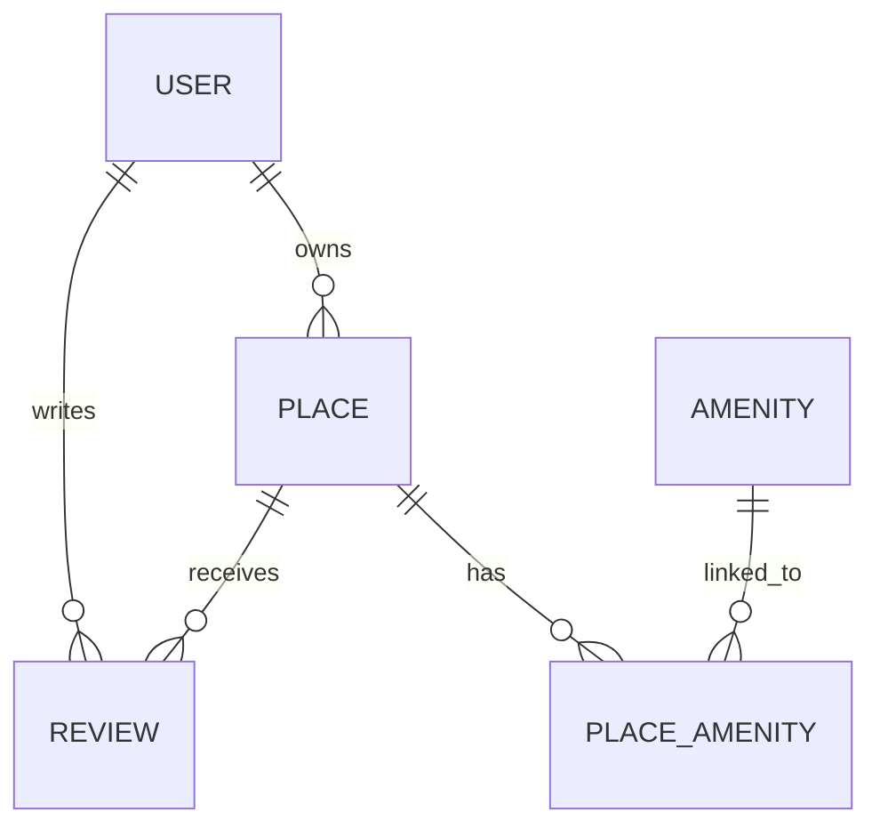

# 🏡 HBnB - Partie 3 : Authentification, Sécurité & Intégration Base de Données

---

## 🎯 Objectifs pédagogiques

À la fin de cette partie, tu sauras :

✅ Implémenter une API sécurisée avec **JWT** (JSON Web Token)  
✅ Mettre en place un **contrôle d'accès par rôle** (utilisateur/admin)  
✅ Utiliser **SQLAlchemy** pour connecter les entités à une vraie base de données (SQLite puis MySQL)  
✅ Concevoir un **schéma relationnel propre** avec Mermaid.js  
✅ Gérer la persistance des données (CRUD) dans la base  
✅ Sécuriser le stockage des mots de passe avec bcrypt  

---

## 🗂️ 1. Architecture technique

### 🛠️ Stack technique

| Composant         | Description                                |
|-------------------|--------------------------------------------|
| **Flask**         | Framework backend Python léger             |
| **SQLAlchemy**    | ORM (Object-Relational Mapper)             |
| **SQLite**        | Base relationnelle légère pour développement |
| **MySQL**         | Base relationnelle robuste pour production |
| **bcrypt**        | Hashage sécurisé des mots de passe         |
| **JWT**           | Authentification via tokens sécurisés      |
| **Mermaid.js**    | Diagrammes ER en markdown                  |

### 🌐 Flux global

```
[Client] --HTTP--> [API Flask] --SQLAlchemy--> [Base SQLite/MySQL]
                           ↳ Gestion Auth (JWT, bcrypt)
```

---

## 🔐 2. Authentification & Sécurité

### ✅ JWT - JSON Web Token

- Permet d'authentifier les utilisateurs sans session serveur
- Le token contient les infos utiles (ex : id, rôle)
- Le token est envoyé dans le header `Authorization: Bearer <token>`

### ✅ bcrypt - Hashage des mots de passe

- Les mots de passe ne sont **jamais stockés en clair**
- Hashage avec un sel (salt) et fonction robuste
- Impossible de déduire le mot de passe depuis le hash

---

## 👥 3. Gestion des rôles

Deux types d'utilisateurs :  
- **Utilisateur standard** → peut créer/modifier ses propres données  
- **Administrateur** → peut tout gérer (utilisateurs, lieux, avis...)  

**Stockage du rôle** dans le champ `is_admin` du modèle `User`.

---

## 🗃️ 4. Base de Données & ORM SQLAlchemy

### ✅ Mapping des entités

| Entité   | Table SQL correspondante |
|-----------|--------------------------|
| User      | users                    |
| Place     | places                   |
| Review    | reviews                  |
| Amenity   | amenities                |
| Place_Amenity | place_amenity (liaison many-to-many) |

Chaque entité hérite d'une `BaseModel` commune avec :  
`id`, `created_at`, `updated_at`

### ✅ Relations à modéliser

- `User` ↔ `Place` : 1 utilisateur possède plusieurs lieux
- `Place` ↔ `Review` : 1 lieu contient plusieurs avis
- `Place` ↔ `Amenity` : Many-to-Many via table intermédiaire

### ✅ Exemple : relation User - Place

```python
class User(BaseModel, Base):
    __tablename__ = 'users'
    places = relationship("Place", backref="owner", cascade="all, delete")
```

---

## 🧩 5. Repository SQLAlchemy

- Remplace le stockage **en mémoire** par persistance réelle en BDD
- Implémente le pattern Repository pour séparer la logique
- Utilise des sessions SQLAlchemy pour les requêtes CRUD

---

## 🗄️ 6. Visualisation du Schéma avec Mermaid.js

Permet de générer un diagramme clair :



---

## ⚠️ 7. Sécurité & bonnes pratiques

✅ Ne jamais stocker un mot de passe en clair  
✅ Valider les entrées utilisateurs côté API  
✅ Protéger les routes sensibles avec @jwt_required()  
✅ Restreindre les actions selon le rôle utilisateur  
✅ Utiliser `backref` et `cascade` pour simplifier la gestion des relations  

---

## 🏁 8. Récapitulatif - Compétences visées

✅ Authentification JWT sécurisée  
✅ Hashage de mots de passe avec bcrypt  
✅ Contrôle d'accès par rôle (RBAC)  
✅ Modélisation relationnelle propre avec SQLAlchemy  
✅ Passage d'un prototype en mémoire à un backend persistant robuste  
✅ Visualisation claire du modèle de données avec Mermaid.js  

---

**⚡ Prêt pour la suite ? Implémente chaque étape, sécurise ton API et prépare ton projet pour un vrai environnement de production !**
