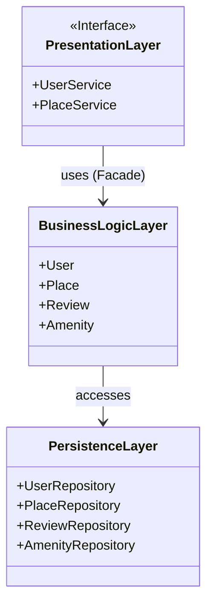

# 📦 Diagramme de Package - Architecture HBnB

## 🌟 Objectif

Comprendre et documenter l’architecture en couches de l’application HBnB (Presentation / Business Logic / Persistence) à l’aide d’un diagramme de package UML. Utilisation du **Facade Pattern** pour représenter l’interface entre les couches.

---

## 🧱 Architecture en couches (Layered Architecture)

* **Présentation (API / Services)** :

  * Sert de point d’entrée aux utilisateurs
  * Expose les endpoints HTTP (ex: `/users/register`, `/places`)

* **Business Logic (Modèles)** :

  * Gère la logique métier (ex: validation, calculs)
  * Contient les entités principales : `User`, `Place`, `Review`, `Amenity`

* **Persistence (Accès DB)** :

  * Interaction avec la base de données
  * CRUD via ORM ou requêtes SQL

---

## 🎭 Le **Facade Pattern**

> Fournit une interface simplifiée pour cacher la complexité de sous-systèmes.

Dans HBnB :

* La couche Présentation communique avec la couche Business Logic via une **façade** (`PlaceService`, `UserService`, etc.).
* Cela isole la logique métier et évite les appels directs à la base de données.

---

## 🧍 Exemple Mermaid.js (code)

---

## ✅ À retenir

* Le diagramme de package **structure les composants** du système.
* Chaque couche a **des responsabilités précises**.
* Le **Facade Pattern** limite les dépendances directes entre Présentation et Persistence.

---

## 📚 Ressources utiles

* [UML Package Diagrams - Overview](https://www.visual-paradigm.com/guide/uml-unified-modeling-language/uml-package-diagram/)
* [Layered Architecture in Python](https://learn.microsoft.com/en-us/azure/architecture/guide/architecture-styles/layered)
* [Facade Design Pattern](https://refactoring.guru/design-patterns/facade)
