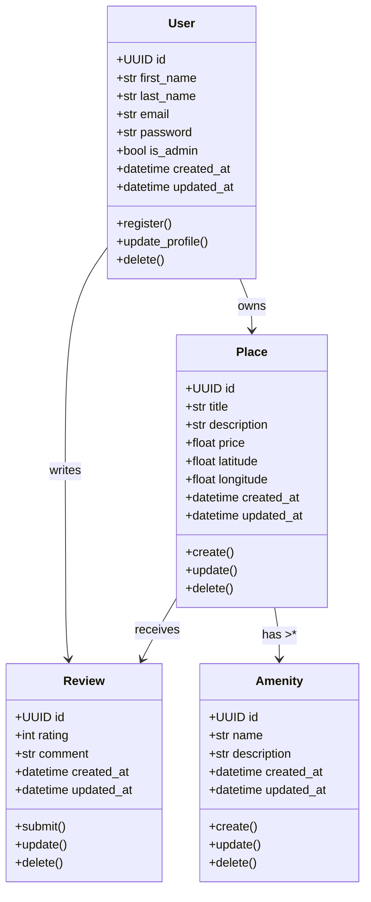

# 🔹 Diagramme de Classe - Couche Business Logic HBnB

## 🌟 Objectif

Réaliser un diagramme de classe UML détaillé de la couche "Business Logic" de l'application HBnB, en se concentrant sur les entités : `User`, `Place`, `Review`, `Amenity`.
Ce diagramme doit inclure leurs attributs, méthodes, relations, ainsi que les contraintes fonctionnelles décrites dans le projet.

---

## 📐 Entités principales à modéliser

### 1. `User`

* Attributs :

  * id: UUID
  * first\_name: str
  * last\_name: str
  * email: str
  * password: str
  * is\_admin: bool
  * created\_at: datetime
  * updated\_at: datetime
* Méthodes :

  * register()
  * update\_profile()
  * delete()

### 2. `Place`

* Attributs :

  * id: UUID
  * title: str
  * description: str
  * price: float
  * latitude: float
  * longitude: float
  * owner: User (association)
  * amenities: List<Amenity>
  * created\_at: datetime
  * updated\_at: datetime
* Méthodes :

  * create()
  * update()
  * delete()

### 3. `Review`

* Attributs :

  * id: UUID
  * place: Place (association)
  * user: User (association)
  * rating: int
  * comment: str
  * created\_at: datetime
  * updated\_at: datetime
* Méthodes :

  * submit()
  * update()
  * delete()

### 4. `Amenity`

* Attributs :

  * id: UUID
  * name: str
  * description: str
  * created\_at: datetime
  * updated\_at: datetime
* Méthodes :

  * create()
  * update()
  * delete()

---

## 🧍\200d♂️ Exemple de diagramme Mermaid.js

---

## ✅ Notes importantes

* Tous les objets ont un `id` unique (UUID) et des champs `created_at`, `updated_at`.
* Relations importantes :

  * Un `User` peut posséder plusieurs `Place`
  * Un `User` peut écrire plusieurs `Review`
  * Un `Place` peut avoir plusieurs `Amenity` (composition ou association selon implémentation)
* Les méthodes sont conceptuelles pour la documentation.

---

## 📚 Ressources utiles

* [UML Class Diagram Tutorial](https://www.lucidchart.com/pages/uml-class-diagram)
* [How to Draw UML Class Diagrams](https://www.visual-paradigm.com/guide/uml-unified-modeling-language/uml-class-diagram/)
* [SOLID Principles OOP](https://medium.com/@joeclever/solid-principles-explained-in-plain-english-5dc5fbbbecc6)
