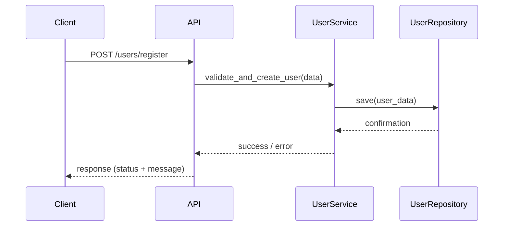
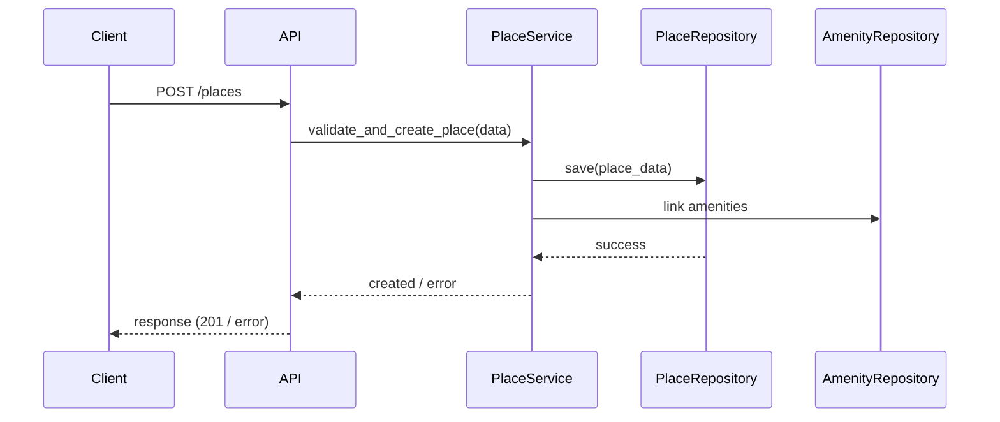
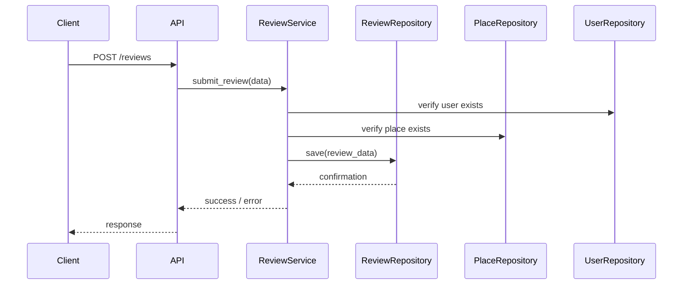
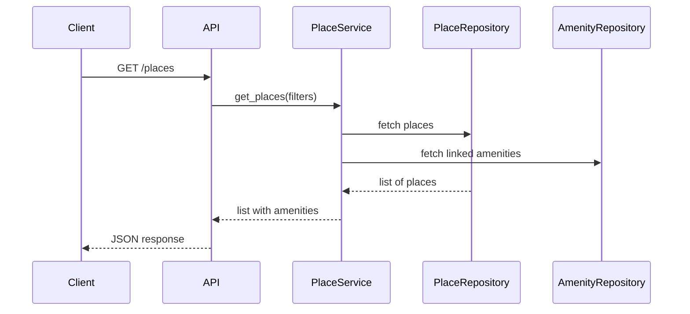

# 📋 Diagrammes de Séquence - API HBnB

## 🌟 Objectif

Visualiser le flot d’interactions entre les couches de l’application HBnB (Présentation, Business Logic, Persistence) à travers des **diagrammes de séquence UML** pour les principales requêtes API.

---

## 🧬 Vue d'ensemble

Chaque diagramme représente une action côté client (frontend ou API) et le cheminement des données et commandes à travers les différentes couches du système jusqu'à la base de données, en suivant le modèle MVC avec le **Facade Pattern**.

API couvertes :

1. User Registration
2. Place Creation
3. Review Submission
4. Fetching List of Places

---

## 1. 👤 User Registration

**Notes** :

* Le `UserService` agit comme facade
* `UserRepository` encapsule l'accès à la base

---

## 2. 🏡 Place Creation

**Notes** :

* La gestion des amenities peut être déléguée à un composant secondaire ou traité en interne.

---

## 3. 📝 Review Submission

**Notes** :

* On vérifie toujours les entités liées (User/Place)

---

## 4. 📖 Fetching a List of Places

**Notes** :

* Possibilité d'utiliser des jointures ou requêtes multiples selon l'ORM

---

## ✅ À retenir

* Les 3 couches sont toujours impliquées : API -> Service -> Repository
* Le `Service` est responsable de la validation, logique métier, et de faire le lien entre API et DB
* Les `Repository` encapsulent les opérations base de données (pattern DAO)

---

## 📚 Ressources utiles

* [UML Sequence Diagram Tutorial](https://www.visual-paradigm.com/guide/uml-unified-modeling-language/uml-sequence-diagram/)
* [Understanding REST API Flows](https://restfulapi.net/)
* [Mermaid.js Sequence Diagrams](https://mermaid.js.org/syntax/sequenceDiagram.html)
