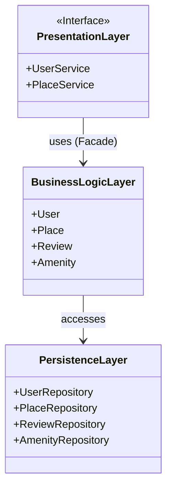
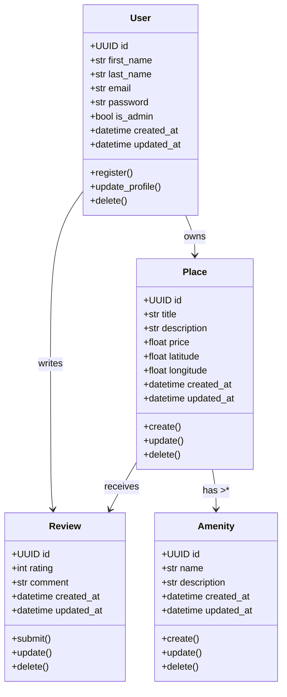
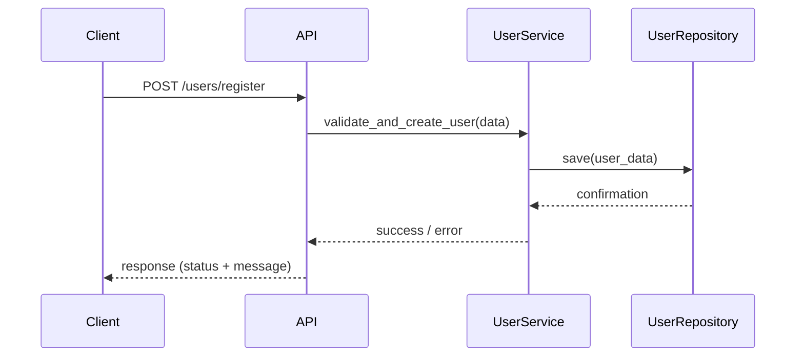
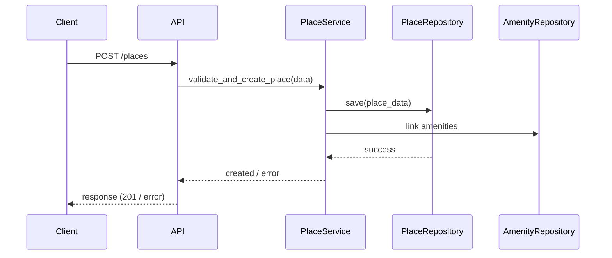
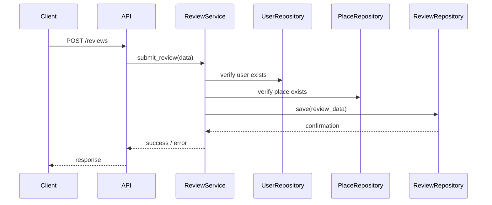
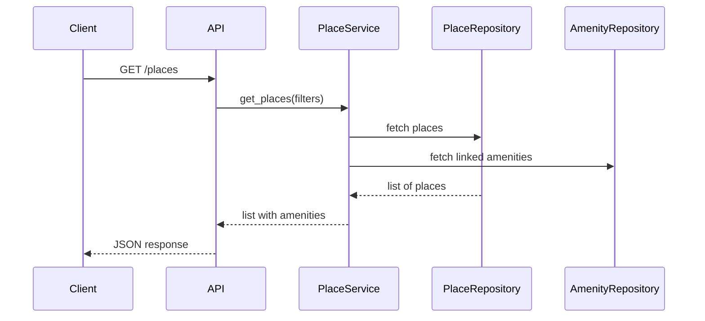

# 📄 Documentation Technique Complète - HBnB Evolution

## 🌎 Introduction

Ce document présente l’architecture technique et la modélisation du projet **HBnB Evolution**. Il a pour but de servir de référence pour les phases de développement ultérieures en décrivant la structure logicielle, les entités principales et le comportement attendu des API.

---

## 🏠 1. Architecture Haut Niveau

### Diagramme de package

Visualisation de l’architecture en 3 couches :

* **Presentation Layer** : Services et APIs
* **Business Logic Layer** : Modèles et logique métier
* **Persistence Layer** : Accès base de données (DAOs)

**Façade pattern** : permet de limiter l’accès direct entre les couches, tout passe par les "services" de la couche métier.

---

## 🔹 2. Modélisation des Entités (Business Logic Layer)

### Diagramme de classes UML

Ce diagramme montre les entités principales du projet, leurs attributs, méthodes, et relations :

---

## 📊 3. Diagrammes de séquence API

### 1. User Registration

### 2. Place Creation

### 3. Review Submission

### 4. Fetching List of Places

---

## 🎓 Conclusion et recommandations

* Cette documentation UML constitue la base de l’implémentation de l’application HBnB.
* Elle permet de s’assurer que la structure logicielle est cohérente, modulaire, et maintenable.
* L’utilisation du **Facade Pattern** et d’une architecture en couches facilite la séparation des responsabilités.
* Tous les objets incluent un `UUID`, un `created_at`, et un `updated_at` pour assurer le suivi des modifications.

---

## 📃 Références

* UML Basics : [Visual Paradigm UML Guide](https://www.visual-paradigm.com/guide/uml-unified-modeling-language/)
* Mermaid.js : [Mermaid Diagrams](https://mermaid.js.org)
* SOLID & OOP : [OOP SOLID Principles](https://medium.com/@joeclever/solid-principles-explained-in-plain-english-5dc5fbbbecc6)
