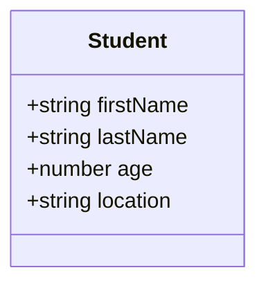
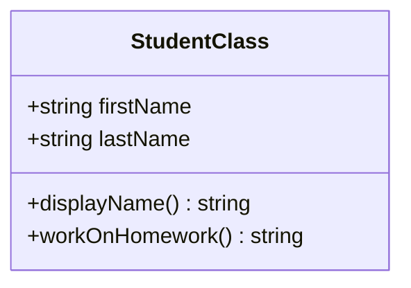
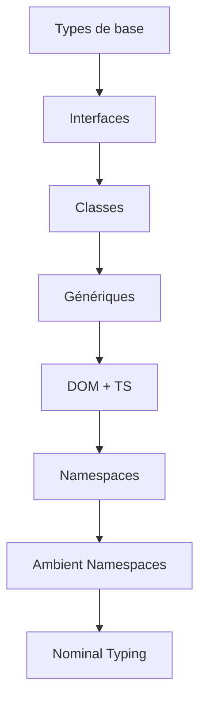

# 📘 Cours Complet sur TypeScript

> **Niveau : Amateur → Intermédiaire**  
> Inspiré du projet Holberton - TypeScript  
> Auteur : Johann Kerbrat (Uber Works)  
> Ressources : Documentation officielle TypeScript, MDN, Holberton Intranet

---

## 📖 Introduction à TypeScript

TypeScript est un **superset de JavaScript** créé par Microsoft.  
Il ajoute un **système de typage statique** et de nombreuses fonctionnalités avancées, tout en restant **100% compatible avec JavaScript**.

### 🚀 Pourquoi apprendre TypeScript ?
- ✅ Typage fort → détection d’erreurs **avant l’exécution**
- ✅ Lisibilité et maintenabilité accrues
- ✅ Productivité améliorée (IntelliSense, autocomplétion)
- ✅ Compatibilité avec tous les frameworks JS (React, Angular, Vue, Node.js)
- ✅ Idéal pour les projets **grands et complexes**

---

## 🛠️ Installation & Configuration

### 1. Installer TypeScript
```bash
npm install -g typescript
```

### 2. Vérifier la version
```bash
tsc -v
```

### 3. Créer un projet TypeScript
```bash
mkdir ts-project && cd ts-project
npm init -y
tsc --init
```

Cela génère un fichier `tsconfig.json` : le **cœur de la configuration**.

Exemple minimal :

```json
{
  "compilerOptions": {
    "target": "ES6",
    "module": "commonjs",
    "strict": true,
    "esModuleInterop": true
  }
}
```

---

## 🔹 Typage de base

| Type       | Exemple                          | Description                         |
|------------|----------------------------------|-------------------------------------|
| `string`   | `"Hello"`                        | Chaîne de caractères                |
| `number`   | `42`                             | Nombre entier ou décimal            |
| `boolean`  | `true`                           | Booléen                             |
| `any`      | `let x: any = "texte";`          | Désactive le typage (⚠️ à éviter)   |
| `unknown`  | `let x: unknown = "?"`           | Type inconnu, plus sûr que `any`    |
| `array`    | `let arr: number[] = [1,2,3];`   | Tableau typé                        |
| `tuple`    | `let t: [string, number]`        | Tableau fixe avec types définis     |
| `enum`     | `enum Role { Admin, User }`      | Ensemble de valeurs nommées         |
| `void`     | `function log(): void {...}`     | Pas de valeur retournée             |
| `never`    | `function error(): never {...}`  | Fonction qui ne retourne jamais     |

---

## 🔹 Fonctions

### Déclaration typée
```ts
function add(a: number, b: number): number {
  return a + b;
}
```

### Paramètres optionnels et valeurs par défaut
```ts
function greet(name: string, age?: number): string {
  return age ? `Hello ${name}, ${age} ans` : `Hello ${name}`;
}
```

### Fonctions fléchées typées
```ts
const multiply = (x: number, y: number): number => x * y;
```

---

## 🔹 Interfaces

Les **interfaces** définissent des contrats pour objets, fonctions ou classes.

```ts
interface Student {
  firstName: string;
  lastName: string;
  age: number;
  location: string;
}

const student1: Student = {
  firstName: "Alice",
  lastName: "Dupont",
  age: 21,
  location: "Paris"
};
```

### UML simplifié (Mermaid)


---

## 🔹 Classes

```ts
interface PersonInterface {
  firstName: string;
  lastName: string;
  displayName(): string;
}

class StudentClass implements PersonInterface {
  constructor(public firstName: string, public lastName: string) {}

  displayName(): string {
    return this.firstName;
  }

  workOnHomework(): string {
    return "Currently working";
  }
}
```

### Schéma UML


---

## 🔹 Héritage & Extends

```ts
class Teacher {
  constructor(public name: string) {}
  teach(): string {
    return "Teaching...";
  }
}

class Director extends Teacher {
  constructor(name: string, public reports: number) {
    super(name);
  }
  manage(): string {
    return "Managing " + this.reports + " teachers";
  }
}
```

---

## 🔹 Génériques

Les **génériques** permettent de créer des fonctions/classe réutilisables.

```ts
function identity<T>(arg: T): T {
  return arg;
}

let output1 = identity<string>("Hello");
let output2 = identity<number>(42);
```

### Génériques avec interfaces
```ts
interface Box<T> {
  value: T;
}

let stringBox: Box<string> = { value: "Hello" };
let numberBox: Box<number> = { value: 123 };
```

---

## 🔹 Manipulation du DOM avec TS

```ts
const input = document.querySelector<HTMLInputElement>("#username");

if (input) {
  input.value = "TypeScript!";
}
```

⚠️ Important : toujours vérifier `null` car TypeScript sait que `querySelector` peut échouer.

---

## 🔹 Namespaces

```ts
namespace Subjects {
  export interface Teacher {
    firstName: string;
    lastName: string;
  }

  export class Subject {
    teacher: Teacher;
    setTeacher(t: Teacher) {
      this.teacher = t;
    }
  }
}
```

### Declaration Merging
```ts
namespace Subjects {
  export interface Teacher {
    experienceTeachingC?: number;
  }
}
```

---

## 🔹 Ambient Namespaces

Utilisés pour typer des librairies externes JS. Exemple avec `crud.d.ts` :

```ts
import { RowID, RowElement } from "./interface";

declare module "crud" {
  export function insertRow(row: RowElement): RowID;
  export function deleteRow(rowId: RowID): void;
  export function updateRow(rowId: RowID, row: RowElement): RowID;
}
```

---

## 🔹 Nominal Typing (Branding)

```ts
interface MajorCredits {
  credits: number;
  _brand: "major";
}

interface MinorCredits {
  credits: number;
  _brand: "minor";
}

function sumMajorCredits(c1: MajorCredits, c2: MajorCredits): MajorCredits {
  return { credits: c1.credits + c2.credits, _brand: "major" };
}
```

Cela évite de mélanger des types ayant la même structure.

---

## ✅ Bonnes pratiques TypeScript

1. Toujours activer `strict` dans `tsconfig.json`
2. Éviter `any` → préférer `unknown` ou des types explicites
3. Utiliser les **interfaces** pour la documentation implicite
4. Découper le code en **modules**
5. Profiter des **génériques** pour éviter la duplication
6. Utiliser `readonly` pour des propriétés immuables
7. Préférer `type` pour unions complexes, `interface` pour objets

---

## 📊 Schéma d’ensemble (Mermaid)



---

## 🎓 Conclusion

TypeScript est un outil puissant qui permet de :
- Rendre JavaScript **plus sûr**
- Faciliter le **développement en équipe**
- Améliorer la **productivité et la maintenabilité**

Avec ce cours, tu as toutes les bases pour réussir les projets Holberton 🎯

---

## 📚 Ressources complémentaires
- [TypeScript Documentation](https://www.typescriptlang.org/docs/)
- [TSConfig Reference](https://www.typescriptlang.org/tsconfig)
- [TypeScript Deep Dive (Basarat)](https://basarat.gitbook.io/typescript/)
- [MDN - DOM Manipulation](https://developer.mozilla.org/fr/docs/Web/API/Document_Object_Model)
