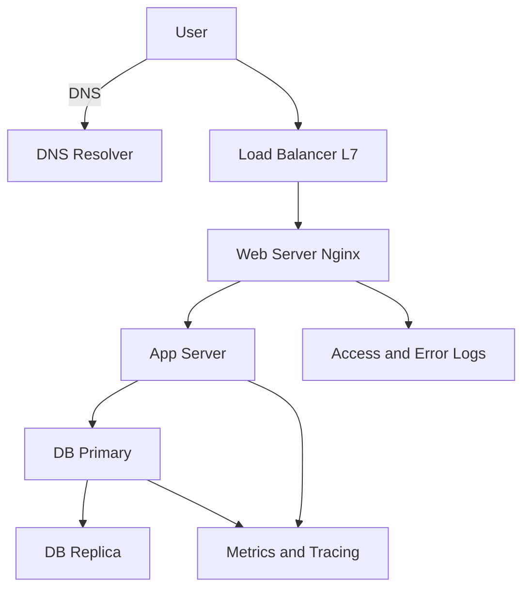
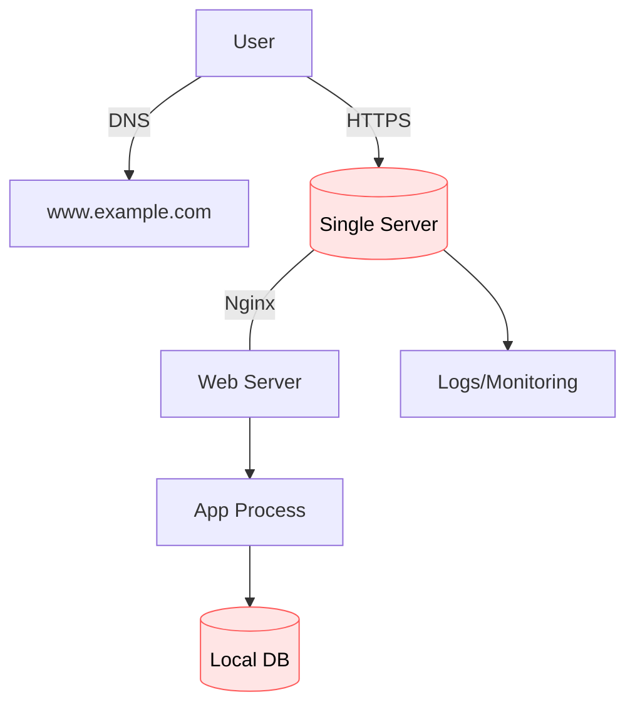
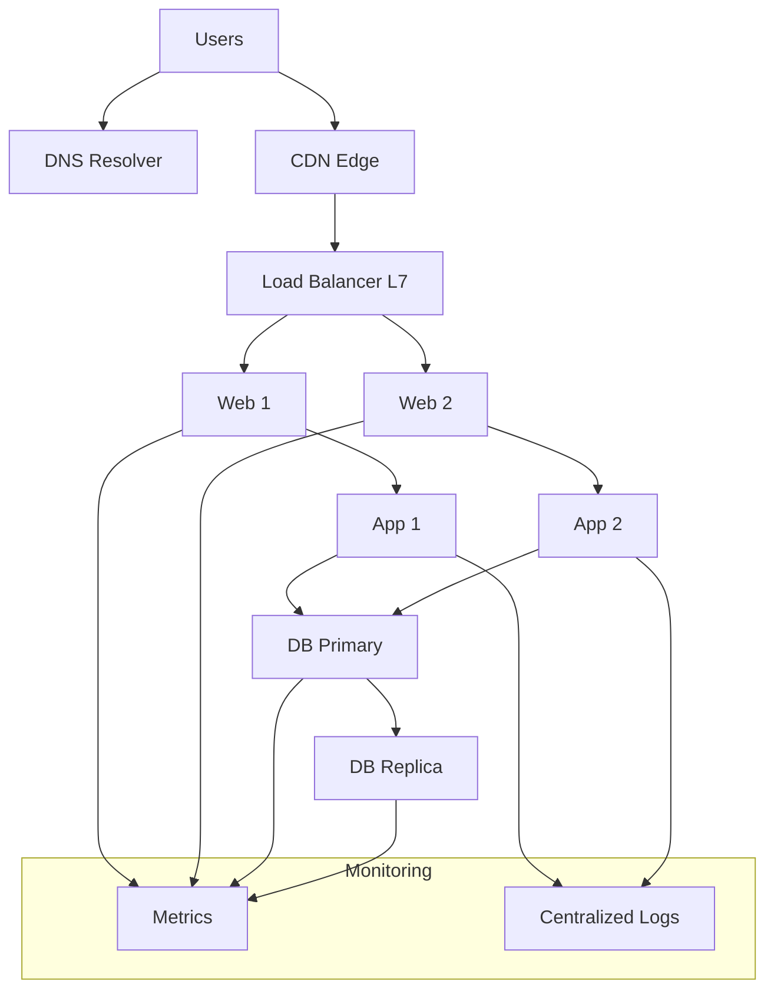
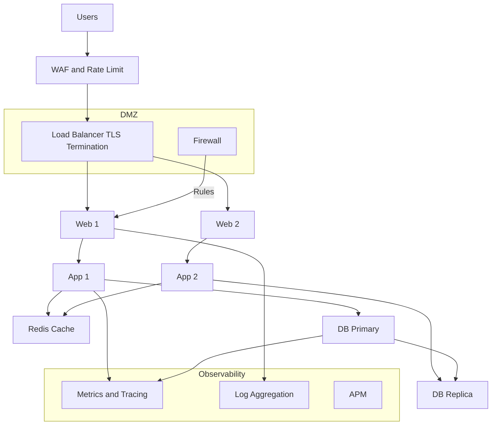
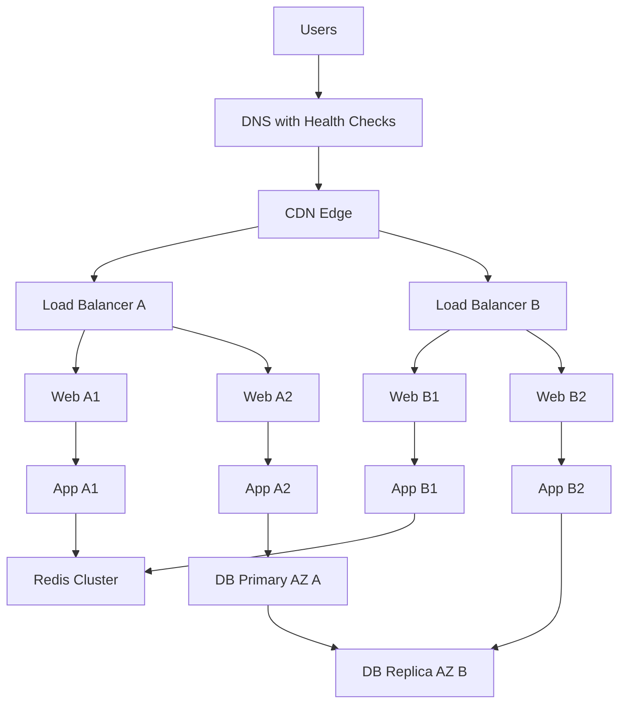

# 🏷️ Project Badge — Web Infrastructure Design (Novice)
**By:** Sylvain Kalache · **Weight:** 1  
**Objectif général :** être capable de **dessiner** et **expliquer** une architecture web complète, ses composants, la redondance, et les points de défaillance — à l’oral (whiteboard) comme à l’écrit (README).

---

## 🔎 Sommaire rapide
1. [Préambule (comment réussir la soutenance/whiteboard)](#-préambule-comment-réussir-la-soutenancewhiteboard)
2. [Vue d’ensemble : du navigateur à la base de données](#-vue-densemble-du-navigateur-à-la-base-de-données)
3. [Rappels « Network basics »](#-rappels--network-basics-)
4. [Serveur, Web server vs App server](#-serveur-web-server-vs-app-server)
5. [DNS (Domain Name System)](#-dns-domain-name-system)
6. [Load Balancer (L4/L7) & stratégies](#-load-balancer-l4l7--stratégies)
7. [Monitoring & Observabilité](#-monitoring--observabilité)
8. [Bases de données & redondance](#-bases-de-données--redondance)
9. [Sécurité : HTTPS, firewall, WAF](#-sécurité--https-firewall-waf)
10. [Haute disponibilité (HA) & SPOF](#-haute-disponibilité-ha--spof)
11. [Déploiements sans downtime](#-déploiements-sans-downtime)
12. [Capacité & QPS (dimensionnement)](#-capacité--qps-dimensionnement)
13. [Diagrams prêts à l’emploi (Mermaid)](#-diagrams-prêts-à-lemploi-mermaid)
14. [Templates de whiteboard pour les tâches Holberton](#-templates-de-whiteboard-pour-les-tâches-holberton)
15. [README.md — squelette conseillé](#-readmemd--squelette-conseillé)
16. [Glossaire des acronymes (LAMP, SPOF, QPS, …)](#-glossaire-des-acronymes-lamp-spof-qps-)
17. [Checklist finale pour la revue manuelle (QA)](#-checklist-finale-pour-la-revue-manuelle-qa)

---

## ✅ Préambule (comment réussir la soutenance/whiteboard)

**But en 30 minutes :**
- **Dessiner** une architecture **claire** (propre, lisible, composants nommés).
- **Expliquer** le rôle de **chaque bloc** + **flux** (requêtes/réponses) + **SPOF** + **sécurité** + **monitoring**.
- **Argumenter** les **choix** (redondance, LB, DNS, cache, DB, déploiement).

**Méthode « 5 couches » à dessiner dans l’ordre (top → bottom) :**
1. **Client** (navigateur/app) → DNS → Internet
2. **Front door** (CDN/WAF/Firewall + Load Balancer)
3. **Edge / Web layer** (Nginx/Apache, reverse proxy, statique, TLS offload)
4. **App layer** (process applicatifs : Gunicorn, uWSGI, Node/Express, PHP-FPM…)
5. **Data layer** (DB primaire/réplique, cache, storage, logs/metrics/traces)

**Toujours annoter :**
- **Ports** (80/443/22/5432/3306…),
- **Protocoles** (HTTP/HTTPS, TCP/UDP),
- **Santé** (health-checks), **monitoring**, **logs**,
- **SPOF** et **mitigations** (active-active, failover),
- **TTL DNS**, **sticky sessions** le cas échéant,
- **Stratégie de déploiement** (blue-green/canary).

---

## 🌐 Vue d’ensemble : du navigateur à la base de données



---

## 🧬 Rappels « Network basics »

- **IP** : adresse d’hôte (IPv4/IPv6).  
- **TCP vs UDP** : TCP = connexion, fiable; UDP = sans connexion, rapide (DNS, streaming).  
- **Ports** : HTTP 80, HTTPS 443, SSH 22, MySQL 3306, PostgreSQL 5432.  
- **HTTP/HTTPS** : protocole applicatif (méthodes GET/POST/PUT/DELETE, codes 2xx/3xx/4xx/5xx).  
- **TLS** (ex-SSL) : chiffrement, authentification serveur (certificat), intégrité.  
- **CIDR/Subnet** : découpage réseau (ex: 10.0.0.0/24).  
- **NAT** : translation d’adresses (sortie Internet, balance de ports).  
- **Latency vs Bandwidth** : délai vs capacité; **throughput** = débit effectif.  
- **Route** : passerelles, tables de routage, **Anycast** (DNS récursifs).  
- **Handshake TCP** : SYN → SYN-ACK → ACK; **TLS** : échange de clés + cert.

---

## 🖥️ Serveur, Web server vs App server

- **Serveur** : machine **physique/VM/container** exécutant OS + services.  
  **Ressources** : CPU, RAM, disque (IOPS), réseau (Gbps), constraints (ulimits).  
- **Web Server (Nginx/Apache)** :
  - Sert **statique** (HTML/CSS/JS/images) efficacement.
  - **Reverse proxy** vers app servers (load, TLS offload, compression, cache).
  - **Terminaison TLS**, **HTTP/2**, **Gzip/Brotli**, **rate limiting**.
- **App Server** :
  - Exécute **code métier** (Django/Gunicorn, Flask+uWSGI, Node/Express, PHP-FPM, Java/Tomcat).
  - Gère **sessions**, **ORM**, **auth**, **rendering**/**API JSON**.
- **Différence** : **Web server** = porte d’entrée & optimisation HTTP; **App server** = logique applicative.

---

## 📛 DNS (Domain Name System)

- **Rôle** : `nom → IP`. Chaîne : **stub resolver → récursif → root → TLD → authoritative**.  
- **Types d’enregistrements** :
  - **A / AAAA** (IPv4/IPv6), **CNAME** (alias), **NS**, **SOA**, **MX**, **TXT**, **SRV**.
- **TTL** : temps de cache; **faible TTL** pour bascules rapides (mais ↑ charge DNS).
- **Load distribution** : **DNS round-robin**, **GeoDNS**, **Anycast** pour latence.

---

## ⚖️ Load Balancer (L4/L7) & stratégies

- **L4** (TCP/UDP) : équilibrage au niveau transport (iptables/HAProxy/NLB).
- **L7** (HTTP/HTTPS) : routage par **URL/Host/Header**, **WAF**, **sticky session**, **canary rules**.
- **Algorithmes** : round-robin, **least-connections**, **weighted**, **ip-hash** (affinité).  
- **Health checks** : HTTP 200/OK, temps de réponse, circuits ouverts/fermés (circuit breaker).  
- **Failover** : **active-active** (tous actifs) vs **active-passive** (secours).

---

## 📈 Monitoring & Observabilité

- **White-box metrics** : CPU, RAM, disque, latences p95/p99, RPS/QPS, erreurs (4xx/5xx).  
- **Black-box** : ping/HTTP checks **externes** (SLA user).  
- **Logs** : access logs, app logs (JSON), **centralisés** (ELK/équivalent), rotation & rétention.  
- **Traces distribuées** : suivre une requête de bout en bout (A → B → C).  
- **Alerting** : seuils (erreurs 5xx), **SLO/SLI** (ex: 99.9% d’uptime), **runbooks**.

---

## 🗃️ Bases de données & redondance

- **RDBMS** (PostgreSQL/MySQL) vs **NoSQL** (Docs, KV, Wide-column, Graph).
- **Schémas de réplication** :
  - **Primary/Replica** (lecture sur répliques, écriture sur primaire),
  - **Sync vs Async** (latence vs risque de perte),
  - **Multi-AZ/Region** (RTO/RPO).
- **Sharding** : partitionner horizontalement par clé (user_id, hash).  
- **Backups** : **full + incrémental**, **tests de restauration**, **chiffrement**.  
- **Caches** : **Redis/Memcached** (sessions, résultats de requêtes, rate-limits).

---

## 🔐 Sécurité : HTTPS, firewall, WAF

- **HTTPS/TLS** :
  - **Certificat** (AC: Let’s Encrypt/CA), **chaîne de confiance**, **HSTS** (force HTTPS).
  - **TLS termination** au LB / Nginx; **TLS pass-through** si besoin E2E.
- **Firewall (L3/L4)** :
  - **Inbound** : ouvert uniquement aux ports nécessaires (80/443 depuis Internet; 22 depuis bastion).
  - **Outbound** : limiter (ex: DB n’accepte que du **réseau privé**).
  - **NACL**/Security Groups/VPC subnets.
- **WAF (L7)** :
  - Filtre OWASP Top-10 (SQLi, XSS), **bot management**, **rate limiting** applicatif.
- **Secrets** : hors repo, **KMS/valuts**, **rotation**.

---

## ♾️ Haute disponibilité (HA) & SPOF

- **SPOF** = Single Point Of Failure : **un seul LB**, **une seule DB**, **un seul AZ**…
- **Éliminer** les SPOF :
  - **2× LB** + **IP flottante** (VRRP/keepalived) ou **LB managé** multi-zone,
  - **DB primaire + réplique** (+ failover automatique/testé),
  - **Instances web/app multiples** en **zones différentes**,
  - **DNS** avec redondance, faible TTL ou **health checks**.
- **Active-Active** : partage charge, complexité de cohérence.  
- **Active-Passive** : bascule rapide, ressources « dormantes ».

---

## 🚀 Déploiements sans downtime

- **Rolling** : on met à jour un sous-ensemble d’instances → **progressif**.  
- **Blue-Green** : **blue (prod)** vs **green (nouvelle)**; on bascule le trafic.  
- **Canary** : un **petit pourcentage** de trafic sur la nouvelle version, observabilité renforcée.  
- **Feature flags** : activer/désactiver côté runtime sans redeploy.  
- **Migrations DB** : **compatibles en N et N+1**, **backward-compatible**, **phases** (add → backfill → switch → drop).

---

## 📏 Capacité & QPS (dimensionnement)

- **QPS** = Requêtes par seconde.  
- **Little’s Law (intuitif)** : **Concurrence ≈ QPS × latence moyenne**.  
  - Ex. latence moyenne **200 ms** (0.2 s) à **100 QPS** → concurrence ≈ **20** req simultanées.  
- **Bottlenecks** : CPU app, DB (locks/IO), réseau (NAT/LB), stockage (IOPS).  
- **Paliers** : cache (↓ DB), compressions, pagination, CDN, pooling DB.

---

## 🧩 Diagrams prêts à l’emploi (Mermaid)

### 1) **Stack simple** (monolithique, 1 serveur)

**SPOF majeurs :** serveur unique, DB locale, pas de HA.

---

### 2) **Distribué avec LB & DB répliquée**

**Gains :** HA web/app, **lectures** possibles sur **Replica**; **point critique** : **LB** & **Primary DB**.

---

### 3) **Sécurisé & monitoré**


---

### 4) **Scale-up : LB redondants + CDN + Multi-AZ**


---

## 🗺️ Templates de whiteboard pour les tâches Holberton

> **Conseil** : pour chaque tâche, écrivez à droite du dessin : **(1) Rôle de chaque bloc**, **(2) SPOF**, **(3) Sécurité**, **(4) Monitoring**, **(5) Déploiement**.

### **Task 0 — Simple web stack**
- **À dessiner** : 1 machine (Nginx + App + DB).  
- **Expliquer** : ports (80/443), requête → Nginx → app → DB → réponse.  
- **SPOF** : serveur unique, DB unique.

### **Task 1 — Distributed web infrastructure**
- **À dessiner** : 1 LB + **2 web/app** + **DB Primary & Replica**.  
- **Expliquer** : health-checks, **read from replica**, backups.  
- **SPOF** : **LB** et **Primary DB**.

### **Task 2 — Secured & Monitored**
- **À dessiner** : **WAF/Firewall**, TLS au LB, **journaux centralisés**, **metrics**, **alertes**.  
- **Expliquer** : **OWASP** au WAF, **HSTS**, limitation d’IP, segmentation réseau (DMZ/VPC).  
- **SPOF** : réduire via redondances + **faibles TTL DNS**.

### **Task 3 — Scale up**
- **À dessiner** : **CDN**, **LB redondés**, **Multi-AZ**, **cache Redis**, **auto-scaling**.  
- **Expliquer** : **statique via CDN**, **sticky sessions** ou **sessions en Redis**, canary.

---

## 📄 README.md — squelette conseillé

> **Rappel projet** : *Un « README.md » à la racine est **obligatoire***.

### Exemple prêt à copier/coller
```markdown
# Web Infrastructure Design — README

## 1) Résumé du projet
Objectif : dessiner et expliquer des architectures Web (simple → HA), DNS, web/app servers, load balancers, DB, monitoring, sécurité.

## 2) Diagrams / Whiteboards
- 0-simple: (lien vers image)
- 1-distributed: (lien)
- 2-secured-monitored: (lien)
- 3-scale-up: (lien)
> Chaque diagramme inclut : rôles, flux, ports, SPOF, mitigations.

## 3) Composants & Rôles
- DNS: résolution des noms, TTL, A/AAAA/CNAME.
- LB (L7): routage par host/path, health-checks, canary, TLS offload.
- Web (Nginx): statique, reverse proxy, gzip, rate limit.
- App: logique métier, ORM, sessions (Redis).
- DB: Primary/Replica, backups, monitoring.
- Cache: Redis/Memcached, TTL, invalidation.
- Observabilité: logs centralisés, metrics, traces, alerting.

## 4) Redondance & Haute dispo
- LB actifs multiples, Multi-AZ.
- DB primaire + réplique, plan de failover, tests réguliers.
- No SPOF: inventaire & mitigation.

## 5) Sécurité
- TLS (HSTS), WAF (OWASP), firewall (ports/minimum), segmentation réseau.
- Secrets management, moindre privilège.

## 6) Déploiement sans downtime
- Rolling / Blue-Green / Canary, feature flags.
- Migrations DB compatibles.

## 7) Capacité & QPS (exemple)
- Latence moyenne 200 ms @ 100 QPS → ~20 requêtes concurrentes.
- Mise en cache pour réduire la charge DB.

## 8) Glossaire
LAMP, LEMP, SPOF, QPS, CDN, WAF, SLI/SLO, RTO/RPO…

## 9) Liens requis (captures écrans)
- Liens Imgur/host des whiteboards
- Lien GitHub des réponses

```
---

## 📚 Glossaire des acronymes (LAMP, SPOF, QPS, …)

- **LAMP** : Linux, Apache, MySQL/MariaDB, PHP.  
- **LEMP** : Linux, Nginx, MySQL/MariaDB, PHP.  
- **SPOF** : Single Point Of Failure (point de défaillance unique).  
- **QPS** : Queries Per Second (≈ RPS côté app/API).  
- **CDN** : Content Delivery Network (cache edge).  
- **WAF** : Web Application Firewall.  
- **SLA/SLO/SLI** : Agreement/Objectives/Indicators de service.  
- **RTO/RPO** : Recovery Time/Point Objectives (sinistre).  
- **HA** : High Availability.  
- **AZ** : Availability Zone.

---

## ✅ Checklist finale pour la revue manuelle (QA)

- [ ] **Diagrammes** fournis (liens + annotations : ports, flux, SPOF, sécurité, monitoring).  
- [ ] **Explication orale** prête (rôle de chaque composant, trade-offs).  
- [ ] **Redondance** justifiée (LB, web/app, DB, DNS/TTL).  
- [ ] **Sécurité** claire (TLS/HSTS, WAF, firewall, segmentation).  
- [ ] **Monitoring** opérationnel (metrics, logs, traces, alertes, runbooks).  
- [ ] **Déploiement** expliqué (rolling / blue-green / canary) + **migrations DB**.  
- [ ] **QPS/capacité** : exemple chiffré simple, cache envisagé.  
- [ ] **README.md** complet à la racine, liens vers captures.  
- [ ] **Acronymes** connus : LAMP, SPOF, QPS (et co.).  
- [ ] **Demande de QA manuelle** effectuée une fois terminé.

---

## 🧠 Astuces d’entretien & whiteboard

- **Commencez par le flux** (du DNS au DB) avant d’entrer dans les détails.  
- **Nommez** chaque bloc et **indiquez les ports**.  
- **Citez 3 SPOF** et **dites comment vous les supprimez**.  
- **Dites votre stratégie de déploiement** (et pourquoi).  
- **Ajoutez monitoring/alerting** (ce que vous mesurez, seuils p95/p99, erreurs 5xx).  
- **Terminez par la sécurité** (TLS, WAF, firewall, secrets).  
- **Si on vous coupe** : allez à l’essentiel demandé dans l’énoncé.

---

### 🎯 Résultat attendu
À l’issue de ce cours, vous pouvez **dessiner** & **défendre** :
- Un **simple stack** (mono-serveur),
- Un **stack distribué** (LB + 2 web/app + DB primaire/réplica),
- Un **stack sécurisé & monitoré**,
- Un **stack scalable** (CDN, multi-AZ, cache, LB redondés),
en **expliquant les rôles**, la **redondance**, les **SPOF**, la **sécurité**, le **monitoring**, et les **déploiements** sans downtime.
