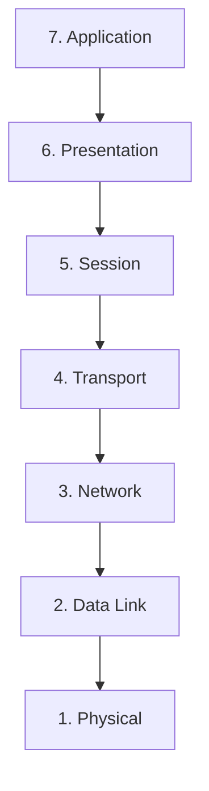
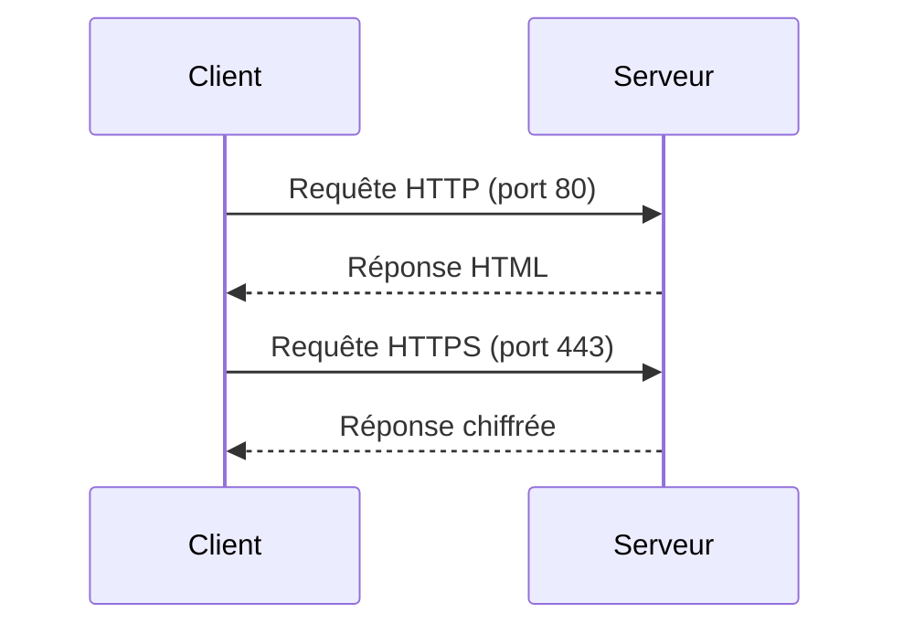
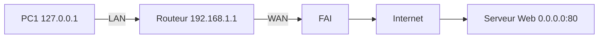

# 🌐 Networking Basics — Cours ULTRA Complet

> **Public** : Étudiants en développement / administration système
> **Contexte** : Projet Holberton - Ubuntu 22.04
> **Format** : Markdown compatible GitHub, avec schémas (Mermaid), exemples Bash, tables de comparaison.

---

## 🧭 Table des matières
- [🌐 Networking Basics — Cours ULTRA Complet](#-networking-basics--cours-ultra-complet)
  - [🧭 Table des matières](#-table-des-matières)
  - [🌱 Introduction](#-introduction)
  - [🎯 Objectifs pédagogiques](#-objectifs-pédagogiques)
  - [🏛 Le modèle OSI](#-le-modèle-osi)
    - [Définition](#définition)
    - [Les 7 couches](#les-7-couches)
  - [🖧 Types de réseaux](#-types-de-réseaux)
    - [LAN (Local Area Network)](#lan-local-area-network)
    - [WAN (Wide Area Network)](#wan-wide-area-network)
    - [Internet](#internet)
  - [💻 Adressage \& identifiants](#-adressage--identifiants)
    - [Adresse MAC](#adresse-mac)
    - [Adresse IP](#adresse-ip)
    - [Localhost](#localhost)
    - [0.0.0.0](#0000)
    - [Subnet](#subnet)
  - [📂 Résolution de noms](#-résolution-de-noms)
    - [/etc/hosts](#etchosts)
    - [DNS (aperçu)](#dns-aperçu)
  - [📡 Transport \& Ports](#-transport--ports)
    - [Ports importants](#ports-importants)
  - [🛠 Outils système](#-outils-système)
    - [ping (ICMP)](#ping-icmp)
    - [netstat](#netstat)
    - [ifconfig](#ifconfig)
    - [telnet](#telnet)
    - [nc (netcat)](#nc-netcat)
    - [cut](#cut)
  - [📊 Schémas d’architecture](#-schémas-darchitecture)
    - [Communication client ↔ serveur](#communication-client--serveur)
    - [Réseau simplifié](#réseau-simplifié)
  - [🧪 Exercices pratiques](#-exercices-pratiques)
  - [⚙️ Scripts Bash conformes](#️-scripts-bash-conformes)
  - [✅ Résumé \& Checklist](#-résumé--checklist)
  - [❓ FAQ](#-faq)
  - [📑 Annexes](#-annexes)
    - [Plages d’adresses privées (RFC1918)](#plages-dadresses-privées-rfc1918)
    - [Ports bien connus](#ports-bien-connus)
  - [📚 Ressources utiles](#-ressources-utiles)

---

## 🌱 Introduction
Le **networking** est la base de toute communication numérique : Internet, cloud, API, SSH, jeux en ligne.
Il repose sur des notions clés : **modèle OSI**, **adresses IP**, **protocoles TCP/UDP**, **ports**, et des outils pratiques comme `ping`, `netstat` et `ifconfig`.

---

## 🎯 Objectifs pédagogiques
Vous devez être capable d’expliquer :
- Le **modèle OSI** : définition, couches, organisation.
- **LAN / WAN / Internet** : usages et tailles typiques.
- **Adresse IP** : IPv4, IPv6, publique/privée, localhost, 0.0.0.0, subnet.
- Pourquoi **IPv6** a été créé.
- **TCP vs UDP** : différences et usages.
- Les **ports** : rôle et numéros à retenir (SSH, HTTP, HTTPS).
- L’outil principal pour vérifier la connectivité (**ping / ICMP**).
- Le rôle de **/etc/hosts**.
- Comment afficher les **interfaces actives** (`ifconfig`).
- Utiliser `telnet`, `nc`, `cut` dans un contexte réseau.

---

## 🏛 Le modèle OSI

### Définition
Le modèle **OSI (Open Systems Interconnection)** est une norme qui décompose les communications en **7 couches**.



### Les 7 couches
1. **Physique** → câbles, signaux, Wi‑Fi.
2. **Liaison de données** → adresses MAC, Ethernet, Wi‑Fi.
3. **Réseau** → IP, routage.
4. **Transport** → TCP (fiable), UDP (rapide).
5. **Session** → gestion des connexions.
6. **Présentation** → chiffrement, compression.
7. **Application** → HTTP, FTP, DNS, SSH.

---

## 🖧 Types de réseaux

### LAN (Local Area Network)
- **Usage** : maison, école, entreprise.
- **Taille** : quelques mètres → km.
- **Exemple** : réseau Wi‑Fi domestique.

### WAN (Wide Area Network)
- **Usage** : relier plusieurs LAN.
- **Taille** : régions, pays, continents.
- **Exemple** : Internet.

### Internet
- Le plus grand WAN au monde.
- Basé sur **TCP/IP** et les **DNS**.

---

## 💻 Adressage & identifiants

### Adresse MAC
- Identifiant physique unique de carte réseau.
- Ex : `00:1A:2B:3C:4D:5E`.

### Adresse IP
- **IPv4** : `192.168.1.1` (32 bits).
- **IPv6** : `2001:db8::1` (128 bits).
- **Privées** : `192.168.x.x`, `10.x.x.x`.
- **Publiques** : visibles sur Internet.

### Localhost
- **127.0.0.1** (IPv4) / `::1` (IPv6).
- Utilisé pour tester en local.

### 0.0.0.0
- Signifie "toutes les adresses locales".
- Exemple : serveur web écoutant sur `0.0.0.0:80`.

### Subnet
- Découpage logique d’un réseau.
- Exemple : `192.168.1.0/24`.

---

## 📂 Résolution de noms

### /etc/hosts
- Fichier de correspondance **nom ↔ IP**.
- Exemple :
  ```
  127.0.0.1   localhost
  192.168.1.10 dev.local
  ```

### DNS (aperçu)
- Système distribué qui traduit `google.com` → `142.250.74.78`.

---

## 📡 Transport & Ports

| Caractéristique | **TCP** | **UDP** |
|-----------------|---------|---------|
| Fiabilité       | ✔️ (accusés, retransmission) | ❌ (pas de vérif) |
| Vitesse         | Moins rapide | Rapide |
| Usage typique   | Web, mail, SSH | Streaming, jeux, VoIP |

### Ports importants
- **22** → SSH
- **80** → HTTP
- **443** → HTTPS

---

## 🛠 Outils système

### ping (ICMP)
Tester la connectivité :
```bash
ping google.com
```

### netstat
Lister connexions actives :
```bash
netstat -tuln
```

### ifconfig
Afficher interfaces actives :
```bash
ifconfig
```

### telnet
Tester une connexion TCP :
```bash
telnet google.com 80
```

### nc (netcat)
Couteau suisse réseau :
```bash
nc -zv google.com 80
```

### cut
Manipuler colonnes :
```bash
netstat -tuln | cut -d " " -f1
```

---

## 📊 Schémas d’architecture

### Communication client ↔ serveur


### Réseau simplifié


---

## 🧪 Exercices pratiques

1. Vérifiez que vous atteignez Google :
   ```bash
   ping google.com
   ```

2. Affichez vos interfaces réseau :
   ```bash
   ifconfig
   ```

3. Testez une connexion au port 80 :
   ```bash
   telnet google.com 80
   ```

4. Lancez un mini‑serveur avec netcat :
   ```bash
   nc -l 1234
   ```

---

## ⚙️ Scripts Bash conformes

Exemple : script `check_ping.sh`
```bash
#!/usr/bin/env bash
# Script pour tester la connectivité avec Google

ping -c 4 google.com
```

Exemple : script `list_ports.sh`
```bash
#!/usr/bin/env bash
# Script pour afficher les ports TCP/UDP actifs

netstat -tuln
```

---

## ✅ Résumé & Checklist

- [x] Expliquer OSI & TCP/IP.
- [x] Différencier LAN, WAN, Internet.
- [x] IP (IPv4, IPv6, publiques/privées).
- [x] Localhost & 0.0.0.0.
- [x] Subnet.
- [x] TCP vs UDP.
- [x] Ports essentiels.
- [x] Outils (`ping`, `netstat`, `ifconfig`, `telnet`, `nc`, `cut`).

---

## ❓ FAQ
**Q: Pourquoi IPv6 ?**
R: Pour résoudre la pénurie d’adresses IPv4.

**Q: Quelle différence localhost / 0.0.0.0 ?**
R: `127.0.0.1` = adresse locale unique, `0.0.0.0` = toutes interfaces.

---

## 📑 Annexes

### Plages d’adresses privées (RFC1918)
- 10.0.0.0 → 10.255.255.255
- 172.16.0.0 → 172.31.255.255
- 192.168.0.0 → 192.168.255.255

### Ports bien connus
- FTP : 21
- SSH : 22
- HTTP : 80
- HTTPS : 443

---

## 📚 Ressources utiles
- [OSI model](https://fr.wikipedia.org/wiki/Mod%C3%A8le_OSI)
- [LAN vs WAN](https://www.cisco.com/c/en/us/products/switches/what-is-a-lan-local-area-network.html)
- [Adresse IP](https://www.cloudflare.com/learning/network-layer/what-is-an-ip-address/)
- [Netcat man page](https://linux.die.net/man/1/nc)
- `man ping`, `man netstat`, `man ifconfig`, `man telnet`, `man nc`, `man cut`
